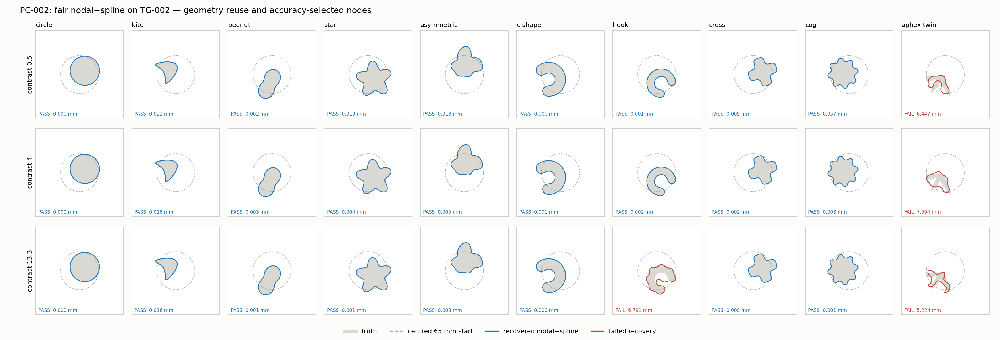

# PC-002 fair nodal+spline

Completed 30/30; recovered 26/30; by contrast {'c0.5': 9, 'c4': 9, 'c13.3': 8}. Median total 100.58 s.

Median fitting 48.18 s; median audits 54.82 s (medians do not add).

Source commit: `1b4dfdab3704967828df75d189e845bd1a6bc08c`; input seal SHA256: `34375b59a40ed8e945904b246d3022bdeeeacb2291fced1bafc16f6861be7b00`.

Selected stage nodes: [130, 386]; escalated stages: 0.

| Case | Recovered | RMS mm | Residual | Fit s | Audit s | Total s | Nodes | Outcome |
|---|---:|---:|---:|---:|---:|---:|---|---|
| aphex_twin__c0.5 | False | 6.45 | 1.41 | 1.43 | 53.2 | 54.6 | [130] | NUMERICAL_FAILURE |
| aphex_twin__c13.3 | False | 5.22 | 1.61 | 2.94 | 52.8 | 55.7 | [130] | NUMERICAL_FAILURE |
| aphex_twin__c4 | False | 7.59 | 1.78 | 1.95 | 52.9 | 54.8 | [130] | NUMERICAL_FAILURE |
| asymmetric__c0.5 | True | 0.013 | 5.79e-06 | 42.5 | 54.7 | 97.2 | [130, 386] | COMPLETED_SCHEDULE |
| asymmetric__c13.3 | True | 0.00339 | 1.07e-05 | 89.3 | 55.8 | 145 | [130, 386] | COMPLETED_SCHEDULE |
| asymmetric__c4 | True | 0.0049 | 2.17e-06 | 64.4 | 55.5 | 120 | [130, 386] | COMPLETED_SCHEDULE |
| c_shape__c0.5 | True | 0.000428 | 8.71e-08 | 36.9 | 54.9 | 91.9 | [130, 386] | COMPLETED_SCHEDULE |
| c_shape__c13.3 | True | 3.05e-05 | 2.18e-06 | 76.7 | 56.4 | 133 | [130, 386] | COMPLETED_SCHEDULE |
| c_shape__c4 | True | 0.000794 | 6.16e-07 | 53.2 | 54.9 | 108 | [130, 386] | COMPLETED_SCHEDULE |
| circle__c0.5 | True | 7.82e-06 | 1.02e-06 | 20.8 | 54.7 | 75.5 | [130, 386] | COMPLETED_SCHEDULE |
| circle__c13.3 | True | 5.37e-05 | 4.21e-08 | 22.9 | 53.9 | 76.8 | [130, 386] | COMPLETED_SCHEDULE |
| circle__c4 | True | 1.61e-05 | 1.25e-05 | 19.7 | 54 | 73.8 | [130, 386] | COMPLETED_SCHEDULE |
| cog__c0.5 | True | 0.0565 | 2e-05 | 44.9 | 54.9 | 99.8 | [130, 386] | COMPLETED_SCHEDULE |
| cog__c13.3 | True | 0.00108 | 5.24e-07 | 147 | 57.1 | 204 | [130, 386] | COMPLETED_SCHEDULE |
| cog__c4 | True | 0.00844 | 2.71e-06 | 65.7 | 55.4 | 121 | [130, 386] | COMPLETED_SCHEDULE |
| cross__c0.5 | True | 0.0051 | 7.89e-07 | 42.8 | 54.8 | 97.6 | [130, 386] | COMPLETED_SCHEDULE |
| cross__c13.3 | True | 0.000135 | 1.16e-07 | 108 | 56.3 | 165 | [130, 386] | COMPLETED_SCHEDULE |
| cross__c4 | True | 0.00232 | 6.94e-07 | 53.4 | 55.3 | 109 | [130, 386] | COMPLETED_SCHEDULE |
| hook__c0.5 | True | 0.00113 | 1.79e-07 | 37 | 54.8 | 91.8 | [130, 386] | COMPLETED_SCHEDULE |
| hook__c13.3 | False | 6.79 | 1.55 | 10.9 | 52.7 | 63.6 | [130] | NUMERICAL_FAILURE |
| hook__c4 | True | 0.00222 | 2.35e-06 | 57 | 54.9 | 112 | [130, 386] | COMPLETED_SCHEDULE |
| kite__c0.5 | True | 0.0208 | 1.43e-05 | 101 | 53 | 154 | [130, 386] | COMPLETED_SCHEDULE |
| kite__c13.3 | True | 0.0162 | 7.67e-05 | 70.6 | 54.3 | 125 | [130, 386] | COMPLETED_SCHEDULE |
| kite__c4 | True | 0.0181 | 2.2e-05 | 51.5 | 49.9 | 101 | [130, 386] | COMPLETED_SCHEDULE |
| peanut__c0.5 | True | 0.00195 | 1.78e-07 | 39.4 | 54.7 | 94.1 | [130, 386] | COMPLETED_SCHEDULE |
| peanut__c13.3 | True | 0.000598 | 1.94e-07 | 52.1 | 55.1 | 107 | [130, 386] | COMPLETED_SCHEDULE |
| peanut__c4 | True | 0.00261 | 4.31e-07 | 39.2 | 54.4 | 93.7 | [130, 386] | COMPLETED_SCHEDULE |
| star__c0.5 | True | 0.0194 | 9.53e-06 | 41.2 | 54.6 | 95.8 | [130, 386] | COMPLETED_SCHEDULE |
| star__c13.3 | True | 0.000628 | 4.69e-07 | 164 | 58 | 222 | [130, 386] | COMPLETED_SCHEDULE |
| star__c4 | True | 0.00401 | 1.15e-06 | 75.2 | 55.6 | 131 | [130, 386] | COMPLETED_SCHEDULE |

Only NS executed; PC-001 M1/N1 times are historical, not a controlled speedup comparison.
Nodal LU/reciprocal solve CUDA, fields/Jacobian contraction CPU; modal LU CPU.
Stage-selection cost and cold startup included; native-profile plus CUDA N1024/N2048 audits.
No trial promotion; failed cases and selection escalations retained.

