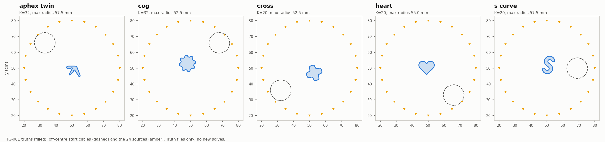

# TG-001: new target shapes (inputs only)

Five single-object targets for the cleaned SC/MA inverse, each at contrasts
0.5, 4 and 13.3, giving 15 new cases. They add geometry that the 36-case CI-001
set does not cover. This campaign prepares and qualifies inputs only. **No inverse fit was run.**



| Scene | What it tests | Stored band K | Taper | Max radius before taper | Centre (m) | Rotation | Start centre (m) |
|---|---|---:|---:|---:|---|---:|---|
| `aphex_twin` | The real Aphex Twin logo glyph: non-star, two thin strokes (minimum width ≈ 9 mm), deep re-entrant notch | 32 | 16 | 57.5 mm | (0.512, 0.488) | 0 | (0.33, 0.66) |
| `cog` | Eight teeth: energy at angular harmonics 8, 16 and 24 | 32 | 20 | 52.5 mm | (0.48, 0.53) | 0.17 | (0.68, 0.66) |
| `cross` | Rounded plus sign: four re-entrant corners | 20 | 10 | 52.5 mm | (0.53, 0.47) | 0.35 | (0.32, 0.36) |
| `heart` | An inward cusp and an outward tip | 20 | 12 | 55.0 mm | (0.49, 0.51) | 0 | (0.66, 0.33) |
| `s_curve` | Thick S: two concavities facing opposite ways | 20 | 12 | 57.5 mm | (0.51, 0.52) | −0.3 | (0.69, 0.50) |

All starts are SC-050-style circles of radius 65 mm, and each start is disjoint from its target.
Each outline is centred at its area centroid and scaled to its maximum radius. A Gaussian
taper exp(−(n/taper)²) is applied before truncation to band K, which rounds polygon corners
without Gibbs ringing. The same frozen 24-pair ring and 19-frequency catalog (0.25–2.5 GHz)
used by CI-001 are reused.

**Logo source.** [`File:Aphex_Twin_logo.svg`](https://en.wikipedia.org/wiki/File:Aphex_Twin_logo.svg)
is public domain (original logo by Paul Nicholson, vectorised by Iwantmorelife). It is
vendored at `experiments/cleaned_interface/assets/aphex_twin_logo.svg` and its SHA-256 is
checked on load. Only the central glyph (the first path, a 190-vertex polygon) is used. The
surrounding ring is a separate annulus, which the single-curve solver cannot represent.

## Data and qualification

For each scene and contrast there are two noiseless catalogs: real wavenumbers, and damped
wavenumbers k(1 + 0.25i). Both are computed with `nodal_kress` on the CPU reference path
(`device=cpu`, `acceleration=reference`) at N = 1024 and N = 2048. A catalog is kept only if
the per-frequency relative difference is at most 1e-8, and `observed` is the N2048
prediction. Results are in `inputs/<scene>/c<contrast>/{qualification,damped_qualification}.json`
and in `generate.log`. A failed catalog would be kept as `failed_*.json` and listed in the
manifest's `qualification_failures`.

All 30 catalogs qualified; no failures. The worst difference is 8.4e-14, at `s_curve` with contrast 13.3 (real). Generation took 38 min of wall time on the CPU reference path.

| Scene | Contrast | Real max rel. N1024 vs N2048 | Damped max rel. | Seconds (real + damped) |
|---|---:|---:|---:|---:|
| `aphex_twin` | 0.5 | 5.2e-15 | 6.5e-15 | 131 |
| `aphex_twin` | 4 | 7.8e-15 | 2.5e-15 | 152 |
| `aphex_twin` | 13.3 | 6.4e-14 | 5.7e-15 | 155 |
| `cog` | 0.5 | 8.2e-15 | 4.6e-15 | 147 |
| `cog` | 4 | 7.1e-15 | 1.9e-15 | 163 |
| `cog` | 13.3 | 5.7e-14 | 4.9e-15 | 157 |
| `cross` | 0.5 | 6.0e-15 | 4.5e-15 | 145 |
| `cross` | 4 | 5.9e-15 | 1.9e-15 | 162 |
| `cross` | 13.3 | 7.3e-14 | 3.7e-15 | 156 |
| `heart` | 0.5 | 5.5e-15 | 4.1e-15 | 142 |
| `heart` | 4 | 3.9e-15 | 2.0e-15 | 160 |
| `heart` | 13.3 | 2.1e-14 | 4.2e-15 | 155 |
| `s_curve` | 0.5 | 6.3e-15 | 4.3e-15 | 142 |
| `s_curve` | 4 | 7.3e-14 | 2.7e-15 | 160 |
| `s_curve` | 13.3 | 8.4e-14 | 8.4e-15 | 157 |

## Use

Case IDs are `target__c<contrast>__<scene>`, for example `target__c13.3__aphex_twin`. The
rows have the CI-001 descriptor shape, so the unchanged `benchmark.fitting_problem`,
`run_case` and `score` consume them, along with the recovery gates (RMS ≤ 1 mm, Hausdorff
upper bound ≤ 2 mm, residual ≤ max(0.003, 3 × noise)). Fitting never reads the truth path; a
test checks this.

```bash
PYTHONPATH=solvers:. python -m experiments.cleaned_interface.target_gallery inventory
PYTHONPATH=solvers:. python -m experiments.cleaned_interface.target_gallery plan --cases target__c13.3__aphex_twin
PYTHONPATH=solvers:. python -m experiments.cleaned_interface.target_gallery run \
    --cases target__c4__cog --run-dir results/validation/cleaned_interfaces/<new-campaign>
```

`verify` enforces the input hashes. The source digests in `manifest.json` (and
`sources.tar.gz`) record how the inputs were generated. They are not a lock, so these cases
can be fitted with later solver code. Each `--run-dir` holds one solver/execution setting.
