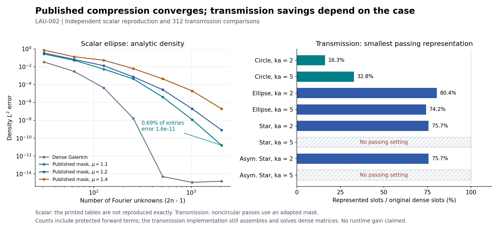

# LAU-002: literature construction reproduced; transmission transfer is conditional

Executed 2026-09-17 under the [approved bounded contract](../../../../docs/iterations/laurent/iteration_03/03_plan.md).
The core 2021 scalar splitting and truncation construction now has an independent
implementation and convergence evidence. Exact printed-table reproduction and
the published fast-assembly implementation remain unresolved. Applying its mask
to transmission needs an explicit adaptation at our small working resolutions.



## What this changes

The earlier failed 30%/50% masks did not test the published construction.
The new scalar reproduction works. The literal published mask still fails every
noncircular transmission case tested, including trace cutoffs through 128.
Increasing its mask parameter independently of trace cutoff gives useful
entry-count reductions on six of eight cases, including the two circles.
Both higher-frequency stars still fail. This is evidence of conditional
transfer, not evidence that Fourier compression fails or that our full
Galerkin transmission operator is wrong.

All 24 uncompressed transmission controls qualify independently: worst physical
data derivative error is 6.86e-11. The difficult part in this experiment is
discarding couplings while meeting the same residual and derivative gates.
Preserving additional singular terms did not eliminate that problem.

## Source-to-code map

[Jiang, Wang and Yu (2021)](https://link.springer.com/article/10.1007/s11075-021-01082-0)
splits a scalar operator into diagonal convolution plus compact remainder.
Its Section 3 index set has O(n) retained positions for fixed mu > 1.
Theorem 6 bounds analytic error by `C r^(n^(1/(2 mu)))`: stretched exponential,
not `C r^n`. Remark 1 leaves the wavenumber-dependent onset unresolved.
Neither statement promises accurate tiny matrices at every frequency.

| Construction | Implementation / independent check |
|---|---|
| `|k|,|l| < n`, `(1+(k+l)^2)^mu min(1+k^2,1+l^2) <= n^2` | `scalar.literature_mask`; matrix input index is `q=-l`, so the diagonal coordinate is `m-q`. Literal double-kernel index test and read-back mask audit |
| Scalar diagonal convolution plus remainder | `scalar.convolution_diagonal`; physical kernel `i H0/4`, symbol `1` at zero and `1/(2|m|)` otherwise. Global normalization differs from the paper but applies consistently to operator and RHS |
| Ellipse scalar single layer | `ellipse_coefficients`, `kernel_matrix`; exact log-symbol contraction, independent direct finite sums, analytic circle eigenvalues, independently assembled nodal Kress comparison |
| Manufactured densities from Examples 1–3 | `run_scalar.density_coefficients`, exact analytic `ellipse_log_density` for Example 3; RHS includes input modes outside each solve window |
| Transfer to coupled transmission | `transmission.SplitCase`, `principal_log`, `mask_for`; numerical extension with three protected splits, not a claimed consequence of the scalar theorem |

The [2012 predecessor](https://link.springer.com/article/10.1007/s10543-012-0380-6)
and [periodic transmission Galerkin paper](https://www.numdam.org/item/10.1051/m2an/2021053.pdf)
are distinct methods. This campaign does not reproduce their full implementations.
The latter concerns layered quasi-periodic interfaces, not our closed-interface
Muller system. Existing Fourier transmission work therefore establishes useful
precedent without certifying this particular sparse derivative implementation.

Publisher PDF provenance, downloaded and visually checked 2026-09-17:

| Source | SHA-256 | Pages checked for this interpretation |
|---|---|---|
| `https://link.springer.com/content/pdf/10.1007/s11075-021-01082-0.pdf` | `98d592499039cf8912092b4da7854c8cbd023ce043c94af8100d8bbd5c81c464` | Printed pp. 1465, 1478, 1481–1484: index rule, theorem, examples, counts |
| `https://link.springer.com/content/pdf/10.1007/s10543-012-0380-6.pdf` | `e7f3c1befb906c3cdee45c1b9a71edcdd8904e18348f3e883da647260d10b9bd` | Supporting split only; not a reproduced numerical baseline |

## Scalar result and unresolved table discrepancies

Authoritative [scalar bundle](../LAU-002-20260917-scalar-qualified-02/):
84 comparisons, grid 256/512 operator agreement 8.12e-16, n through 1024
(2,047 Fourier unknowns), orthonormal Fourier density errors including the
unresolved tail. The Example 3 wavenumber is assumed to remain 3 from the
preceding examples; the paper does not restate it there.

At n=1024, the analytic-density results are:

| Arm | Retained positions | Fraction of dense positions | Density L2 error |
|---|---:|---:|---:|
| Dense Galerkin | 4,190,209 | 100% | 1.54e-15 |
| mu=1.1 | 28,771 | 0.687% | 1.63e-11 |
| mu=1.2 | 20,837 | 0.497% | 8.30e-10 |
| mu=1.4 | 13,197 | 0.315% | 1.99e-7 |

Only mu=1.1 meets the declared 1e-10 final analytic error gate. The larger-mu
arms are retained failures of that gate, despite convergence. For the two less
regular densities, all three masks approach their dense errors: approximately
1.36e-4 and 6.25e-5 at n=1024. Their Fourier reference uses 1,048,576 samples,
checked against 524,288, and a tail through mode 131,071. Coefficient refinement
norms are 5.04e-8 and 1.22e-8; extending the tail from 65,535 to 131,071 adds
norms 4.08e-7 and 1.17e-7. These finite references are numerical qualifications,
not rigorous infinite-tail bounds. Example 3 uses exact coefficients.

**We do not reproduce the printed tables exactly.** Our analytic dense error
at n=128 is 1.69e-8 versus Table 3's 7.73e-5; the compressed values differ too.
An unstated dimension/RHS/error-evaluation convention remains possible.
The implementation was not retuned to fit the printed values.

Table 4 has an independently checkable inconsistency: its definitions require
`CC = (2n-1) CR`. At n=64, mu=1.2, the printed 6.51% implies CC=8.2677,
but the table reports 15.48. All ten printed pairs violate this identity by
far more than rounding. This does not disprove the truncation theorem; it
prevents treating the table as an unquestionable acceptance oracle.
The exact formula counts and discrepancies are in `counts.csv`.

Scalar sparse LU is real, but smooth-kernel construction and reference
assembly are dense. This experiment isolates truncation and convergence;
it does not establish the paper's end-to-end complexity or speed.

## Transmission result

Authoritative [transmission bundle](../LAU-002-20260917-transfer-campaign-01/):
312 comparisons, 1,872 individual directional rows, 24 qualified full controls,
48/48 combined-direction finite-difference checks passing. **89/312** settings
pass every physical gate; **47** also represent fewer forward slots than the
original smaller dense system. Multiple settings on one case are not
independent successful geometries: compact passes cover **6/8 cases**.

Literal masks couple n to trace cutoff `K=n-1`. The adaptation restricts the
published index set for `n*=2n,4n,8n,16n` to the original trace window, at mu=1.1.
This increases bandwidth without unnecessarily increasing the number of trace
unknowns. It was recorded in the contract after the failed pilot, before this
campaign; no accuracy gate changed.

Smallest passing forward representations found in this discrete sweep:

| Case | Trace K | Mask n*, mu | Represented / original dense slots | Data error | Lifted residual | Worst derivative error |
|---|---:|---|---:|---:|---:|---:|
| Circle, ka=2 | 16 | 17, 1.4 (literal) | 710 / 4,356 = 16.3% | 7.66e-14 | 1.16e-11 | 8.14e-4 |
| Circle, ka=5 | 48 | 49, 1.2 (literal, refined trace) | 3,150 / 9,604 = 32.8% | 5.11e-11 | 3.90e-12 | 6.53e-5 |
| Ellipse, ka=2 | 16 | 136, 1.1 (adapted) | 3,502 / 4,356 = 80.4% | 6.76e-14 | 3.63e-9 | 1.29e-9 |
| Ellipse, ka=5 | 24 | 200, 1.1 (adapted) | 7,126 / 9,604 = 74.2% | 3.45e-7 | 9.72e-7 | 5.68e-6 |
| Star, ka=2 | 40 | 656, 1.1 (adapted) | 19,854 / 26,244 = 75.7% | 6.69e-10 | 3.68e-7 | 1.31e-8 |
| Asymmetric star, ka=2 | 40 | 656, 1.1 (adapted) | 19,854 / 26,244 = 75.7% | 1.41e-9 | 4.00e-7 | 1.54e-8 |
| Either star, ka=5 | 48, 96, 128 | all tested settings | **No pass** | — | — | — |

The ka labels use the same common regular-star equivalent radius to set the
two physical frequencies, matching LAU-001-R1; they are not separately rescaled
for each shape. Full geometry, acquisition, materials, reference radius and
gates are frozen in `config.json`.

Every listed best representation protects the identity only. The principal-log
variant differentiates a finite geometry multiplier and exact convolution
symbol; tests check its sign and shape tangent. It and the full-log protection
produce additional passes but no smaller winner. Full-log protection retains
an entire dense logarithmic matrix and is charged accordingly.

Counts include protected forward terms and structural mask positions, without
thresholding small values. They exclude derivative/factorization storage. The
transmission implementation still stores, assembles and factors dense matrices.
**These are potential representation savings, not measured memory or runtime
savings.** The circle's large gain is not representative of the noncircular cases.

Gates remain receiver 1e-6, independently lifted residual 1e-6, all six physical
data derivatives 1e-3, and cancellation-aware objective derivative agreement.
Four directions are training and two held out; the geometric index mask uses
neither set. Finite differences test a fixed combination of all six at two
steps, for each protected split with mu=1.2; they are not separate FD checks
of every winning parameter setting. Worst FD error is 3.73e-6. The six
individual analytic tangents of every candidate are separately checked against
refined Kress derivatives. No inverse recovery or local-offset campaign ran.

## Verification, resources, and reproduction

**77 tests passed in 15.28 seconds** across the existing modal package,
LAU-001 repair, and new literature code. Both authoritative bundles pass
`audit_bundle`: artifact hashes, 81 current source hashes, count identities,
saved masks, derivative-to-comparison joins, gates, work and resource ceilings.
Neither campaign had source drift or a failure artifact.

| Campaign | Assemblies | Factorizations | Wall time | Peak RSS |
|---|---:|---:|---:|---:|
| Scalar qualified 02 | 2 | 28 | 1.89 s | 0.73 GiB |
| Transmission campaign 01 | 80 | 536 | 53.98 s | 0.55 GiB |

Resource ceilings were 160 assemblies, 600 factorizations, 30 minutes and
6 GiB **per campaign**. Runtimes are operational accounting, not matched
solver benchmarks. Earlier scalar pilot/campaign and failed transmission
pilot bundles remain intact; the final scalar rerun refines density sampling
and tail qualification, without changing the published mask or physical gates.

From the repository root, using fresh output paths:

```bash
export OMP_NUM_THREADS=1 OPENBLAS_NUM_THREADS=1 MKL_NUM_THREADS=1
export PYTHONPATH=solvers:. MPLCONFIGDIR=/tmp/laurent-mpl
/home/drdeng/miniconda3/envs/EMNerf/bin/python -m pytest -q experiments/modal_muller_research experiments/laurent_compression experiments/laurent_literature
/home/drdeng/miniconda3/envs/EMNerf/bin/python -m experiments.laurent_literature.run_scalar --stage campaign --output /tmp/lau002-scalar-new
/home/drdeng/miniconda3/envs/EMNerf/bin/python -m experiments.laurent_literature.run_transfer --stage campaign --output /tmp/lau002-transfer-new
/home/drdeng/miniconda3/envs/EMNerf/bin/python -m experiments.laurent_literature.audit_bundle /tmp/lau002-scalar-new
/home/drdeng/miniconda3/envs/EMNerf/bin/python -m experiments.laurent_literature.audit_bundle /tmp/lau002-transfer-new
```

## Assessment

We have caught up with one established compression construction sufficiently
to test its mechanism and limits, rather than judging it through our earlier
heuristics. Full literature parity remains open: printed-table conventions,
fast assembly, and a transmission/shape-derivative theorem are not reproduced.
The transfer evidence supports modest noncircular entry reductions at the
tested low-to-moderate frequencies, not a general sparse replacement.

A performance claim now needs actual construction/action of retained entries,
including setup and derivatives, at matched accuracy against the qualified
nodal/compiled baseline. Another retained-percentage sweep alone would not
answer that question. Existing production defaults and hash-pinned numerical
libraries were unchanged; the new code is confined to an experimental package.
