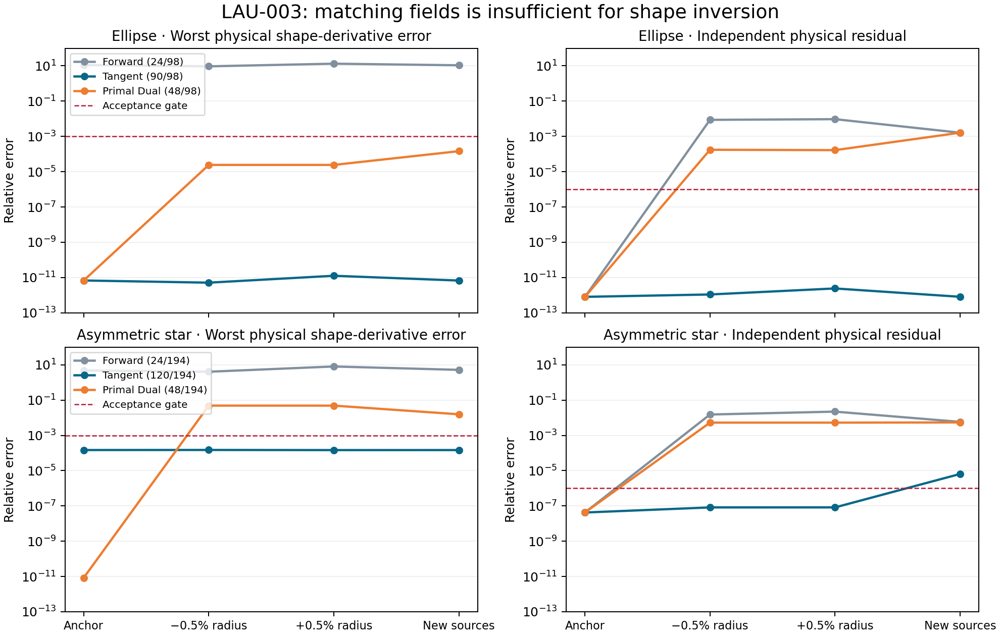

# LAU-003 — sensitivity-aware trace reduction: useful, with a local-reuse limit

Executed 2026-09-17 under the user's direction to move Laurent research toward
our innovations. [Contract](../../../../docs/iterations/laurent/iteration_04/03_plan.md)
· [Raw pilot](../LAU-003-20260917-pilot-01/).

**Decision: preserve inverse sensitivities explicitly; reject the tested compact
frozen basis as a reusable model at 0.5%-radius shape motion.** This pilot
establishes a distinction from the earlier entry-mask studies, not a completed
inverse method or a general novelty claim. The full campaign was not released.



## Measured mechanism

The original Laurent system uses 98 unknowns for the ellipse and 194 for the
asymmetric star at common-reference ka=5. All eight full controls qualify against
independent 256/384-node Kress fields and derivatives, including both shape
offsets and new illumination. The full model is not the source of the failures.

We solve an actual smaller dense system `V* A V`, with analytic derivatives of
that same frozen-basis model, including changing source and receiver operators.
This changes the solution subspace rather than deleting operator entries.
The state uses the existing `(u, J*d_n u)` coefficient coordinates. Each POD
snapshot block has unit Frobenius norm; tangent amplitudes therefore do not
arbitrarily dominate selection. Singular values below 1e-12 of the largest
are discarded. Four shape directions can train the basis; two cannot.

| Case / arm | Selected unknowns | Anchor gates | Both geometry offsets | Shifted sources | Stored model family / full |
|---|---:|---|---|---|---:|
| Ellipse / forward only | 24 / 98 | Fail derivative | Fail | Fail | 13.7% |
| Ellipse / four tangents | 90 / 98 | Pass | Pass | Pass | 94.6% |
| Ellipse / primal + receiver adjoint | 48 / 98 | Pass | Fail residual | Fail residual | 35.8% |
| Asymmetric star / forward only | 24 / 194 | Fail derivative | Fail | Fail | 4.7% |
| Asymmetric star / four tangents | 120 / 194 | Pass | Pass | Fail field/residual | 48.8% |
| Asymmetric star / primal + receiver adjoint | 48 / 194 | Pass | Fail | Fail residual/derivative | 12.0% |

The forward-only fields agree with Kress to 4.0e-12 / 6.7e-12 **at the anchor**,
yet worst relative shape-derivative errors are 11.0 / 4.81. These are not small
absolute derivatives hidden by a norm-only claim: all objective derivative
checks are retained individually in `derivatives.csv`. Its original rank search
never meets the training derivative gate, so the largest-rank failed arm is
reported rather than silently discarded.

The 48-dimensional primal/dual basis preserves all six anchor derivatives to
6.8e-12 / 8.5e-12 relative error. This includes the two untrained directions.
At the asymmetric star, however, either 0.5%-radius offset produces about
4.48e-4 field error, 5.28e-3 physical residual and 4.87e-2 derivative error.
Anchor interpolation alone gives no sufficiently large reuse radius here.

Explicit tangent enrichment changes that result: the star's 120-dimensional
basis passes both offsets with worst field error 9.92e-9, physical residual
8.25e-8 and derivative error 1.49e-4. It misses the predeclared target of at
most half the original unknowns (120 > 97). Its stored family including six
projected tangents is 48.8% of the equivalent full family. This storage result
is useful but does not override the separate rank target. New illumination
fails at field error 1.56e-6 and residual 6.49e-6; gates were not relaxed.

## Interpretation and candidate innovation

A good field interpolant can be a bad inverse model. Preserving receiver-adjoint
information fixes the anchor derivative without training individual shape
perturbations; preserving state tangents helps after geometry changes. Neither
mechanism alone met the full compact-reuse hypothesis in this pilot.

The [design note](../../../../docs/iterations/laurent/iteration_04/02_proposals/01_innovation_direction.md)
separates our candidate contribution from established sensitivity POD and
parameter interpolation. The prospective contribution is a Laurent inverse
model that monitors and preserves the geometry directions needed for a reliable
update, including a defensible refresh/acceptance rule. This pilot supplies the
first direct control and the local failure that such a rule must detect.

A specific next candidate is a hierarchical basis: preserve the primal span
exactly, then add orthogonal tangent/adjoint corrections selected by residuals.
Joint POD truncation currently trades primal accuracy against tangent accuracy,
and its stringent anchor residual gate selects large ranks. Whether hierarchical
construction improves that is a hypothesis, not a measured result. Acquisition
changes require separate enrichment or a rebuild. No production integration is
justified by these measurements.

## Validation, stopping and limits

**83 tests pass** across the modal, compression, literature and new ROM packages.
The new tests cover complex adjoint conventions, full-span equivalence, untrained
parameter derivative interpolation, tangent reproduction, second-order frozen
basis finite differences, evaluation isolation and full storage accounting.
The pilot read-back audit passes: saved vectors reproduce 24 comparison gates
and 144 directional comparisons, with source and artifact hashes checked.

**The predeclared pilot-to-campaign gate is false.** Eleven of twelve physical
finite-difference rows meet 1e-4; the forward-only star at step 2e-4 has error
1.39e-4. Halving the step gives 3.48e-5 (a factor of four), consistent with
centered-difference truncation, while both enriched arms pass at both steps.
This is not evidence of an incorrect analytic tangent. Nevertheless, the
contract requires all rows to pass, so no eight-case campaign ran. The compact
local-reuse failures already answer the narrower scientific question; there is
no reason to extend the campaign just to increase the case count. A successor
can predeclare a finer step ladder without rewriting this failed gate.

Coefficient-window refinement B=128 to 160 changes the two anchor fields by
at most 5.1e-15 and their six derivatives by at most 9.1e-15; refined full
controls qualify. Numerical window checks do not certify an infinite series.

Rank selection uses only native anchor fields, residuals and four training
sensitivities. Both shape offsets, two untrained directions and rotated source
locations are evaluated after freezing rank and basis. An offset synthetic
truth supplies objective residuals only; it does not select anything. Because
these fixtures have been reused for method development, this is development
evidence, not an untouched generalization set. No inverse recovery ran.

Resource accounting: 38 assemblies, 135 factorizations, 268 RHS batches / 6,432
columns; 23.23 s wall time, 0.445 GiB peak RSS. The pilot stayed within its
180-assembly / 1,200-factorization / 2,500-batch / 30-minute / 6-GiB ceilings.
It ran with one BLAS/OpenMP thread; host isolation is unverified. Separate
anchor assembly and basis setup timings are in `timings.csv`; projection plus
six tangents is in `comparisons.csv`. These are diagnostic timings, not a
matched speed comparison. Dense assembly and full anchor solves remain required.
The source derivative and projection arithmetic are not separately itemized
as solve counts. Storage counts include V, A/b/C plus six derivatives, and LU;
they exclude transient full matrices, snapshots and validation arrays. They do
not measure peak-memory savings or fast assembly.

Standing scope: lossless scalar TMz, equal permeability, known single component,
fixed Laurent center/scale, the qualified log quotient, fixed material and
frequencies. These Cartesian coefficient directions do not establish unrestricted
shape inversion. Existing numerical libraries and production defaults are
unchanged. Owner: Codex; independent reviewer: unassigned.

## Reproduce

From the repository root, using a fresh output directory:

```bash
export OMP_NUM_THREADS=1 OPENBLAS_NUM_THREADS=1 MKL_NUM_THREADS=1
export PYTHONPATH=solvers:.
PY=/home/drdeng/miniconda3/envs/EMNerf/bin/python
$PY -m pytest -q experiments/modal_muller_research experiments/laurent_compression experiments/laurent_literature experiments/laurent_tangent_rom
$PY -m experiments.laurent_tangent_rom.run --stage pilot --output /tmp/lau003-pilot-new
$PY -m experiments.laurent_tangent_rom.audit /tmp/lau003-pilot-new
```

`plot.py` regenerates this figure from the saved pilot without rerunning physics.
The optional campaign driver exists but remains unexecuted after the pilot stop.
