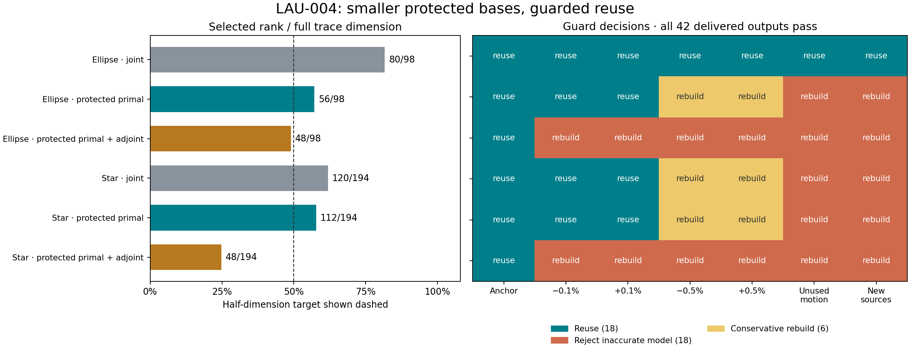

# LAU-004 — protected spans reduce rank; a guard makes local reuse reliable in the pilot

Executed under the user's “go” after LAU-003. [Contract](../../../../docs/iterations/laurent/iteration_05/03_plan.md)
· [Raw pilot](../LAU-004-20260917-pilot-01/) ·
[Previous result](../LAU-003-20260917-closeout/README.md).

**Result:** preserving the primal span before compressing tangents reduces the
selected rank from 80 to 56 on the ellipse and 120 to 112 on the asymmetric
star. A defect-based guard rejects every physically inaccurate frozen model
in this pilot; rebuilding at refused candidates delivers **42/42 physical
passes**, with 18 reuses, 24 rebuilds and no full-model fallback.

**Limit:** no hierarchical basis at or below half the full dimension is reused
successfully away from its anchor. The compact-reuse release criterion fails,
so the eight-case campaign does not run. This is a useful rank and correctness
result, not a speed result or a completed inverse method.



## Matched construction comparison

All arms use the same native Laurent operator, analytic shape derivatives,
four training directions, two unused evaluation directions, geometry/acquisition,
rank ladder, selection tolerances and independent physical gates. Only basis
construction changes. Each candidate starts from the same anchor basis; there
is no advantageous path ordering or cumulative use of evaluation observations.

| Basis | Ellipse rank / 98 | Star rank / 194 | Ellipse family storage / full | Star family storage / full |
|---|---:|---:|---:|---:|
| Joint tangent POD | 80 | 120 | 78.3% | 48.8% |
| Protect primal, then tangent corrections | **56** | **112** | **45.0%** | **43.6%** |
| Protect primal and receiver adjoints, then tangents | 48 | 48 | 35.8% | 12.0% |

The protected primal arm reduces rank by 30.0% / 6.7% versus the fresh matched
joint-POD control. Its counted stored family is 42.5% / 10.7% smaller than that
control. Counts include V, A/b/C, six projected derivatives and LU; transient
full assembly, snapshots and validation are excluded. These are exact model
storage formulas, not measured process-memory reductions. Dense full matrices
are still assembled and retained by the diagnostic runner.

LAU-003's ellipse joint rank was 90; this experiment adds a common rank-80 step
for all arms. **80 to 56** is the identifiable construction comparison here.
The older 90-to-56 difference also includes the changed rank ladder and is not
attributed entirely to protected spans. No old results were reclassified.

The 48-dimensional primal/adjoint model already matches anchor derivatives;
selection therefore adds no tangent modes in that arm. It must rebuild on all
12 nonanchor candidates. Protecting adjoints proves useful for anchor accuracy,
but does not by itself supply the tangent content needed for local reuse.

## Physical reuse and refresh results

Both protected-primal bases pass the physical gates at the anchor and after
all four training-span geometry motions (+/-0.1% and +/-0.5% radius). At the
larger offsets, the ellipse's worst physical residual is 2.20e-7 and derivative
error 3.32e-6; the star's are 1.14e-7 and 3.44e-4. Both fail when the geometry
moves in the two untrained directions or when sources rotate. Those failures
remain in the frozen-model records.

The guard does not read Kress truth, native solution truth or the two evaluation
derivatives. It uses current A/b/C, reduced primal/receiver-adjoint solutions,
the four training tangents and the minimum singular value of A. It requires
native primal residual <=1e-7, paired finite-system field bound <=1e-7 and four
paired derivative bounds <=1e-4. The finite-system bounds do not certify the
continuum discretization or unused shape directions. Independent Kress checks
assess those separately.

Across the 42 initial frozen cases:

- 24 meet all physical gates; 18 fail.
- The guard accepts 18, all physically accurate, and refuses all 18 failures.
- It also refuses six physically accurate cases: the protected-primal model
  at both large offsets on each fixture, plus the joint model at both large
  star offsets. These conservative rebuilds are counted, not hidden.
- Rebuilding at the current candidate with the same training-only selection
  yields 24 accepted physical passes. None requires the full fallback.

All 42 delivered outputs pass, with worst field error **1.06e-9**, physical
residual **4.27e-8**, and six-direction derivative error **3.88e-4**. Objective
derivative gates also pass. Among nonanchor candidates, reuse occurs 12 times
and rebuilding 24 times. The protected-primal arm reuses its basis on both
small motions for both fixtures, but its ranks 56/98 and 112/194 exceed half.
These are related deterministic configurations, not 42 independent recoveries.

All 18 physically inaccurate frozen models also exceed the simple primal
residual guard; the stronger sensitivity bounds are **not shown necessary**
by these particular physical cases. They are checked algebraically against a
field-exact/wrong-derivative counterexample in the tests. Two conservative
rebuilds arise from the field bound alone. Thus the pilot supports the complete
safe-delivery policy empirically, but does not establish that its expensive
stability calculation is better than a cheaper residual rule on these scenes.

## Bound and validation

For reduced state X, receiver adjoint Z and reduced shape tangent Xj, define
`R=b-A X`, `S=C* - A*Z`, and `Rj=bj-Aj X-A Xj`. With sigma the smallest singular
value of A, the implementation bounds paired field and derivative errors using
these defects and `||Aj||_2`; the full formula is in the contract and
`model.guard`. The bound follows from `U-X=A^-1 R` and the adjoint residual
identity. It is an exact-arithmetic finite-matrix statement, not an interval
arithmetic certificate. Read-back allows 1e-10 times the reference output norm
for floating-point comparisons; guard thresholds themselves are not relaxed.

**90 tests pass** across all five Laurent packages. Seven new tests check
orthogonality and protected prefixes, unused-direction anchor interpolation,
absence of spurious correction modes, complex defect bounds across eight
random systems, rejection of accurate-field/wrong-derivative models, full-span
acceptance without solution-reference access, and fail-closed relative bounds.

All **14/14 full physical controls** qualify independently at 256/384 Kress
nodes. All **12/12 physical finite-difference checks** pass at steps 1e-4 and
5e-5; maximum error is 3.96e-7. B=128 to 160 changes anchor fields by at most
5.02e-15 and their derivatives by at most 9.05e-15. All **66/66 finite-system
bounds cover** their independently computed native errors within the stated
floating-point allowance. There are no observed guard false acceptances,
including the two unused directions in physical evaluation.

The saved-output audit reconstructs physical and objective gates, 396 direction
records, defect-bound formulas/errors, rank-selection predicates and 42 policy
decisions. Both this bundle and the old LAU-003 bundle pass source/artifact hash
checks. The older numerical code and its results were not changed.

## Resources, release decision and limits

The pilot used 56 assemblies, 482 factorizations, 1,286 RHS batches / 30,864
columns, 98 analytic operator derivatives and 70 stability SVDs. Wall time was
34.82 s; peak RSS 0.436 GiB. Budgets were 180 assemblies, 2,000 factorizations,
5,000 batches, 30 minutes and 6 GiB. No resource or source-drift failure occurred.
The new guard calculations total 0.246 s and stability calculations 0.103 s in
this diagnostic. These timings are not a controlled speed comparison: each
candidate also builds/solves the full native and independent evaluation models,
and setup/factorization costs would need to be measured in an actual inverse.
Single BLAS/OpenMP threads were used; host-wide isolation is unverified.

Every numerical qualification release condition passes. The **compact nonanchor
reuse condition fails**, so no full campaign is released. Do not replace this
criterion with “42/42 delivered outputs” after seeing the results: frequent
rebuilding can make accurate delivery trivial without making an inverse faster.

Standing limitations: two previously used development fixtures, one common
frequency, deterministic motions, known single component and fixed lossless
unit-permeability materials. No noisy inverse, topology or production change.
Generic constrained POD and residual estimates are not claimed as inventions.
The candidate contribution remains a sensitivity-preserving Laurent inverse
model with measured update/rebuild behavior; that complete inverse behavior
has not yet been demonstrated. Independent reviewer: unassigned.

The next discriminating work is **enrichment after a defect is detected**:
compare adding a few residual corrections with rebuilding the whole basis,
accounting for the required full solves. Selection should anticipate a finite
shape move, since the smallest anchor-accurate primal/adjoint rank always stops
at 48 here. A future inverse must measure total work against the qualified
nodal/compiled baseline; another anchor accuracy demonstration is insufficient.

## Reproduce

```bash
export OMP_NUM_THREADS=1 OPENBLAS_NUM_THREADS=1 MKL_NUM_THREADS=1
export PYTHONPATH=solvers:.
PY=/home/drdeng/miniconda3/envs/EMNerf/bin/python
$PY -m pytest -q experiments/modal_muller_research experiments/laurent_compression experiments/laurent_literature experiments/laurent_tangent_rom experiments/laurent_adaptive_rom
$PY -m experiments.laurent_adaptive_rom.run --stage pilot --output /tmp/lau004-new
$PY -m experiments.laurent_adaptive_rom.audit /tmp/lau004-new
```

`plot.py` reads the preserved pilot to regenerate the figure without numerical
reruns. The campaign driver remains unexecuted after the release criterion fails.
