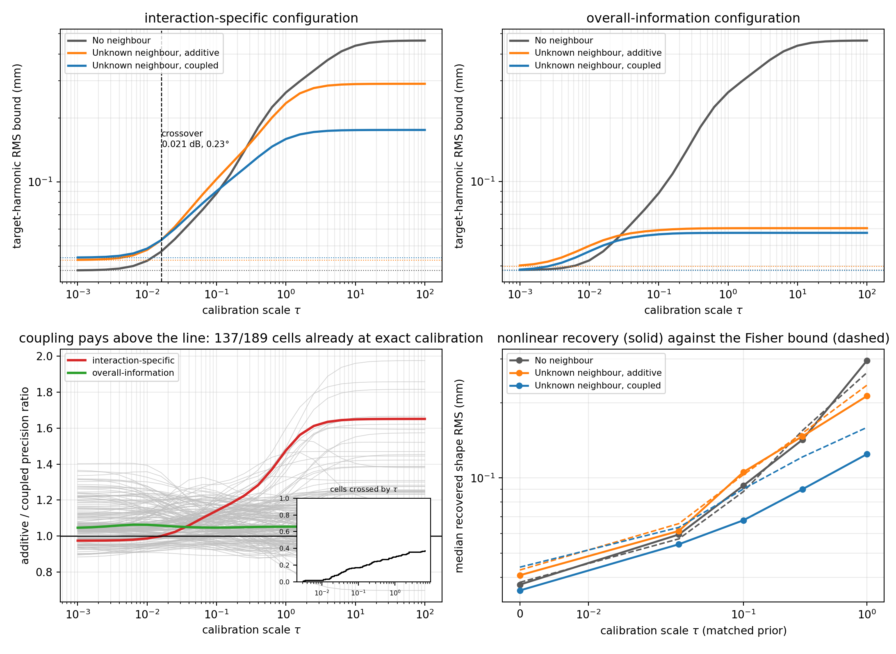

# LAU-005 — a neighbour mostly helps by illumination, and calibration sets where it does not

2026-09-18. Closeout of [LAU-005](../../../../docs/iterations/laurent/iteration_06/03_plan.md),
the alternative the [priority review](../../../../docs/iterations/laurent/iteration_06/02_proposals/01_outsider_priority_review.md)
left open when generic trace compression was parked.

## Finding

The [neighbour study](../../../experiments/laurent_neighbour_20260916/report.md) named
**scattering-assisted separation of shape and calibration** as its useful hypothesis, and
was careful to say that its own results left *"the stronger claim of improved shape sensing
with perfect calibration unsupported"*. This experiment settles that open question by
making calibration uncertainty continuous instead of binary.

Replacing the known/unknown gain switch by a Gaussian log-gain prior of scale `tau` —
`tau=0` exact calibration, `tau=1` the study's own truth gain scale, `tau`→∞ its free-gain
arm — gives one family that contains both of its endpoints. Across **all 189
configuration/prior cells of the recorded screen**:

- The claim the study left unsupported **holds in most of them**. Coupling already beats
  the additive control at **exact** calibration in **137/189**
  cells. There the benefit cannot be a nuisance-ambiguity effect, because no calibration
  nuisance is left: it is illumination.
- **70/189** cells instead cross over — coupling pays only once
  calibration is worse than `tau*` — with median `tau*` **0.132**
  (**0.172 dB**, **1.89 degrees** of
  per-antenna gain error, one standard deviation).
- **15/189** cells never pay at any calibration quality.

The configuration the study analysed is one of the crossing minority, and it crosses very
early: additive/coupled precision ratio 0.974
at exact calibration, rising to 1.651 with free
gains, crossing at `tau*` = 0.016
(0.021 dB,
0.23 degrees). That is not an accident:
it was *selected* to maximise the coupled-over-additive gain **with gains free**, which is
exactly the criterion that rewards the calibration-ambiguity mechanism. The
**overall-information** configuration, selected without that criterion, never crosses —
coupling helps by 1.044x at exact calibration and
1.052x with free gains.

So the mechanism the study proposed is real but is **not** the main reason a neighbour
helps. Two thresholds should be quoted separately and not merged: for the configuration it
analysed, coupling stops paying below 0.021
dB / 0.23 degrees of gain error; across
the crossing cells generally, below 0.172 dB /
1.89 degrees. Both are far tighter than the 1.303 dB / 14.3 degree
errors the study actually simulated, which is why its `tau=1` arm looked like a pure
calibration effect.



## The two endpoints are the recorded study, exactly

Every swept curve is checked against the neighbour study's own screen at both ends. Over
all 189 cells and four neighbour arms, the worst relative disagreement is
**1.48e-14** at the free-gain endpoint and
**0.00e+00** at the known-gain endpoint.
No curve is non-monotone in `tau` beyond `1e-9` relative: a looser calibration prior never
adds information. Those two checks are what make this a reparameterisation of the recorded
result rather than a new quantity.

## Matched nonlinear recovery agrees with the bound

The interaction-specific configuration, five arms, two fixed shape pairs,
10 gain/noise seeds, two initialisations, lower training cost
selected without truth. At each `tau` the truth gains are the **same standard-normal draw
rescaled**, so the sweep is paired across calibration levels, and the inverse carries
exactly the prior that generated them.

Median recovered target-harmonic error (mm):

| Physical world / available knowledge | tau=0 | tau=0.03 | tau=0.1 | tau=0.3 | tau=1 |
|---|---:|---:|---:|---:|---:|
| No neighbour | 0.037 | 0.059 | 0.093 | 0.142 | 0.295 |
| Known neighbour, coupled | 0.028 | 0.048 | 0.068 | 0.077 | 0.071 |
| Unknown neighbour, coupled | 0.035 | 0.054 | 0.068 | 0.090 | 0.125 |
| Known neighbour, additive | 0.037 | 0.062 | 0.077 | 0.084 | 0.084 |
| Unknown neighbour, additive | 0.041 | 0.061 | 0.106 | 0.147 | 0.213 |

With exact calibration (`tau=0`) the coupled and additive arms are statistically
indistinguishable and both are far better than the isolated target
(0.035 and
0.041 against
0.037 mm): paired mean
-0.0042 mm,
95% interval
[-0.0090,
+0.0008] mm.
At the study's own gain scale (`tau=1`) coupling is ahead again:
0.125 against
0.213 mm, paired mean
-0.1023 mm,
95% interval
[-0.1549,
-0.0560] mm.

**Bridge arm.** One setting keeps the recorded study's improper flat gain prior at
`tau=1`; it is the same inverse object, verified by a test that compares its residual and
Jacobian against the study's own. Restricted to the five seeds per scene the study ran, it
reproduces **all five published medians exactly**: no neighbour 0.654 mm, known neighbour, coupled 0.075 mm, unknown neighbour, coupled 0.118 mm, known neighbour, additive 0.091 mm, unknown neighbour, additive 0.257 mm. This stage's own medians
differ only because it doubles the seeds (0.133 mm
coupled, 0.257 mm additive,
0.502 mm isolated over
20 cases). Knowing the calibration prior is itself worth
1.06x
on the coupled arm at the same calibration quality, and
1.70x on
the isolated target — a modelling gain, not a neighbour effect, and a further sign that
part of what the neighbour buys is calibration information that a prior can also supply.

**Dependency drift.** Of the 64 source files the neighbour bundle
hash-pins, 2 differ in this checkout: `solvers/gpr_bem_kress/multicomponent.py`, `solvers/ordered_boundary/validation.py`. Both were
changed by the speed-up track's commit `25de4cd`, before this experiment, and neither was
touched here. The bridge arm reproducing all five published medians exactly is the direct
evidence that this drift does not perturb the results compared against. Every other pinned
file, including all of `laurent_neighbour`, `laurent_calibration` and
`modal_muller_research`, is unchanged.

Every selected state was re-checked against a fresh 192-node full-boundary solve; the worst
relative forward discrepancy is
**3.07e-14**, and
600/600 selected
fits converged.

## What this does and does not establish

- It is a **local Fisher result over the recorded screen**, plus nonlinear confirmation on
  one configuration. The screen's configurations are a 63-point synthetic scan, not a
  sample of real scenes.
- The Gaussian prior on log gains is a **modelling choice**, not a measured calibration
  distribution. `tau` is reported in dB and degrees so it can be compared with an
  instrument specification, but no instrument was measured.
- Standing limits are unchanged: lossless homogeneous 2-D TMz, exterior permittivity 6,
  one target and at most one neighbour, disjoint bounding circles, known component count
  and identity, locally constrained starts, no air/soil interface, antenna pattern, clutter
  or conductivity.
- **No production promotion, no speed claim, no Laurent-specific novelty claim.** The
  compiled scattering path is used because it is the qualified tool for this scene, not
  because the result belongs to it; the same sweep could be run on a nodal forward.
- Two fixed shape pairs and 10 seeds per pair are feasibility
  statistics. Bootstrap intervals resample seeds within a fixed shape pair and do not
  describe generalisation to other shapes or neighbour positions.

## Reproduce

```bash
export OMP_NUM_THREADS=1 OPENBLAS_NUM_THREADS=1 MKL_NUM_THREADS=1
export PYTHONPATH=solvers:.
/home/drdeng/miniconda3/envs/EMNerf/bin/python -m pytest -q experiments/laurent_identifiability
/home/drdeng/miniconda3/envs/EMNerf/bin/python -m experiments.laurent_identifiability.run --stage sweep
/home/drdeng/miniconda3/envs/EMNerf/bin/python -m experiments.laurent_identifiability.run --stage recover
MPLCONFIGDIR=/tmp/laurent-mpl /home/drdeng/miniconda3/envs/EMNerf/bin/python -m experiments.laurent_identifiability.analyze
```

Sweep curves, per-fit records, summaries, paired statistics, qualification and the
source/environment manifest are in
[`LAU-005-20260918-calibration-sweep-01/`](../LAU-005-20260918-calibration-sweep-01). No production default, prior bundle or
neighbour/calibration source file was changed.
