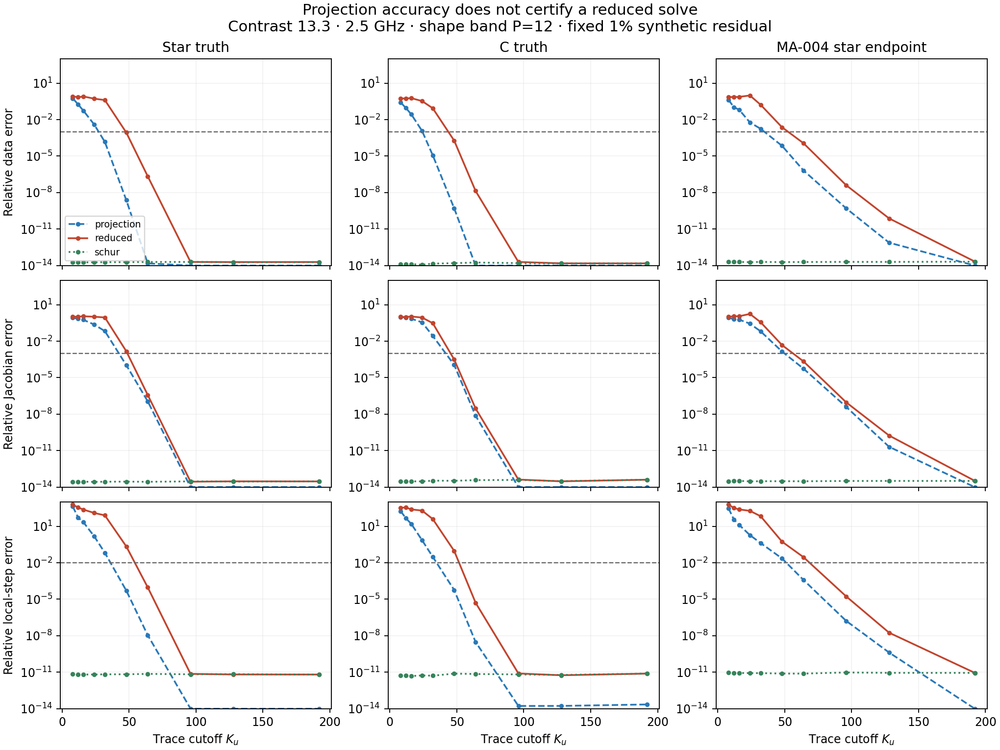
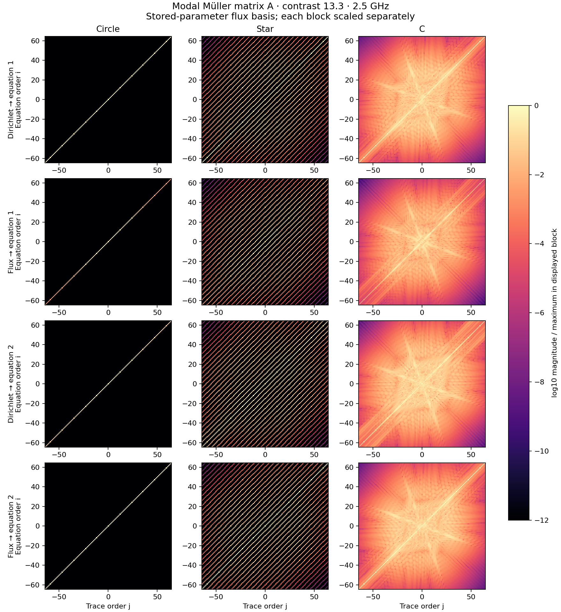
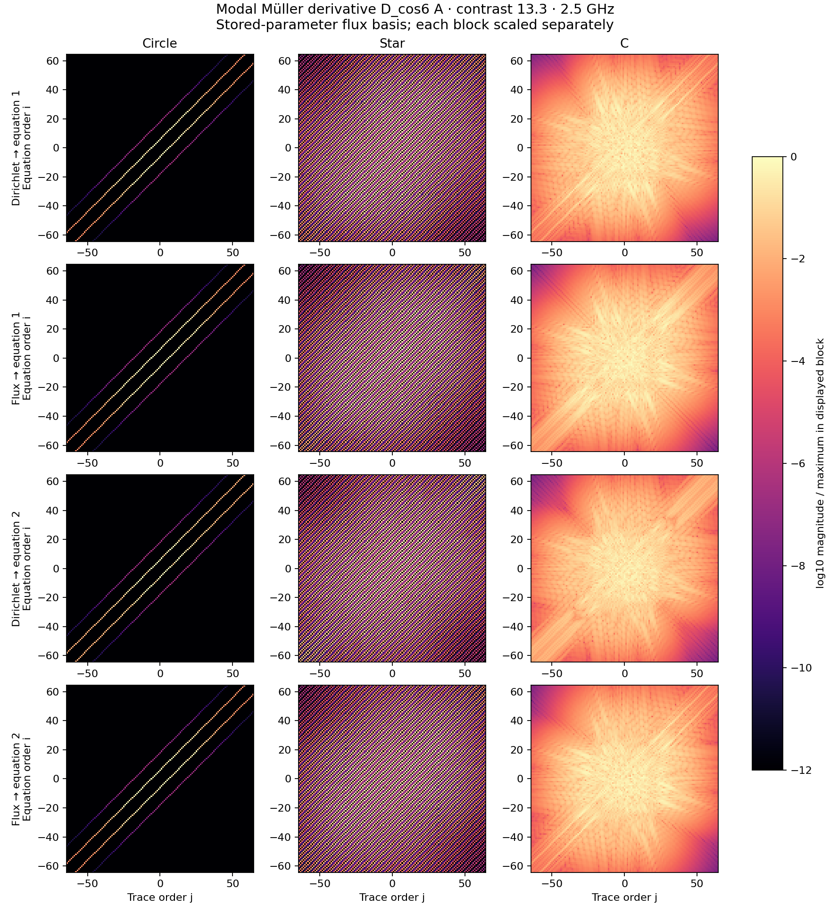

# MA-006 evidence — modal operators and trace cutoff

Ten fixed cells; nine qualify. This is a projected-Nyström modal atlas in the stored curve parameter, with flux unknowns and a unitary DFT. It is not a coefficient-native assembler or a deployed adaptive solver.

[Contract](../../../../docs/iterations/modal_atlas/iteration_06/03_plan.md) · [Interpretation](../../../../docs/iterations/modal_atlas/iteration_07/01_results.md)

The frozen contract records status at launch. `index.json` and the interpretation record completion.

## Smallest sufficient tested cutoff

Data/J requires both relative errors ≤ 1e-3. The local-update gate additionally requires gradient and fixed-ridge step errors ≤ 1e-2. Every larger tested cutoff must also pass. Shape directions extend only through P=12. These are ladder values, not exact minimal cutoffs.

| Cell | Qualified | Projection: data/J | Reduced: data/J | Projection: local update | Reduced: local update |
|---|---|---:|---:|---:|---:|
| circle_c0.5_f0.5 | True | 8 | 8 | 8 | 8 |
| circle_c0.5_f2.5 | True | 12 | 12 | 12 | 12 |
| circle_c13.3_f2.5 | True | 12 | 12 | 12 | 12 |
| star_c0.5_f0.5 | True | 16 | 16 | 16 | 16 |
| star_c0.5_f2.5 | True | 24 | 24 | 32 | 32 |
| star_c13.3_f2.5 | True | 48 | 64 | 48 | 64 |
| c_c0.5_f2.5 | True | 24 | 24 | 24 | 24 |
| c_c13.3_f2.5 | True | 48 | 48 | 48 | 64 |
| star_D_c13.3_f2.5 | True | 64 | 64 | 64 | 96 |
| c_D_c13.3_f2.5 | False | — | — | — | — |



## Persistent atlas

Each `<cell>/atlas.npz` contains the full complex 1024 × 1024 modal matrix `A` (four 512 × 512 trace blocks), joint source/reciprocal RHS `B`, receiver map `R`, both Dirichlet and flux `trace_coefficients`, geometry and basis metadata, and selected `dA`, `dB`, `dR` for constant and cosine-6 shape directions. The first 24 RHS columns are sources and the next 24 are unit-strength reciprocal receivers. `modes` specifies FFT ordering; coefficients use unitary normalization, not Fourier-series 1/N normalization.

It also retains the complex data/Jacobians, gradients, steps and reduced traces for every cutoff, plus reference and independently refined data/Jacobians. `feedback_K*` records A_LL^{-1} A_LH x_H. Full matrices permit later block, Schur, derivative and acquisition-aware analysis without regenerating the BIE solves.

`metrics.json` stores qualifications, four-block low/high coupling norms, retained conditioning, both trace tails, Schur corrections, discrete/Hadamard derivative comparisons, timings and artifact hashes. `manifest.json` freezes numerical sources, the two endpoint inputs, acquisition input and run environment.





## Validation, work and limits

Read-back audit: **PASS**, 300 arm/cutoff records. Five tests passed before collection. Actual campaign: 130.9 s, 100 nodal assemblies, 20 nodal factorizations, 300 reduced/Schur factorizations, 452.8 MiB of numerical snapshots. One CPU worker and one BLAS thread. Timings are descriptive; host load was not controlled.

The work ledger names primary reference/reduced/derivative RHS columns. Schur high-block elimination also solves against A_HL and B_H (sum over cutoffs of retained dimension + 48 RHS per cell), its corrected low solve uses 48 RHS, and the feedback diagnostic uses another 48 retained RHS. These diagnostic costs are additional to the primary RHS counters; factorization counts include all three per cutoff. No end-to-end speedup is claimed.

The failed C endpoint passes field/Jacobian grid checks but misses the fixed Cartesian direction-window fidelity gate: normal-basis projection discrepancy 2.17e-4 exceeds 1e-4. Its raw matrices are retained, but it receives no cutoff recommendation. This does not diagnose its reconstruction failure.

The 25-column Hadamard Jacobian and the two selected discrete-model derivatives are distinct objects at finite cutoff. The latter include changes in matrix, incident map and readout. A small data error alone does not certify either derivatives or a useful update. Schur reconstruction is a correctness control with full omitted-space work, not a compression method.

No high-update-band (M=37–85) qualification, native coefficient-workspace study, parameter-gauge invariance, noise model, timing benefit, or inverse recovery is established here.

## Reproduction

```bash
export OMP_NUM_THREADS=1 OPENBLAS_NUM_THREADS=1 MKL_NUM_THREADS=1
export PYTHONPATH=solvers:. SC_FORWARD_BACKEND=cpu
/home/drdeng/miniconda3/envs/EMNerf/bin/python -m pytest -q -p no:cacheprovider experiments/modal_atlas
/home/drdeng/miniconda3/envs/EMNerf/bin/python -m experiments.modal_atlas.operator_atlas collect --output <fresh-directory>
/home/drdeng/miniconda3/envs/EMNerf/bin/python -m experiments.modal_atlas.operator_atlas_report results/validation/modal_atlas/MA-006
```
