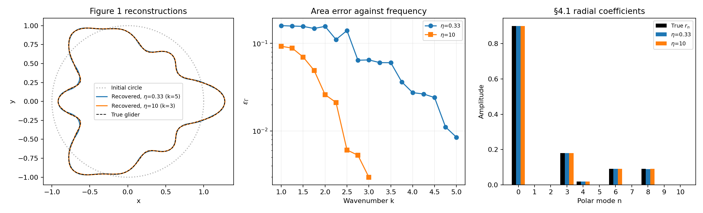

# SC-013 — Figure 1 glider recovered on the paper profile

Run on 2026-09-22 at source `c5077ab6b3928fe29a83bf3cf917f595e4d9dc56` plus the
uncommitted changes described below. Both bundles audit with **no source hash
mismatches**. This supersedes [SC-012](../SC-012-paper-glider-k2/README.md)'s
stall as the current state of the §4.1 boundary inverse; SC-012's records and
its failure remain unchanged.

**The frequency ladder completes and the shape is recovered.** Every stage is
committed after its N/2N field and full-Jacobian check, and every accepted
update strictly decreased its own stage residual.

| | contrast `ki²/k² = 0.33` | contrast `ki²/k² = 10` |
|---|---:|---:|
| Ladder | k = 1 → 5 (17 stages) | k = 1 → 3 (9 stages) |
| Final area error `εΓ` | **0.849%** | **0.297%** |
| Final stage data residual | 5.87e-4 | 1.23e-5 |
| Accepted updates | 102 | 327 |
| Forward solves / Jacobians | 272 / 136 | 386 / 345 |
| Wall clock | 241.97 s | 355.45 s |
| Max / RMS radial error | 0.01826 / 0.00592 | 0.00511 / 0.00175 |

Timings are two single-threaded processes that ran concurrently on a 24-core
host, so they are not a controlled wall-clock comparison with each other or
with SC-012. Solve counts are exact. The area error is the evaluation-only
polygon symmetric difference described in the [audit](../../../../experiments/shape_continuation/PAPER.md#area-scoring);
truth is never visible to the optimizer.



The recovered polar coefficients match the §4.1 glider
`r(t) = 0.9(1 + 0.2cos3t + 0.02cos4t + 0.1cos6t + 0.1cos8t)`:

| Mode n | 0 | 3 | 4 | 6 | 8 |
|---|---:|---:|---:|---:|---:|
| True `r_n` | 0.9000 | 0.1800 | 0.0180 | 0.0900 | 0.0900 |
| Recovered, `η`=0.33 | 0.9001 | 0.1798 | 0.0180 | 0.0900 | 0.0893 |
| Recovered, `η`=10 | 0.9000 | 0.1800 | 0.0180 | 0.0900 | 0.0900 |

Every spurious mode is below 4.3e-4 at `η`=0.33 and below 4.0e-5 at `η`=10.
`η`=10 reconstructs better than `η`=0.33 at every shared frequency, which is
the ordering Figure 1 reports; the larger interior wavenumber widens the update
band `floor(3 max(k,ki))` at the same exterior frequency.

## What changed since SC-012

The user identified the authors'
[reference implementation](../../../../docs/reference/papers/README.md#reference-implementation)
on 2026-09-22. Reading it settled four settings the manuscript states loosely,
each of which this pipeline had implemented differently. The
[audit](../../../../experiments/shape_continuation/PAPER.md#profile-and-fidelity-audit)
owns the full table; the four are:

1. **Trust-region band.** `n_curv = max(n_curv_min, M)` with `n_curv_min = 20`,
   not the manuscript's `⌈ck⌉`. At k=1 the old band was 2 while the update band
   M was 3, so the band excluded the update's own highest harmonic.
2. **Trust-region tolerance.** `eps_curv = 0.1` bounds an *amplitude* ratio, so
   our energy fraction takes the squared value `0.01`.
3. **Gaussian filter.** It damps harmonic `n` of the normal update `h` by
   `exp(-(n/M)²/sigma)`. Eq.19 instead reads as the stored-curve band and
   `sigma²`, under which the first levels are no-ops and the rest collapse the
   update to a translation.
4. **Steepest descent.** It is scaled to the Cauchy point
   `t = |J*r|²/|J J*r|²`. Eq.18 names only the direction, whose raw magnitude
   is arbitrary.

**Only the first is demonstrated to have ended the stall.** With the band
widened, the unfiltered Gauss-Newton step became admissible and decreasing at
k=1, and a `k ≤ 2` ladder run with correction 1 alone produced a trajectory
identical to one with all four. That comparison is the working-directory check
recorded in [the iteration-02 results](../../../../docs/iterations/shape_frequency_continuation/iteration_02/01_results.md);
its outputs were not preserved as a separate bundle.

Corrections 3 and 4 are exercised differently by the two contrasts:

| | `η`=0.33 | `η`=10 |
|---|---:|---:|
| Accepted by Gauss-Newton | 102 | 23 |
| Accepted by steepest descent | 0 | 304 |
| Proposals refused by the curvature gate | 0 | 59 |
| Proposals refused as invalid geometry | 0 | 245 |
| Filter levels beyond 0 used | 0 | 0 |

At `η`=10 the Gauss-Newton step is usually too large — self-intersecting or
over-curved — and the Cauchy-scaled steepest-descent step carries the run. So
correction 4 is load-bearing there, even though it changed nothing at
`η`=0.33. **The Gaussian filter is never reached in either ladder**, so
correction 3 is a fidelity repair with no measurement behind it here.

## Limits

- Two contrasts of one shape, noiseless, full aperture, known contrast, single
  component, in dimensionless coordinates. This is §4.1 only.
- The ladders stop at k=5 and k=3; the paper's grid runs to k=30 and its
  snapshots are k=1, 5 and 10. Cost grows as the dense `N³` with `N ∝ L k
  max(1,√η)`, so `η`=10 is the more expensive case per frequency.
- At `η`=10 the first six stages stop on the 50-iteration limit, not on the
  step tolerance, so each costs the paper's maximum. The reference drivers
  loosen `eps_upd` to `1e-3`, which we did not adopt; that would cut this cost
  and is untested here.
- Nodal Müller/Kress replaces Alpert quadrature, and the remaining declared
  differences in the [audit](../../../../experiments/shape_continuation/PAPER.md)
  still stand. Matching `εΓ` is not a claim of identical trajectories.
- No adaptive shape/frequency policy is compared here. This is the fixed
  increasing ladder, which is the baseline such a comparison would need.

## Reproduce

Analysis of the saved bundles, with no forward or inverse solves:

```bash
env OMP_NUM_THREADS=1 OPENBLAS_NUM_THREADS=1 MKL_NUM_THREADS=1 \
  PYTHONPATH=solvers:. MPLCONFIGDIR=/tmp/shape-continuation-mpl \
  /home/drdeng/miniconda3/envs/EMNerf/bin/python \
  results/validation/shape_continuation/SC-013-paper-glider-recovery/analyze.py
```

It asserts the qualification, commit and monotone-residual invariants, writes
[analysis.json](analysis.json), and reports any source file that has changed
since the runs. The original inverse commands, recorded for provenance:

```bash
env OMP_NUM_THREADS=1 OPENBLAS_NUM_THREADS=1 MKL_NUM_THREADS=1 PYTHONPATH=solvers:. \
  /home/drdeng/miniconda3/envs/EMNerf/bin/python -m experiments.shape_continuation.paper \
  --mode run --contrast 0.33 --k-stop 5 --max-forwards 3000 --max-seconds 3000 \
  --output run-contrast-0.33

env OMP_NUM_THREADS=1 OPENBLAS_NUM_THREADS=1 MKL_NUM_THREADS=1 PYTHONPATH=solvers:. \
  /home/drdeng/miniconda3/envs/EMNerf/bin/python -m experiments.shape_continuation.paper \
  --mode run --contrast 10 --k-stop 3 --max-forwards 3000 --max-seconds 3000 \
  --output run-contrast-10
```

Both budgets were generous ceilings, not the measured cost; neither was reached.
Tests at this source: **54 in the package**, and **168** together with
`pytest/gpr_bem_kress` and `pytest/ordered_boundary`.
