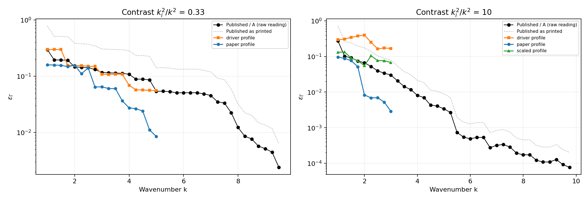

# SC-014 — Figure 1 profile comparison; reproduction provisional

**Interpretation amended by Codex on 2026-09-22**, after review of `1a6a55a`.
The [review and concerns](../../../../docs/iterations/shape_frequency_continuation/iteration_03/02_proposals/01_codex_review.md)
supersede this report's earlier claims of a settled plotting convention,
recovered band rule and replicated low-contrast curve. Measurements and saved
bundles are unchanged; the original wording remains in Git at `1a6a55a`.

Runs were made on 2026-09-22. Each manifest records base commit `8e5c152` plus
working-tree edits; all five arms' 41 source hashes match reviewed code at
`1a6a55a`. All 61 stages were committed after reported passing N/2N field and
full-Jacobian checks. Review inspected those records without rerunning the inverse.

SC-013 found lower shape errors than the digitized curve under the paper's
printed normalization. SC-014 tests several settings and both area
interpretations. It shows that these choices substantially change agreement;
it does not identify the inputs or plotting path that produced Figure 1.



## Result

Agreement is the ratio published/ours per frequency, summarised as the RMS of
its base-10 logarithm — 0 means the curves coincide, 0.3 means a typical factor
of two in either direction. Both readings of the published y axis are reported;
see [the audit](../../../../experiments/shape_continuation/PAPER.md#area-scoring).

| Contrast | Profile | Ladder | Forwards | raw reading | as printed |
|---|---|---|---:|---:|---:|
| 0.33 | **driver** | k=1→5 | 206 | **0.117** | 0.459 |
| 0.33 | paper (§4 prose) | k=1→5 | 272 | 0.424 | 0.796 |
| 10 | **scaled** | k=1→3 | 126 | **0.246** | 0.376 |
| 10 | driver | k=1→3 | 167 | 0.629 | 0.276 |
| 10 | paper (§4 prose) | k=1→3 | 1334 | 0.675 | 1.052 |

**Contrast 0.33 shows encouraging partial agreement over k ∈ [1,5]** under
the raw-area hypothesis and our driver-inspired profile. The published/ours
ratio has median 1.0367, range **0.6504–1.5688**, and log10 RMS 0.1170. The
staircase-like structure resembles the digitized curve, but the median is not
pointwise agreement within 4%. The `paper` profile generally produces smaller
shape errors under this reading, by up to 7.75x at k=4.75; it is not uniformly
below the curve at every frequency.

**Contrast 10 does not replicate.** The published curve falls by a factor of 9
over k=1→3; the prose profile falls by 33 (ending ~6x *below* published), the
driver profile by 1.7 (ending ~5x above), under the raw-area hypothesis. The
published curve lies between these two tested curves in this window. Since
the profiles change several controls together, that is not an identified
bracket on the authors' bandwidth rule.

## Interpretations that remain open

### Raw-area plotting is plausible, not verified

§4 defines `εΓ = δA/A` and the figure's axis is labelled `εΓ`. The inspected
reference drivers save raw `area(pdiff1) + area(pdiff2)`, which supports checking
the alternative raw reading. We have not recovered the Figure 1 plotting code
or data; normalization could occur after those values are saved. The true area
is 2.6215, so the interpretation makes a substantial difference.

Raw-area plotting gives better agreement for the low-contrast driver-inspired
arm (0.117 versus 0.459). It does not improve every arm: the contrast-10 driver
arm agrees better as printed (0.276 versus 0.629). Selecting a profile and an
axis interpretation from their fit to this same curve is calibration evidence,
not independent confirmation of either choice.

The former argument based on the initial circle is withdrawn. Decreasing
scattering residual does not guarantee decreasing shape-area error. A published
shape-error point worse than that circle would therefore not establish a wrong
axis interpretation. Both readings remain in the comparison.

### The first-stage comparison does not identify the update-band rule

All profiles start from the same unit circle, but they differ in optimizer,
resolution, stopping tolerance and iteration cap as well as update band.
Under the raw-area hypothesis, their first-stage errors are:

| Contrast | Published / A | M=2 (driver) | M=3 or 9 (prose) | M=6 (scaled) |
|---|---:|---:|---:|---:|
| 0.33 | 0.2979 | **0.2984** | 0.1595 | — |
| 10 | 0.2730 | **0.2929** | 0.0962 | 0.1313 |

The M=2 profile is close at contrast 0.33 (about 0.15% apart), and differs by
about 7% at contrast 10. Matching one scalar error does not uniquely determine
the band, optimizer trajectory or author settings. The experiment was not a
controlled comparison changing only M. These observations motivate a hypothesis;
they do not recover the Figure 1 band rule.

## Profiles

| Control | `paper` (§4 prose) | `driver` | `scaled` |
|---|---|---|---|
| Optimizer | GN and SD compared | steepest descent only | steepest descent only |
| Update band M | `floor(3 max(k,ki))` | `floor(2 k L / 2π)` | `floor(2 max(k,ki) L / 2π)` |
| Inverse sizing factor in our K/N formulas | 70 | 30 | 30 |
| RMS displacement tolerance | `1e-5` | `1e-3` | `1e-3` |
| Iteration cap | 50 | 100 | 100 |

`driver` is an existing CLI label for a profile inspired by upstream
`tests/driver_charlie_transmission.m`, a different geometry/material example.
**It does not reproduce that script's inverse resolution or stopping norm.**
The script's local `nppw=30` is for data generation; its inverse starts with
500 nodes and does not set `opts.nppw`. Our inverse sizing factor 30 was
misattributed to that setting. All profiles here stop on RMS displacement;
upstream stops on filtered coefficient norm. The
[audit](../../../../experiments/shape_continuation/PAPER.md#profile-settings-and-provenance)
and [review](../../../../docs/iterations/shape_frequency_continuation/iteration_03/02_proposals/01_codex_review.md)
record the source evidence. In the low-contrast driver arm, 6 of 17 stages stop
while the reference coefficient threshold would still fail.

`scaled` combines the interior wavenumber with arclength scaling. It is
identical to `driver` when `ki <= k`, as `compare.py` asserts. That algebraic
identity does not independently validate the high-contrast rule.

## Limits

- **`scaled` was chosen after seeing `driver` fail at contrast 10.** That is one
  degree of freedom fitted against the digitized plot. It is a proposed
  reconciliation, not a recovered author setting or independently validated rule.
- The published curves run to k=10; ours stop at k=5 and k=3. The contrast-0.33
  agreement is demonstrated over half the published range, covering the k=1 and
  k=5 snapshots but not k=10.
- Figure 1's values are digitized from a printed log plot, at roughly 0.75% per
  pixel, with 35 and 36 of 37 points recoverable. Agreement below a few percent
  is not meaningful.
- Nodal Müller/Kress still replaces Alpert quadrature. The resolution and
  stopping differences above remain in the executed code; documentation changes
  do not repair them or establish what corrected trajectories would be.
- Cost is not the same question as accuracy: the prose profile at contrast 10
  spent 1334 forwards and 639 s to land *further* from the published curve than
  `scaled` did with 126 forwards and 108 s. A smaller distance to the published
  curve is not a better reconstruction. These profiles differ in several
  settings, so this does not isolate a bandwidth speedup or establish efficiency
  at matched recovery quality.
- Timings come from single-threaded processes sharing a 24-core host with up to
  four other arms, so they are not controlled wall-clock measurements. Forward
  counts are exact.

## Reproduce

Comparison of the saved bundles against the digitized figure, no solves:

```bash
env OMP_NUM_THREADS=1 OPENBLAS_NUM_THREADS=1 MKL_NUM_THREADS=1 \
  PYTHONPATH=solvers:. MPLCONFIGDIR=/tmp/shape-continuation-mpl \
  /home/drdeng/miniconda3/envs/EMNerf/bin/python \
  results/validation/shape_continuation/SC-014-figure1-calibration/compare.py
```

It asserts each arm's qualification records, writes [comparison.json](comparison.json)
and the figure above. The published values come from
[SC-013's digitizer](../SC-013-paper-glider-recovery/digitize_figure1.py). The
five inverse commands were `paper.py --mode run` with
`--profile {paper,driver,scaled}`, `--contrast {0.33,10}` and
`--k-stop {5,3}`, under budgets that none of them reached.
