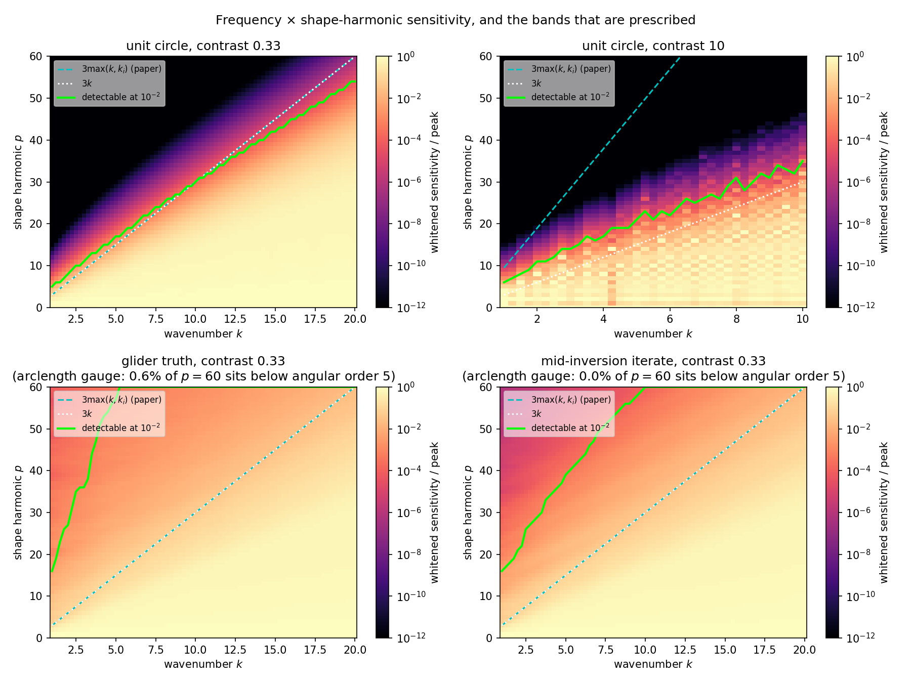
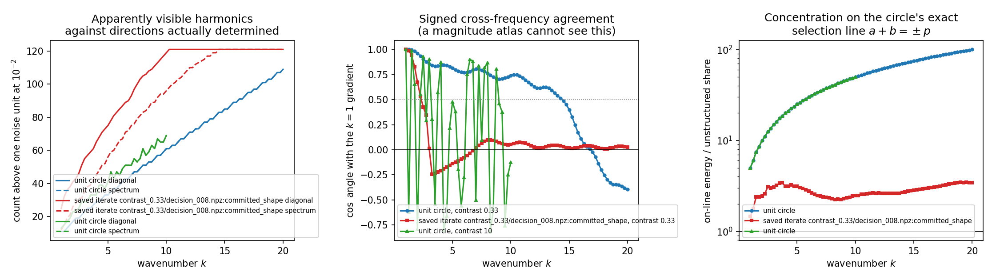
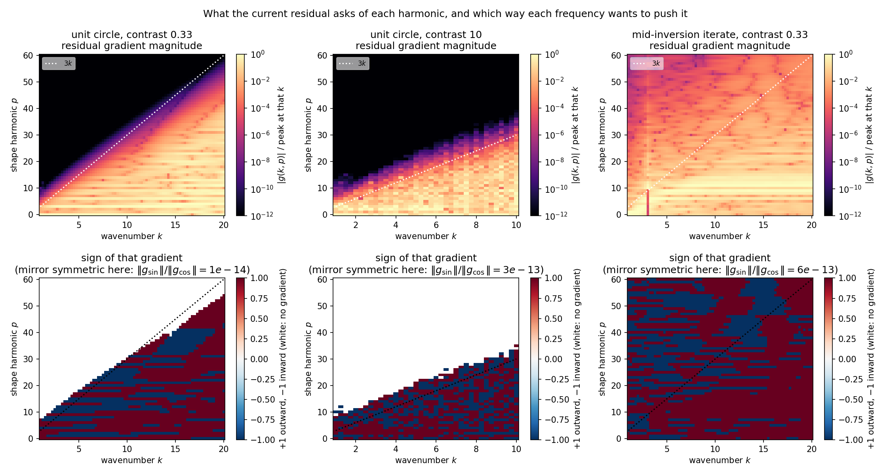

# SC-015 — the frequency × shape-harmonic atlas at a fixed boundary

Runs made 2026-09-23 with `experiments/shape_continuation/survey.py`. Each arm
records, at one declared geometry, what every available frequency says about
every shape harmonic: whitened sensitivity, the signed residual gradient, the
**full** Gauss–Newton block, and its spectrum. Nothing here is an inversion.

Shape coordinates are normal displacements on an `L²(ds)`-orthonormal
arclength-harmonic basis, and data are whitened by `C_ℓ = σ_ℓ² I` with
`σ_ℓ = 10⁻³ ‖d_ℓ‖ / √n_ℓ`. Both conventions are fixed in `atlas.py`; without
them no diagonal number is comparable between harmonics, wavenumbers or
iterates. All lengths are in the geometry's own unit (the target has area-
equivalent radius ≈ 0.9).





## Arms

| Arm | Geometry | Contrast | k | Acquisition | Atlas N/2N gate |
|---|---|---|---|---|---|
| A | unit circle | 0.33 | 1→20, Δ0.25 | `floor(10k)` | passed (≤4×10⁻¹⁴) |
| B | unit circle | 0.33 | 1→20, Δ0.25 | fixed 64 | passed (≤5×10⁻¹⁴) |
| C | unit circle | 10 | 1→10, Δ0.25 | `floor(10k)` | passed (≤1×10⁻¹³) |
| D | glider truth | 0.33 | 1→20, Δ0.25 | `floor(10k)` | passed (≤2×10⁻¹²) |
| E | SC-013 iterate (`decision_008`, boundary error 0.070) | 0.33 | 1→20, Δ0.25 | `floor(10k)` | passed (≤4×10⁻¹³) |

Observations pass their own N/2N refinement gate at 10⁻⁷ before any atlas is
built. The atlas gate compares sensitivity, gradient and the full block at N
and 2N; at a geometry whose residual is solver noise the gradient ratio is
meaningless and is reported but excluded from the verdict.

## Results

**The detectability frontier is `2.5k`, not `3 max(k, kᵢ)`.** Taking a harmonic
as detectable when an RMS normal displacement of 10⁻² moves the data by one
noise unit, the highest detectable harmonic fits

| Contrast | Measured frontier | Manuscript §4 rule | Ratio |
|---|---|---|---|
| 0.33 | 2.53 k + 4.2 | 3 k | 0.84 |
| 10 | 2.92 k + 5.6 | 9.49 k | 0.31 |

So the exterior wavenumber, not the interior one, sets the recoverable band:
raising the contrast from 0.33 to 10 raises the frontier by 1.15×, while
`√contrast` would predict 3.16×. The frontier moves by only ±4% between
detection thresholds of 10⁻¹ and 10⁻³, so it is not an artifact of the
threshold. **Arm B is the control**: holding the acquisition at 64 channels for
every frequency changes the frontier by less than 5%, so the frontier is
physics and not acquisition growth.

**The circle is the one geometry where a heatmap loses nothing.** Rotational
symmetry makes the Gauss–Newton block diagonal in the arclength harmonics, so
on arms A–C the number of harmonics the diagonal calls detectable equals the
number of directions the spectrum actually determines, exactly (median ratio
1.00). At the mid-inversion iterate the diagonal over-reports by a median of
1.21× and up to 2.13×; at the truth, 1.19× and up to 2.27×. Any intuition
about diagonal atlases calibrated on a circle is calibrated on the only case
where the off-diagonal is empty.

**The exact selection rule is a circle property and it is destroyed off the
circle.** `test_atlas.py` proves the structure: rotational equivariance plus
the Hadamard formula force each Jacobian column's double Fourier support onto
the single line `a + b = p` and the resulting order table `V(a,b)` to be
*exactly rank one*, `A_a B_b`, at any contrast and any receiver radius
(checked at contrast 6 and 10, receiver radii 10 and 400, second singular
value below 10⁻⁸ of the first). Ammari–Chow–Zou's `J_n(kR)J_m(kR)h(n−m)` is
the weak-scattering far-field limit of that statement, reproduced here to
within 8%. Measured on the runs, the fraction of a column's energy on that
line is 52.5× the unstructured share on the circle — the maximum possible,
`n_d/2` — and 2.2–2.7× at the truth and at a real iterate. The analytical
selection rule is therefore a benchmark limiting case, not a design rule.

**Frequencies disagree, and the disagreement is measurable without truth.** At
contrast 0.33 from the unit circle the whitened gradient stays aligned with
the `k=1` gradient (cos ≥ 0.74) up to `k≈14`, then collapses through zero and
reaches −0.39 by `k=20`; 14% of all frequency pairs are in outright
opposition. At contrast 10 the alignment falls below 0.5 by `k=1.25` and
42% of pairs oppose, with the sign flipping between adjacent grid points
(1→1.25→1.5 gives +1.00, −0.62, +0.99). The median adjacent-frequency
alignment is 0.999 at contrast 0.33 and 0.268 at contrast 10. A fixed Δk=0.25
ladder is therefore comfortably inside the decorrelation length at low
contrast and marginal at high contrast — which is what SC-013/SC-014 met as
"contrast 10 remains unmatched", now visible as a property of the data rather
than as a tuning failure.

### The residual gradient, which is a different map

`sensitivity.png` asks what a harmonic *could* do to the data. The signed
residual gradient `g(k,p) = Re⟨J_{k,p}, C_k⁻¹ r_k⟩` asks what the *current*
misfit wants it to do, and that is the quantity a descent step actually uses.
They are not the same map and the literature review is explicit that conflating
them is the main conceptual risk.



The magnitude panels (top) differ from the sensitivity map mainly by being
noisier above the frontier: the residual weights a harmonic by how wrong the
boundary currently is there, not only by how visible it is.

The sign panels (bottom) are the part a magnitude atlas cannot produce. **In
this test problem the sign is unambiguous, for a reason worth stating: the
configuration is mirror symmetric.** The glider's radial profile is purely
cosine, the initial circle is centred and the acquisition ring is symmetric, so
every sine component vanishes — the measured `‖g_sin‖/‖g_cos‖` is 1.1×10⁻¹⁴ on
the circle and 6.1×10⁻¹³ at the iterate. Each harmonic's gradient is therefore
a signed scalar and the panel is exactly its sign, ±1 by symmetry rather than
by any discovered structure. The analysis records `sine_fraction` so that a
configuration which breaks the symmetry is not read with this assumption; the
truth-geometry arm already shows 0.63 there, because its residual is solver
noise rather than a real mismatch.

Among cells carrying at least 1% of that frequency's peak gradient, the
fraction pushing *against* the majority of frequencies is **27%** at contrast
0.33 from the circle, **18%** at the mid-inversion iterate, and **40%** at
contrast 10 — where the disagreement is also visibly unstructured, flipping
between adjacent `k` rather than forming bands. That is the same phenomenon as
the alignment collapse in `structure.png`, resolved per harmonic.

## What this does not establish

**The harmonic axis is not gauge-invariant off the circle.** An arclength
harmonic equals an angular harmonic only on a circle. On the glider, 14% of
harmonic 10's amplitude, 7% of harmonic 20's and 0.6% of harmonic 60's lie
below angular order 5, and the measured high-harmonic sensitivity at the truth
(3.2 at `p=60`, `k=2`, against 7×10⁻⁹ at `p=20` on the circle) is converged to
four digits across quadratures from 256 to 1024 nodes but is *within* the
upper bound that this order mixing alone predicts. The flat non-circular
frontier in the lower panels of the figure is therefore not evidence that
curvature lifts evanescence; it is mostly evidence that the axis has changed
meaning. Comparing atlas cells between iterates needs the transport question
settled first (`atlas.transport_overlap` reports the mixing but nothing here
corrects for it).

The sign map's ±1 values are a property of a mirror-symmetric test
configuration, not a general finding; in an asymmetric problem each cell
carries a phase and the projection used here is a choice, not a measurement.
The alignment collapse is measured from the unit circle and from one saved
iterate; it is not a controlled study of distance-to-solution. No inversion
was run in this record, and nothing here shows that any of these quantities
improves a reconstruction — that is SC-017's question.

## Reproduce

```bash
export OMP_NUM_THREADS=4 PYTHONPATH=solvers:.
PY=/home/drdeng/miniconda3/envs/EMNerf/bin/python
$PY -m experiments.shape_continuation.survey --output OUT --geometry circle \
    --contrast 0.33 --k-stop 20 --band 60
$PY results/validation/shape_continuation/SC-015-atlas-structure/analyze.py
```

`analyze.py` regenerates `analysis.json` and both figures from the saved
`atlas.npz`/`summary.json` bundles without re-solving.
