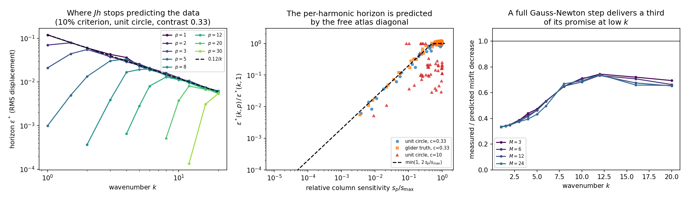

# SC-016 — how far the first-order atlas keeps predicting

Runs made 2026-09-23 with `experiments/shape_continuation/validity.py`. Every
use of an atlas cell — a sensitivity map, a Gauss–Newton step, a frequency
ranking — assumes a finite boundary motion still behaves like its
linearization. This record measures where that stops being true.

Two ladders are walked at one geometry. The first is **residual-free**: along
a single shape harmonic, compare the measured change in the scattered field
with `J h`, and call the *linearization horizon* `ε*(k, p)` the largest RMS
normal displacement whose relative error stays under 10%. The second is the
optimization question: walk a band-restricted Gauss–Newton step and compare
the realised whitened-misfit decrease with the quadratic model's promise.



## Arms

| Arm | Geometry | Contrast | k | Quadrature |
|---|---|---|---|---|
| H1 | unit circle | 0.33 | 1…20 (12 values) | 30 pts/wavelength |
| H2 | unit circle | 10 | 1…10 (9 values) | 30 pts/wavelength |
| H3 | SC-013 iterate, truncated to band 80 (discarded tail 2×10⁻⁸) | 0.33 | 1…20 | 30 pts/wavelength |
| H4 | glider truth | 0.33 | 1…20 | 30 pts/wavelength |
| H5 | unit circle | 0.33 | 1,2,4,8,16 | **60** pts/wavelength, 16-rung ladder |

Displaced curves keep the arclength gauge (`horizon.perturbed`, not the
optimizer's `displaced`), so no horizon depends on a reparameterization
tolerance. Each displaced curve's Fourier truncation error is checked
*relative to its own displacement*, a requirement that is amplitude-
independent because both scale linearly.

## Results

**The measurement is a real second-order remainder, not solver noise.** The
fitted slope of log relative error against log amplitude has median **1.00** in
every arm, which is what a genuine first-order remainder gives; a
discretization floor would give slope 0. **H5 is the control**: at double
quadrature and a 16-rung ladder the horizons agree with H1 to three digits
(0.1194 vs 0.1194 at k=1, 0.0069 vs 0.0069 at k=16), so the horizon is a
property of the geometry rather than of the solver.

**The horizon ceiling is `0.12/k` in RMS normal displacement.**

| Arm | Fitted ceiling | Exponent |
|---|---|---|
| H1 circle, c=0.33 | 0.112 k⁻⁰·⁹⁷ | −0.97 |
| H5 circle, c=0.33, fine | 0.105 k⁻⁰·⁹³ | −0.93 |
| H3 iterate, c=0.33 | 0.089 k⁻⁰·⁹⁰ | −0.90 |
| H4 truth, c=0.33 | 0.085 k⁻⁰·⁸⁹ | −0.89 |
| H2 circle, c=10 | 0.029 k⁻⁰·⁹² | −0.92 |

In wavelengths, `ε* ≈ λ/52` at contrast 0.33 — the shape derivative predicts
out to roughly one fiftieth of a wavelength — and `ε* ≈ λ/220` at contrast 10.
The exponent is −1 to within the fit error at every geometry, including at
the solution, so this is not an artifact of being far from the answer. This
is the quantitative content of "low frequencies control the nonlinearity":
it is not that low frequencies are smoother in some vague sense, but that
their first-order model survives a displacement 20× larger at k=1 than at
k=20.

**The per-harmonic horizon is predicted by the free atlas diagonal.** Measuring
a horizon per cell is unaffordable; it turns out not to be necessary. Within a
frequency, the horizon rises linearly with a harmonic's *relative* column
sensitivity and then saturates at that frequency's ceiling:

```
eps*(k, p) = eps*(k) · min(1, c · s(k,p) / max_q s(k,q)),    c = 2.05
```

Pooled over 188 measured cells the median `|log10(measured/predicted)|` is
**0.044 dex** — 11%. Per arm at contrast 0.33 it is 0.021 dex (H1, 74 cells),
0.033 (H5), 0.042 (H3), 0.043 (H4), with **100% of cells within a factor of
two**. The mechanism is transparent: the second-order remainder of a normal
displacement is nearly harmonic-independent, while the first-order term is
proportional to the column norm, so the ratio that defines the horizon scales
like `1/s_p` until it meets the ceiling. One probe per frequency therefore
calibrates a whole column of the atlas.

**The law fails at high contrast.** At contrast 10 the median error is 0.689
dex and only **12%** of cells fall within a factor of two, because the
sensitivity profile itself is non-monotone in `p` (interior resonances) and
the second-order response acquires its own harmonic structure. The
p-independent-remainder premise is a low-contrast statement.

**Detectability and predictability fail at the same frontier.** Inside the
`2.5k` frontier of SC-015 the horizon is essentially flat in `p` — at `k=8` it
is 0.0141, 0.0161, 0.0145, 0.0150, 0.0142, 0.0129 for `p = 1,2,3,5,8,12` —
and then collapses by orders of magnitude: 5×10⁻⁴ at `p=20` and below 10⁻⁴ at
`p=30`. A harmonic outside the frontier is not merely weak; its leading data
response is second order, so a first-order atlas cell for it is structurally
misleading rather than just small.

**A full Gauss–Newton step is always outside the horizon, and it shows.** From
the unit circle the undamped step delivers **0.33** of its predicted misfit
decrease at k=1, rising to 0.65–0.75 by k=12–20, with almost no dependence on
the declared update band (M = 3, 6, 12, 24 agree to ±0.03). The band-restricted
Gauss–Newton *direction* has the same 0.11 k⁻¹ horizon as a single harmonic,
so widening the update band does not shorten the horizon of the resulting
step — whatever wider bands cost, it is not linearization validity.

**These two curves cross where the manuscript's rule sits.** Combining the
SC-015 detection threshold `ε_min(k,p)` with the horizon gives an admission
criterion — a harmonic is worth updating only if it is detectable at an
amplitude the model still predicts — whose band is

| k | 1 | 2 | 4 | 8 | 12 | 16 | 20 |
|---|---|---|---|---|---|---|---|
| measured window | 4 | 7 | 12 | 21 | 30 | 38 | 47 |
| §4 rule `3k` | 3 | 6 | 12 | 24 | 36 | 48 | 60 |

So Borges–Rachh–Greengard's empirical band rule is, at contrast 0.33, the
locus where detectability meets the linearization horizon; it agrees to
within one harmonic up to `k≈5` and over-allocates by 1.3× by `k=20`. At
contrast 10 the same construction gives ≈3k where the printed rule gives
9.49k.

## What this does not establish

The horizon is defined by a 10% criterion on one direction at a time; it is
not a convergence radius, and nothing here bounds the remainder uniformly. The
`0.12/k` ceiling is fitted on one target family (the SC-013 glider and the
unit circle) at two contrasts, full aperture, noise-free data with a declared
whitening. The predicted-form law is empirical, is calibrated on `c = 2.05`
pooled across arms, and is shown to fail at contrast 10. The band table above
is arithmetic on two measurements, not the outcome of an inversion; whether
using it helps is SC-017's question, and there the answer is partly negative.

## Reproduce

```bash
export OMP_NUM_THREADS=3 PYTHONPATH=solvers:.
PY=/home/drdeng/miniconda3/envs/EMNerf/bin/python
$PY -m experiments.shape_continuation.validity --output OUT --geometry circle \
    --contrast 0.33 --wavenumbers 1 1.5 2 3 4 5 6 8 10 12 16 20 \
    --harmonics 1 2 3 5 8 12 20 30 --band-limits 3 6 12 24
$PY results/validation/shape_continuation/SC-016-validity-horizon/analyze.py
```
