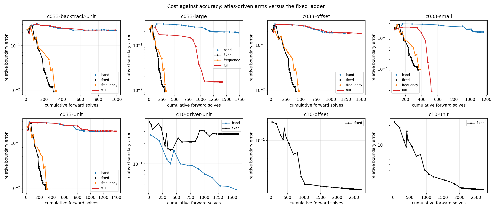

# SC-017 — driving continuation from the atlas, at a matched budget

Runs made 2026-09-23 with `experiments/shape_continuation/campaign.py`. Four
arms share one optimizer, one solver, one data set, one scoring definition and
one forward-solve budget, and differ only in where their continuation decisions
come from:

| Arm | Frequency | Update band |
|---|---|---|
| `fixed` | the uniform `Δk = 0.25` ladder | prescribed, `floor(3 max(k, kᵢ))` |
| `band` | the same ladder | measured: where detectability meets the horizon |
| `frequency` | the largest probed jump whose own model delivers ≥ 25% of its promised misfit decrease | prescribed |
| `full` | measured | measured |

Atlas probes are charged to the same `Work` object as the inversion, so an arm
that measures more has fewer solves left to optimize with; the tables report
how many of each arm's solves went on probing. Truth generates observations and
scores endpoints on a separate budget; it never enters a policy or an
optimizer. Every endpoint passes an N/2N field re-check (all at or below
7×10⁻¹⁵ relative).

The measured band comes from SC-016's admission rule — a harmonic is admitted
only if its detection threshold lies inside its own linearization horizon — and
the frequency probe measures that horizon online with a 3–4 rung bracket
anchored at `0.12/k`.



## Result

**Atlas-driven frequency selection is neutral here, and the atlas says why.**
On all four starts the `frequency` arm lands within 3% of the fixed ladder's
boundary error (0.00954–0.00960 against 0.00926–0.00929) and within 2% of its
held-out prediction error, for 1.08–1.14× the forward solves, of which 44% went
on probes. It reached `k=8` in 9–11 decisions instead of 29. That is the
expected outcome: SC-015 measured the whitened gradient staying aligned with
the `k=1` gradient to `k≈14` at contrast 0.33, so on this ladder *no frequency
is cycle-skipped and there is nothing for a frequency policy to avoid*. The
diagnostic predicted its own null result, which is the useful thing a
diagnostic can do when the baseline is already near-optimal.

**The measured band rule fails, reproducibly, and the mechanism is the gauge.**
The `band` arm ends at a boundary error of 0.158–0.219 on every start, against
0.0093 for the fixed ladder, using 3–5× the forward solves; it never reaches
even 0.1, while the fixed ladder reaches 0.01. Its error trajectory stalls at
0.16–0.29 from `k=1.5` onward instead of descending.

The cause is not step control. The `c033-backtrack-unit` case re-runs the same
arms with the optimizer's 8 step halvings restored (the paper profile disables
them), which is the obvious suspect because the Gaussian filter damps harmonic
`n` by `exp(-(n/M)²/σ)` and therefore damps *less* for a wider band. It changes
nothing: 0.219 with backtracking against 0.181 without.

The cause is the harmonic axis. The same admission rule gives these bands:

| k | 1 | 2 | 4 | 8 |
|---|---|---|---|---|
| on the unit circle (SC-015 arm A) | 4 | 7 | 12 | 21 |
| on a mid-inversion iterate (arm E) | 10 | 13 | 22 | 35 |
| admitted in the runs, all four starts | 3–5 | 9–12 | 19–22 | 35–40 |

The runs match the circle value at `k=1`, where the iterate still *is* a
circle, and then track the non-circular value as the geometry departs from it,
inflating by 1.7–1.9×. SC-015 measured why: an arclength harmonic is an angular
harmonic only on a circle, and on the glider 14% of harmonic 10's amplitude and
7% of harmonic 20's sit below angular order 5. The criterion therefore reads
that leaked low-order content as evidence that a high harmonic is detectable.
Since single-frequency recursive linearization carries each stage's fit forward
as the next stage's warm start, harmonics admitted on that evidence are fitted
to one frequency's own idiosyncrasies and then poison the continuation.

**The combined arm does not rescue it, and it is erratic.** Across the four
starts `full` ends at 0.00183, 0.0153, 0.183 and 0.185 — best-in-campaign on
one, 1.6× worse than the fixed ladder on another, and diverged on two. The
success (the `small` start) reached boundary error 0.00183, area 0.00128 and a
held-out prediction error of 3.0×10⁻⁶ — a 5× better shape and a 47× better
prediction than the fixed ladder — for 525 forwards against 356, by jumping
1→2, crawling 2→3.25 where the probes refused larger steps, then jumping
3.25→6.5→8 and widening the band only once the geometry was already good. That
is exactly the behaviour the design intended, and **one success in four, with a
spread of two orders of magnitude, is not a result.** It is recorded because it
locates what a corrected band rule would have to reproduce, not as evidence
that the controller works.

## Verdict

Of the two ingredients, the one that depends only on residual alignment
(frequency selection) is sound and currently unnecessary at contrast 0.33; the
one that depends on comparing harmonic amplitudes across an evolving geometry
(band selection) is blocked by harmonic transport, quantitatively and
reproducibly. That is a sharper statement of the literature review's open
question "how should the same shape harmonic be transported along a nonlinear
trajectory?" — here it is not a stylistic concern but the specific reason a
measured band rule diverges.

The identified next step is to re-evaluate admission in a gauge where the axis
means the same thing on every iterate, or to cap the band by the number of
directions the Gauss–Newton *spectrum* determines rather than by diagonal
counts. SC-015 measured that gap: at the mid-inversion iterate and `k=4` the
diagonal calls 65 columns detectable where the spectrum determines 45.

## Declared limitations

- **Contrast 10 was not completed, and its partial arms point the other way.**
  Only the `driver` band rule's `fixed` arm finished: it hit the 120-decision
  limit at boundary error 0.276 after reaching 0.160, having spent 108 of its
  120 decisions refining at `k=4` without moving the residual off 0.3557. Three
  arms were stopped in progress when the session's compute window closed and
  are scored from their last checkpoints: `c10-unit/fixed` and
  `c10-offset/fixed` (the §4 band rule) were at 0.0203 and 0.0150, and
  `c10-driver-unit/band` — the *measured* band — was at 0.0415, having reached
  0.05 in 1284 forwards where its own `fixed` counterpart never reached 0.1.
  **None of this is a result**: they are unfinished runs at unequal budgets,
  recorded so the question is not mistaken for answered. They do indicate that
  contrast 10, where SC-015 measures the gradient decorrelating by `k=1.25`, is
  the regime the controller was built for and the one still untested.
- The refinement rule — keep working at the top frequency while the previous
  decision accepted any update — is too weak, and that is a controller defect
  this record owns. It must be repaired before contrast 10 is re-run.
- One target (the SC-013 glider), one ladder (`k = 1 → 8`, `Δk = 0.25`), full
  aperture, noise-free data with a declared 10⁻³ whitening, four circular
  starts. `frequency`'s neutrality is a statement about a regime where the
  baseline already works, not a general one.
- Both policy halves share `probe_band_cap = 80`; the admitted band never
  reached it (maximum 40), so the cap is not what limited the arms.
- Endpoint N/2N field re-checks pass at or below 7×10⁻¹⁵ relative for every
  scored arm, so none of the differences above is a resolution artifact. The
  campaign's own `holdout_self_convergence` field compared a node count with
  itself in these runs; `analyze.py` redoes the check and that is what is
  quoted. The bug is fixed in `campaign.py` for later runs.

## Measurements

Rows marked `stopped_in_progress` were killed when the session's compute window
closed; they are scored from their last committed checkpoint and carry no
endpoint score or resolution check.

| Case | Arm | Stop | k reached | Forwards | of which probes | Boundary error | Held-out | Area |
|---|---|---|---:|---:|---:|---:|---:|---:|
| c033-backtrack-unit | band | policy_stop | 8.0 | 992 | 118 | 0.21900 | 5.10e-02 | 0.12306 |
| c033-backtrack-unit | fixed | policy_stop | 8.0 | 307 | 0 | 0.00927 | 1.38e-04 | 0.00439 |
| c033-backtrack-unit | frequency | policy_stop | 8.0 | 337 | 148 | 0.00955 | 1.41e-04 | 0.00446 |
| c033-backtrack-unit | full | stopped_in_progress | 5.0 | 981 | 0 | 0.22523 | - | - |
| c033-large | band | policy_stop | 8.0 | 1728 | 111 | 0.18867 | 2.30e-02 | 0.09566 |
| c033-large | fixed | policy_stop | 8.0 | 303 | 0 | 0.00926 | 1.38e-04 | 0.00439 |
| c033-large | frequency | policy_stop | 8.0 | 332 | 147 | 0.00954 | 1.41e-04 | 0.00446 |
| c033-large | full | stopped_in_progress | 8.0 | 1416 | 0 | 0.01525 | - | - |
| c033-offset | band | policy_stop | 8.0 | 1227 | 110 | 0.17951 | 1.33e-02 | 0.06566 |
| c033-offset | fixed | policy_stop | 8.0 | 413 | 0 | 0.00929 | 1.39e-04 | 0.00440 |
| c033-offset | frequency | policy_stop | 8.0 | 469 | 161 | 0.00960 | 1.42e-04 | 0.00449 |
| c033-offset | full | policy_stop | 8.0 | 1494 | 285 | 0.18294 | 1.63e-02 | 0.08751 |
| c033-small | band | policy_stop | 8.0 | 1161 | 120 | 0.15770 | 1.88e-02 | 0.09186 |
| c033-small | fixed | policy_stop | 8.0 | 356 | 0 | 0.00928 | 1.38e-04 | 0.00440 |
| c033-small | frequency | policy_stop | 8.0 | 381 | 147 | 0.00955 | 1.41e-04 | 0.00445 |
| c033-small | full | policy_stop | 8.0 | 525 | 85 | 0.00183 | 2.97e-06 | 0.00128 |
| c033-unit | band | policy_stop | 8.0 | 1290 | 115 | 0.18060 | 1.68e-02 | 0.08296 |
| c033-unit | fixed | policy_stop | 8.0 | 305 | 0 | 0.00928 | 1.38e-04 | 0.00439 |
| c033-unit | frequency | policy_stop | 8.0 | 333 | 148 | 0.00956 | 1.41e-04 | 0.00446 |
| c033-unit | full | policy_stop | 8.0 | 1397 | 295 | 0.18450 | 1.74e-02 | 0.08927 |
| c10-driver-unit | band | stopped_in_progress | 4.0 | 1571 | 0 | 0.04145 | - | - |
| c10-driver-unit | fixed | decision_limit | 4.0 | 1612 | 0 | 0.27597 | 3.94e-01 | 0.17338 |
| c10-offset | fixed | stopped_in_progress | 4.0 | 2707 | 0 | 0.01497 | - | - |
| c10-unit | fixed | stopped_in_progress | 4.0 | 2716 | 0 | 0.02030 | - | - |

| Case | Arm | forwards to 0.1 | forwards to 0.05 | forwards to 0.02 | forwards to 0.01 |
|---|---|---:|---:|---:|---:|
| c033-backtrack-unit | band | not reached | not reached | not reached | not reached |
| c033-backtrack-unit | fixed | 128 | 184 | 227 | 303 |
| c033-backtrack-unit | frequency | 143 | 253 | 313 | 325 |
| c033-backtrack-unit | full | not reached | not reached | not reached | not reached |
| c033-large | band | not reached | not reached | not reached | not reached |
| c033-large | fixed | 124 | 180 | 223 | 299 |
| c033-large | frequency | 138 | 248 | 308 | 320 |
| c033-large | full | 904 | 963 | 1067 | not reached |
| c033-offset | band | not reached | not reached | not reached | not reached |
| c033-offset | fixed | 208 | 290 | 333 | 409 |
| c033-offset | frequency | 223 | 361 | 445 | 457 |
| c033-offset | full | not reached | not reached | not reached | not reached |
| c033-small | band | not reached | not reached | not reached | not reached |
| c033-small | fixed | 177 | 233 | 276 | 352 |
| c033-small | frequency | 189 | 297 | 357 | 369 |
| c033-small | full | 448 | 476 | 476 | 510 |
| c033-unit | band | not reached | not reached | not reached | not reached |
| c033-unit | fixed | 126 | 182 | 225 | 301 |
| c033-unit | frequency | 139 | 249 | 309 | 321 |
| c033-unit | full | not reached | not reached | not reached | not reached |
| c10-driver-unit | band | 568 | 1284 | not reached | not reached |
| c10-driver-unit | fixed | not reached | not reached | not reached | not reached |
| c10-offset | fixed | 546 | 914 | 1031 | not reached |
| c10-unit | fixed | 390 | 945 | not reached | not reached |

"Forwards to X" is the cumulative forward-solve count at the first committed
iterate whose relative boundary error reached X, so it compares arms without
depending on where a budget line falls.

## Reproduce

```bash
export OMP_NUM_THREADS=3 PYTHONPATH=solvers:.
PY=/home/drdeng/miniconda3/envs/EMNerf/bin/python
$PY -m experiments.shape_continuation.campaign --output OUT --contrast 0.33 \
    --k-stop 8 --starts unit --max-forwards 3000 --max-seconds 3000
$PY results/validation/shape_continuation/SC-017-atlas-controller/analyze.py
```

`analyze.py` re-scores every saved iterate from geometry alone and adds two
solves per arm for the endpoint refinement check; it regenerates
`analysis.json`, `results_table.md` and the figure.
