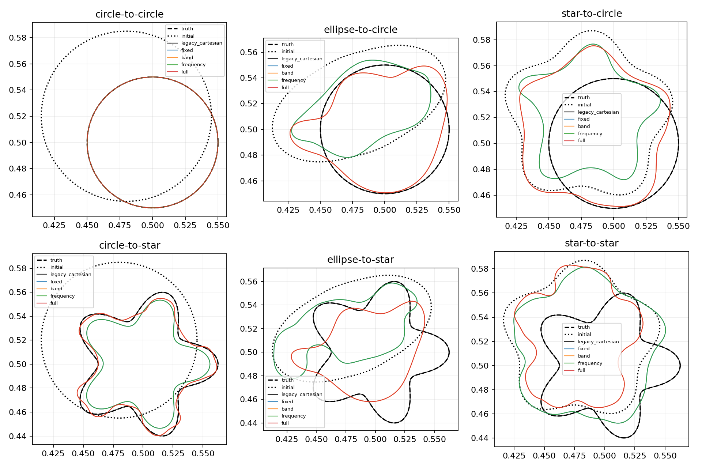

# SC-018 — previous explicit Fourier single-object cases

**Subsequent diagnosis:** [SC-019](../SC-019-step-halving/protocol.md) finds
that the inherited 1% curvature-tail gate excludes the true star (8.07%
tail above band 20). The results below are unchanged, but the star failures
include this incompatible setting; they do not establish an intrinsic
limitation of the new representation or continuation method.

Shared independent observations, initial curves and per-arm budgets. Boundary error is symmetric sampled Hausdorff; acceptance uses its conservative upper bound. Held-out error below is the worst of three unused frequencies.

| Case | Arm | Stop | Frequency solves | Seconds | Boundary mm | Train rel. | Worst holdout rel. | Gates |
|---|---|---|---:|---:|---:|---:|---:|---|
| circle-to-circle | legacy_cartesian | initial_data_tolerance | 1663 | 31.5 | 5.785e-06 | 1.532e-07 | 1.98e-06 | PASS |
| circle-to-circle | fixed | policy_stop | 19 | 4.6 | 0.002037 | 2.069e-08 | 5.28e-08 | PASS |
| circle-to-circle | band | policy_stop | 48 | 12.6 | 0.02119 | 6.34e-06 | 9.199e-05 | PASS |
| circle-to-circle | frequency | policy_stop | 35 | 9.6 | 0.002037 | 2.069e-08 | 5.28e-08 | PASS |
| circle-to-circle | full | policy_stop | 48 | 12.5 | 0.02119 | 6.34e-06 | 9.199e-05 | PASS |
| ellipse-to-circle | legacy_cartesian | initial_data_tolerance | 2193 | 38.8 | 3.404e-06 | 1.59e-07 | 2.055e-06 | PASS |
| ellipse-to-circle | fixed | policy_stop | 7 | 2.0 | 45.23 | 0.9551 | 4.004 | FAIL |
| ellipse-to-circle | band | policy_stop | 144 | 31.3 | 23.72 | 0.5446 | 4.254 | FAIL |
| ellipse-to-circle | frequency | policy_stop | 19 | 5.3 | 45.23 | 0.9551 | 4.004 | FAIL |
| ellipse-to-circle | full | policy_stop | 144 | 31.2 | 23.72 | 0.5446 | 4.254 | FAIL |
| star-to-circle | legacy_cartesian | initial_data_tolerance | 2299 | 41.6 | 1.105e-06 | 5.574e-08 | 7.204e-07 | PASS |
| star-to-circle | fixed | policy_stop | 10 | 4.4 | 35.91 | 1.143 | 5.41 | FAIL |
| star-to-circle | band | policy_stop | 34 | 21.7 | 31.84 | 1.005 | 5.277 | FAIL |
| star-to-circle | frequency | policy_stop | 22 | 9.0 | 35.91 | 1.143 | 5.41 | FAIL |
| star-to-circle | full | policy_stop | 34 | 21.9 | 31.84 | 1.005 | 5.277 | FAIL |
| circle-to-star | legacy_cartesian | initial_data_tolerance | 2405 | 124.5 | 6.591e-06 | 3.333e-07 | 4.876e-07 | PASS |
| circle-to-star | fixed | policy_stop | 25 | 5.4 | 6.912 | 0.4191 | 0.647 | FAIL |
| circle-to-star | band | policy_stop | 251 | 75.6 | 5.196 | 0.1324 | 0.3121 | FAIL |
| circle-to-star | frequency | policy_stop | 39 | 10.5 | 6.912 | 0.4191 | 0.647 | FAIL |
| circle-to-star | full | policy_stop | 251 | 75.4 | 5.196 | 0.1324 | 0.3121 | FAIL |
| ellipse-to-star | legacy_cartesian | stable_data_and_geometry | 3147 | 153.9 | 2.787e-06 | 1.296e-07 | 2.012e-07 | PASS |
| ellipse-to-star | fixed | policy_stop | 35 | 12.0 | 58.73 | 0.947 | 1.837 | FAIL |
| ellipse-to-star | band | policy_stop | 81 | 23.3 | 27.26 | 0.9436 | 1.539 | FAIL |
| ellipse-to-star | frequency | policy_stop | 47 | 16.2 | 58.73 | 0.947 | 1.837 | FAIL |
| ellipse-to-star | full | policy_stop | 81 | 23.6 | 27.26 | 0.9436 | 1.539 | FAIL |
| star-to-star | legacy_cartesian | initial_data_tolerance | 2511 | 124.7 | 5.68e-06 | 2.61e-07 | 3.681e-07 | PASS |
| star-to-star | fixed | policy_stop | 17 | 10.6 | 37.8 | 1.081 | 1.481 | FAIL |
| star-to-star | band | policy_stop | 45 | 26.1 | 43.6 | 1.171 | 1.452 | FAIL |
| star-to-star | frequency | policy_stop | 29 | 16.2 | 37.8 | 1.081 | 1.481 | FAIL |
| star-to-star | full | policy_stop | 45 | 25.5 | 43.6 | 1.171 | 1.452 | FAIL |

## Comparison contract

- Legacy uses cumulative frequencies; new arms use one frequency at a time.
- Legacy uses polar-angle Cartesian K6 and finite-difference LM; new arms use arclength normal GN/SD.
- New arms retain at least 128 storage modes to resolve the inherited non-circular starts.
- The same solve/time caps apply; algorithms may stop before exhausting them.
- Only three measured training frequencies exist; no extra observations are generated for adaptation.

All new arms use SC-017's optimizer settings with 50 updates per decision, minimum storage band 128, and a shared terminal progress guard. The legacy arm uses the existing cumulative-frequency Cartesian K6 optimizer with its original 150-update allocation and 2-mm modal step limit.

Per-arm caps: 6000 single-frequency forward solves and 600 seconds. Preparation and endpoint scoring are excluded for all arms. Elapsed times include checkpoint writing and concurrent resource contention; they are descriptive.

Recovery gates: boundary upper bound ≤1 mm, training relative L2 ≤0.003, worst holdout relative L2 ≤0.05, N/2N endpoint field discrepancy ≤1e-6. A passed gate does not imply nanometre parity with the historical star recovery.

Inputs, every checkpoint and endpoint are portable JSON. Input and numerical-source hashes are checked. Failures and budget stops remain in the table.
