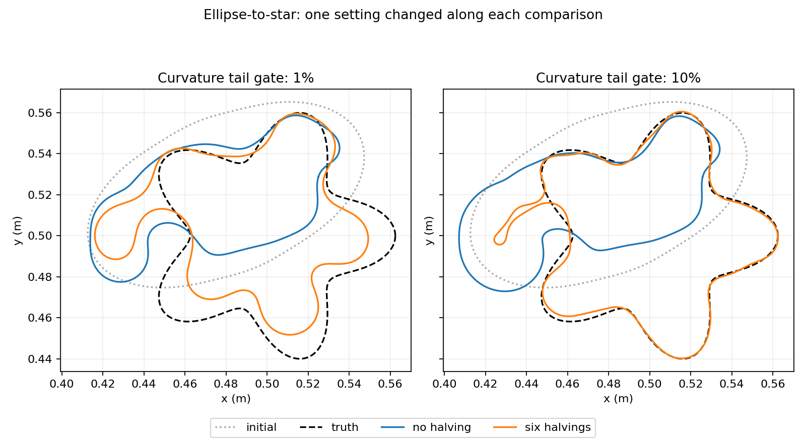

# SC-019 — step halving and curvature admissibility

**Step halving removes a demonstrated local stall, but does not restore
ellipse-to-star recovery. A follow-up also exposes an incompatible curvature
setting inherited from SC-017.** No core numerical code or defaults changed.

[Protocol and reproduction](protocol.md) · [full four-arm records](factorial-comparison.json)
· [integrity checks](verification.json).

## Matched results

All four runs use the same SC-018 observations, initial curve, fixed policy,
update-band rule, projection tolerance and 6000-forward/600-second limits.
Each horizontal/vertical comparison changes one configuration setting. The
10% follow-up was motivated by the target audit below and is exploratory.
None of the four runs exhausts its budget; all endpoints are scored using the
unchanged independent data, conservative geometry gate and N/2N evaluator.

| Curvature tail gate | Halvings | Frequency solves | Boundary mm | Train relative | Worst holdout relative | Stop | Gates |
|---|---:|---:|---:|---:|---:|---|---|
| 1% | 0 | 35 | 58.73 | 0.947 | 1.837 | policy_stop | FAIL |
| 1% | 6 | 78 | 39.14 | 0.6081 | 1.137 | policy_stop | FAIL |
| 10% | 0 | 297 | 59.75 | 0.9486 | 1.966 | policy_stop | FAIL |
| 10% | 6 | 310 | 31.55 | 0.08178 | 0.2201 | policy_stop | FAIL |


The previous Cartesian inverse remains the reference: sampled boundary error
2.79e-9 m, training error 1.30e-7 and worst holdout error 2.01e-7 on this case.
The new combined arm's symmetric area error improves from 77.1% to 5.53%, but
it retains a false protrusion on the left. That defect drives the 31.6-mm
maximum boundary error despite the visual improvement elsewhere.



## What is actually identified

1. **A search-length defect at a specific state.** The no-halving control
   reproduces SC-018 exactly, including coefficients and 35 forward solves.
   At its first stalled geometry, all 12 trials are invalid through
   self-intersection or unresolved arclength projection, with normalized
   gradient infinity norm 0.690. Repeating that exact state with six halvings
   accepts the unfiltered Gauss–Newton direction at step 1/8 and lowers the
   relative residual from 0.863757 to 0.781543. No other input changed.
   [Same-state probe](same-state-probe.json).
2. **The original curvature gate excludes the exact target.** At curvature
   band 20 the true star has tail energy 0.0807025, versus the allowed 0.01.
   Even band 26 gives 0.0451470. The computation agrees after arclength
   refitting. The setting was inherited from SC-017; it was not qualified for
   this star before SC-018. This corrects the interpretation of those failures:
   they include an incompatible setting, not evidence that the new shape
   representation intrinsically cannot recover the old targets.
   [Curvature audit](truth-curvature-audit.json).
3. **Neither single change suffices.** Halving alone reduces boundary error
   by one third; relaxing the gate alone does not improve it. The combination
   reduces pooled training error from 0.947 to 0.0818 and worst held-out error
   from 1.837 to 0.220. All four still fail the frozen recovery criteria.
4. **The combined run remains stuck at the curvature constraint.** Its final
   curvature tail is 0.099951 against the 0.1 gate, gradient infinity norm is
   0.370, and its last search rejects 69 candidates for curvature, 15 as
   geometrically invalid and 28 as nondecreasing. Earlier combined-run stages
   stop mostly through projection/geometry rejections. These diagnose where
   the search stops; they do not prove that removing the gate would recover
   the correct shape or that it should be removed.

A separate [storage audit](truth-storage-audit.json) finds that the exact
star fails the unchanged projection tolerance at storage bands 128 and 160,
but passes at 192 and above. The final combined stage stores 288 modes, so
this observation is relevant to the early stages, not proof that its final
stall is caused by inadequate target storage. These are evaluation-only
checks; truth never enters the optimizer.

## Validation and limits

The control is a bitwise endpoint/solve-count replay of SC-018. All four arms
share the same input hash and unchanged numerical sources. Configuration
comparisons verify exactly one changed field along each edge of the 2×2
comparison. All JSON is strictly parseable, all endpoints pass the field
refinement gate (worst discrepancy 6.15e-8), and both figures were inspected.
The diagnostic scripts compile; the previously recorded 218 passing tests
cover the unchanged numerical core. No independent review is claimed.

This is one noiseless paired-source case. The curvature follow-up was chosen
after diagnosing the target's exclusion, not frozen before the primary run.
Neither damping nor cumulative-frequency fitting has been isolated here.
Those remain separate questions; the present evidence identifies local step
control and admissibility problems without establishing a complete repair.

## Additional reproduction

After the commands in the protocol:

```bash
$PY results/validation/shape_continuation/SC-019-step-halving/summarize.py \
  --output FRESH_OUTPUT
```
