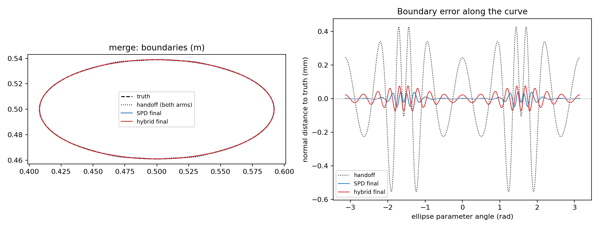

# SC-020 — clean hybrid under SPD's policy, against SPD

**PASS** under the [frozen plan](../../../../docs/iterations/shape_frequency_continuation/iteration_06/03_plan.md).
The hybrid combines Borges' normal move with an arclength refit on every
trial, an SPD-style LM backend and the package's nodal Müller physics. On
SPD's only single-object case (the merge ellipse continuation) it:

- completes SPD's four-stage cumulative schedule;
- passes every original SPD gate;
- has every stage endpoint numerically qualified.

It is less accurate and more expensive than SPD on this case: 0.076 mm
against 0.048 mm, and 580 work units against 256. The mechanism is measured
below. [Interpretation and next decision](../../../../docs/iterations/shape_frequency_continuation/iteration_07/01_results.md).

## Result

Both arms start from the same saved TOP-025 handoff, which is 0.554 mm from
the true ellipse, and use the same observations. Both are scored by SPD's own
endpoint scorer with its Kress predictor. Training errors below are
per-frequency relative errors at 512 nodes.

| Arm | Stage | Outcome / optimizer stop | Accepted | Stage loss | Stage units | Hausdorff mm | IoU | Training rel. 0.5 / 0.75 / 1 / 1.25 GHz | Evaluation rel. 1.5 / 2.5 GHz |
|---|---:|---|---:|---:|---:|---:|---:|---|---|
| SPD | 1 | normal / loss tolerance | 16 | 5.79e-15 | 80 | 0.0296 | 0.9998 | 1.1e-7, 3.6e-7, 1.3e-5, 1.6e-4 | 5.3e-4, 2.7e-3 |
| SPD | 2 | normal / gradient tolerance | 1 | 1.69e-14 | 16 | 0.0284 | 0.9998 | 1.1e-7, 2.4e-7, 1.0e-5, 1.5e-4 | 5.2e-4, 2.8e-3 |
| SPD | 3 | normal / gradient tolerance | 2 | 4.02e-13 | 36 | 0.0267 | 0.9998 | 1.5e-7, 5.3e-7, 1.5e-6, 8.0e-5 | 4.2e-4, 3.0e-3 |
| SPD | 4 | normal / gradient tolerance | 3 | 4.65e-13 | 64 | **0.0478** | 0.9990 | 3.1e-7, 7.3e-7, 1.3e-6, 1.2e-6 | 1.3e-5, 3.6e-3 |
| hybrid | 1 | normal / gradient tolerance | 13 | 6.81e-13 | 130 | 0.0713 | 0.9982 | 1.2e-6, 4.3e-6, 6.5e-5, 3.4e-4 | 5.9e-4, 5.5e-3 |
| hybrid | 2 | normal / no decreasing step | 3 | 2.17e-12 | 98 | 0.0750 | 0.9982 | 1.3e-6, 2.6e-6, 8.6e-6, 1.4e-4 | 4.2e-4, 4.8e-3 |
| hybrid | 3 | normal / gradient tolerance | 6 | 3.29e-12 | 192 | 0.0806 | 0.9982 | 1.8e-6, 2.8e-6, 3.0e-6, 1.8e-5 | 1.5e-4, 4.6e-3 |
| hybrid | 4 | normal / no decreasing step | 2 | 7.00e-12 | 100 | **0.0762** | 0.9974 | 1.6e-6, 3.4e-6, 5.3e-6, 3.8e-6 | 2.8e-5, 6.0e-3 |



| Arm | Status | Work units | Solves | Derivative units | Elapsed |
|---|---|---:|---|---:|---:|
| SPD (fresh rerun) | Completed, recovered, final-state hash equals the TOP-025 record | 256 | 210 attempted: 48 candidate, 46 refined validation, 46 derivative base, 10 initial, 60 endpoint | 46 reciprocal batches (+46 base solves) | 142.6 s |
| hybrid | Completed, recovered | 580 | 525: 283 candidate, 172 refined validation, 10 initial, 60 endpoint | 55 reciprocal batches | 202.9 s |

Of the hybrid's trials, 24 were accepted, 84 did not decrease the production
loss and 50 failed SPD's refined-margin rule. No trial was refused for
geometry, projection or domain.

Elapsed times are from sequential single-thread runs on a lightly loaded
shared host. They are descriptive, not a controlled speed comparison. Work
units follow SPD's definition: one frequency system solve, or one reciprocal
batch per frequency. The hybrid reuses its forward factorization for the
Jacobian, so its derivative cost is lower by construction.

## Mechanism of the accuracy and cost gap

This is an evaluation-only analysis in `comparison.json`. The normal distance
to the exact ellipse is decomposed into normalized-arclength harmonics, split
at the update band M=16.

| State | Max. error mm | ≤16 mm | >16 mm |
|---|---:|---:|---:|
| Handoff (both arms) | 0.554 | 0.370 | 0.0496 |
| Hybrid stage 1 / 2 / 3 / 4 | 0.071 / 0.075 / 0.081 / 0.076 | 0.018 / 0.012 / 0.010 / 0.015 | 0.0497 at every stage |
| SPD final | 0.048 | 0.013 | 0.018 |

The hybrid's steps cannot reach normal error beyond arclength harmonic 16, so
the handoff's 0.0496 mm there persists to four digits. Within the band the
hybrid matches SPD. SPD's 33 polar radial directions are different functions
of arclength on this elongated shape (speed ratio 2.76), and they correct
part of that error.

The data effect of the remaining error leaves the hybrid's loss about 15×
higher than SPD's. LM then pays for searches along weakly determined
directions. At the stage-1 plateau (a development measurement recorded in
the plan), the Gauss–Newton step is 1.04 mm along directions with singular
values ~5e-5. Its actual loss is dominated by the second-order term. This is
where the 84 non-decreasing and 50 margin-rejected trials come from.

## Contract and integrity

[Plan](../../../../docs/iterations/shape_frequency_continuation/iteration_06/03_plan.md):

- same cumulative frequency sets, weights, stage quotas, LM rules, acceptance
  rule and numerical-regime hard stop as SPD;
- declared mapping M=16, K=96, with step bounds of 12, 18 and 6 mm by
  harmonic order;
- same domain box; no radius floor.

`verification.json` confirms:

- both arms read identical hash-checked inputs;
- no numerical source changed between preparation and the runs;
- the only source added since preparation is the report-only
  `spd_report.py`.

Pre-run validation: 113 package tests pass (`logs/pre_run_tests.log`). New
tests show three things:

- the residual map is bitwise equal to SPD's;
- the acceptance rule equals SPD's on 200 random cases;
- the Jacobian agrees with differences through the actual trial to 1e-6.

The rerun SPD arm reproduces TOP-025's final state exactly. The development
measurements cited in the plan were rerun after the comparison; scripts and
output are in `development/`:

- the physics bridge, ≤4.1e-13;
- directional derivatives through the trial;
- the stage-1 plateau analysis: Gauss–Newton step 1.04 mm, singular values
  down to 4.6e-5, actual losses along that step.

## Reproduce

```bash
export PYTHONPATH=solvers:. OMP_NUM_THREADS=1 OPENBLAS_NUM_THREADS=1 MKL_NUM_THREADS=1 NUMEXPR_NUM_THREADS=1
PY=/home/drdeng/miniconda3/envs/EMNerf/bin/python
OUT=results/validation/shape_continuation/<fresh-directory>
$PY -m experiments.shape_continuation.spd_cases --output $OUT --prepare
$PY -m experiments.shape_continuation.spd_cases --output $OUT --one spd
$PY -m experiments.shape_continuation.spd_cases --output $OUT --one hybrid
$PY -m experiments.shape_continuation.spd_report --output $OUT   # no solves
```

## Limits

- This is one near-truth case, 0.55 mm from the target, with a single
  handoff. It qualifies the backend and policy interface against SPD. It
  establishes nothing about recovery from distant starts, harder targets,
  noise, or any adaptive policy.
- The step-bound and update-band mapping is declared, not derived from
  equivalence.
- SPD's radius floor is absent from the hybrid; it was inactive here.
- The hybrid's physics is Müller, not Kress. Both agree with each other to
  ≤4e-13 on the handoff.
