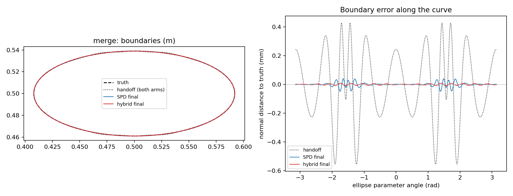

# SC-021 — SC-020 with update band M=32

**2026-09-24 review:** the [outsider verdict](../../../../docs/iterations/shape_frequency_continuation/iteration_08/02_proposals/01_codex_outsider_review.md)
accepts the measured improvement on this handoff. It remains a development
ablation, with no general M=32 robustness or coordinate-system advantage
established. Original results are unchanged.

One change from [SC-020](../SC-020-spd-matched-hybrid/README.md): the
hybrid's update band M is 32 instead of 16. The inputs, SPD-matching
schedule, LM, acceptance, storage K=96, step bounds and scorer are unchanged.
The SPD arm was rerun and is again hash-identical to TOP-025.
`verification.json` is **PASS**, and no source changed after preparation.

| | SPD | Hybrid M=16 (SC-020) | Hybrid M=32 |
|---|---:|---:|---:|
| Final matched Hausdorff | 0.0478 mm | 0.0762 mm | **0.0088 mm** |
| IoU | 0.9990 | 0.9974 | 0.9990 |
| Final stage loss | 4.65e-13 | 7.00e-12 | 9.07e-15 |
| Evaluation rel. 1.5 / 2.5 GHz | 1.3e-5 / 3.6e-3 | 2.8e-5 / 6.0e-3 | 9.9e-6 / 2.0e-3 |
| Stage stops | loss, then 3× gradient | 2× gradient, 2× no decreasing step | 4× loss tolerance |
| Accepted / rejected trials | — | 24 / 134 | 10 / 0 |
| Work units | 256 | 580 | **150** |
| Elapsed | 144 s | 203 s | 59 s |

The error beyond arclength harmonic 16 falls from the handoff's 0.0496 mm to
0.0035 mm after stage 1 and 0.0022 mm at the end; SPD's final state has
0.018 mm there. The prediction recorded in
[iteration 07](../../../../docs/iterations/shape_frequency_continuation/iteration_07/01_results.md)
before this run holds: the out-of-band error falls below SPD's and the
rejected trials disappear.

The two arms ran concurrently this time, one thread each, so the elapsed times
are descriptive only. Work units are the like-for-like cost measure.

**Limits.** This is one near-truth case, and M=32 was chosen after seeing
SC-020, so it is development evidence rather than a blind test. It does not
establish a general rule for M.

Reproduce as in SC-020, adding `--update-modes 32 --experiment SC-021` to
`--prepare`.
