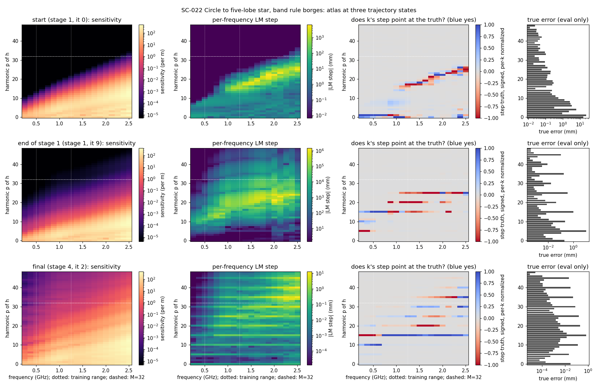
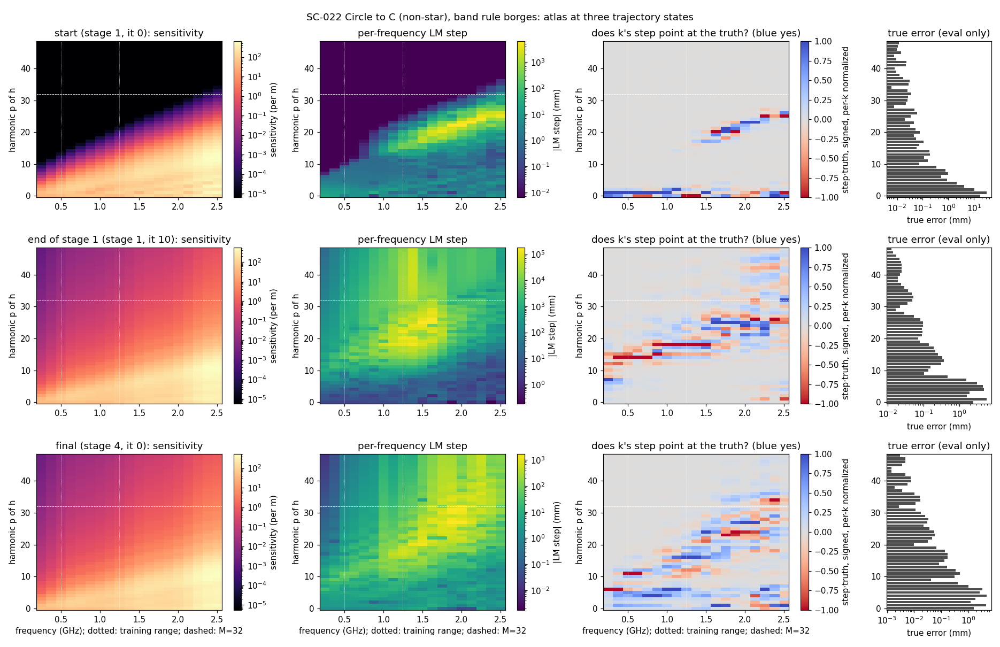
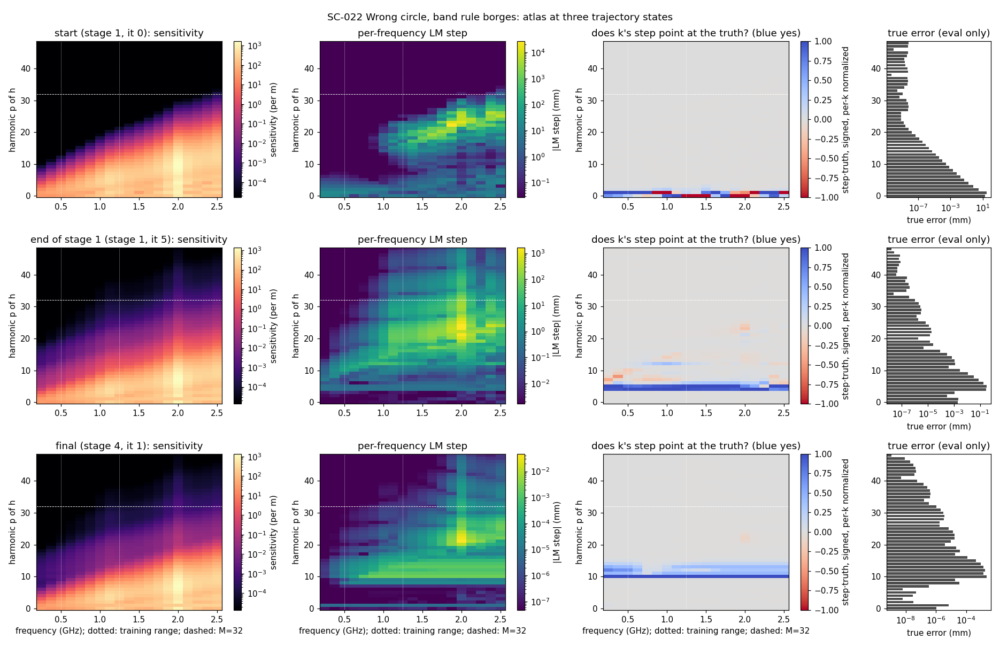

# SC-022 — atlas along fixed-schedule trajectories

[Plan and amendment](../../../../docs/iterations/shape_frequency_continuation/iteration_07/03_plan.md) ·
[results note](../../../../docs/iterations/shape_frequency_continuation/iteration_08/01_results.md).

**2026-09-24 outsider review:** [verdict and derivations](../../../../docs/iterations/shape_frequency_continuation/iteration_08/02_proposals/01_codex_outsider_review.md)
and [reproducible audit](../review-20260924/README.md). Counts, local NPZ hashes
and step replay are confirmed. Read “true error” below as a signed-distance
proxy and “raw LM” as damped but unclipped. Full-space step components are
conditional on the other allowed modes; the review demonstrates a p=15 sign
reversal under a restricted solve. Coefficient norms differ from physical RMS
displacements. These qualifications change interpretation, not the stored
measurements or figures.

This is a descriptive record. It covers three single-object cases chosen by
the user, run on SPD's acquisition and schedule. For each case the atlas is
evaluated at every accepted state of the trajectory, over a 19-frequency
catalog (0.25–2.5 GHz) and 48 normal harmonics. It makes no strategy claim.

## Build checks

- **Unit test.** The stage LM proposal assembled from per-frequency layers
  equals the backend's own proposal (`test_atlas_survey.py`).
- **Along the real trajectories.** 32 accepted first-trial steps are
  reproduced by the atlas, restricted to the run's M and clipped, to
  ≤1.5e-13 relative (`analysis.json`, `trajectory_consistency`).
- **Merge check** (`build_check/`, SC-020 stall state, no dense catalog). The
  0.5 GHz step layer requests 0.025 mm in harmonics 17–32, against 0.0045 mm
  within the old band. Its direction matches the true error with cosine
  0.999 over harmonics 17–24, at about half the true magnitude (0.050 mm).
- **Oracles.** All catalogs pass: 2048/1024-node refinement and the
  cross-solver check are ≤1.3e-13 relative. Solver residuals in every atlas
  cell are ≤3.4e-14.

## Trajectories

All arms use the SPD-matching schedule (0.5 → 1.25 GHz cumulative) and SPD
LM, with the Borges update, K=192 storage and 512/1024 nodes. They start from
the legacy circle (65 mm at 0.48, 0.52). Hausdorff distance is sampled and
symmetric.

| Arm | Case | Hausdorff start → end | Per-stage end (mm) | Units / time |
|---|---|---:|---|---:|
| `borges` (M = 3, 5, 7, 9) | Wrong circle | 43.3 → **0.005 mm** | 0.92, 0.30, 0.048, 0.005 | 87 / 105 s |
| `borges` | Circle to star | 48.7 → **1.43 mm** | 12.9, 1.51, 1.42, 1.43 | 139 / 170 s |
| `borges` | Circle to C | 60.1 → **19.4 mm** | 32.9, 19.9, 19.4, 19.4 | 386 / 438 s |
| `fixed32` (M=32) | Wrong circle | 43.3 → 26.3 mm | stalls in stage 1 | 87 / 88 s |
| `fixed32` | Circle to star | 48.7 → 33.7 mm | stalls in stage 1 | 41 / 41 s |
| `fixed32` | Circle to C | 60.1 → 47.8 mm | stalls in stage 1 | 301 / 406 s |

In the `fixed32` arm every rejected trial is geometric. In the star's stage
1, 60 of 64 trials are refused: 37 fail the arclength refit, 22
self-intersect and 1 is irregular. The first
accepted step already puts 3–4 mm into harmonics 6–9, and later proposals are
clipped at the 6 mm bound in every harmonic. See the plan amendment.

## What is recorded

`runs/<arm>/<case>/`:

| File | Content |
|---|---|
| `stage_N_history.json` | Every accepted state, its step coefficients and its live damping |
| `atlas.npz` (local, not tracked) | Per state and frequency: loss, relative residual, gradient, the full 97×97 Gauss–Newton block, eigenvalues, LM step at the live damping, truncated GN step; per state: the stage step |
| `true_error_EVALUATION_ONLY.npz` (local) | Normal distance to the truth, decomposed on the same harmonics |
| `atlas_summary.json` | Hashes and counts |

In total: 159 states, 141 unique curves and 2,679 cells, about 12 minutes of
wall time across 24 parallel workers. Because the blocks and gradients are stored, any other step variant can
be recomputed offline with no new solves: other damping, truncation, band
restriction, clipping or frequency weights.

## First descriptive observations

These are measured, not interpreted. The true error is evaluation-only.

1. **Raw per-frequency LM steps are dominated by weak directions.** At the
   start states, the median over frequencies of each frequency's LM step
   norm is 600–2,300 mm, against a true RMS error of about 25 mm. The large
   components sit along each frequency's sensitivity edge. This is the
   stored-layer view of the `fixed32` stall. Unregularized, the
   per-frequency step is not a usable demand signal by itself.
2. **Off the circle, sensitivity spreads to high harmonics.** Once the curve
   is non-circular, high arclength harmonics are sensitive at every
   frequency; the C panels show this most clearly. This matches SC-015's
   glider result.
3. **The star's residual lies beyond the ladder's band, and the data point
   at part of it.** At the star's final state, the true error is largest at
   harmonic 15 (0.66 mm), then 20 (0.21 mm), 25 (0.16) and 10 (0.13).
   - For p=15, from 0.75 GHz upward, each frequency's own LM step points at
     the truth (cosine 0.85–1.00) with 40–90% of the needed size. At
     0.25–0.62 GHz it points the other way at about 4% of the size.
   - For p=20, from 0.75 to 2.0 GHz, the steps point the wrong way (cosine
     −0.17 to −1.00) and overshoot 1.2–6.7×. Only the GN step at 2.4–2.5 GHz
     points correctly.
4. **The full-band stage step stops pointing at the truth near the end.** The
   cosine between the stage objective's P=48 LM step and the true error
   falls from 0.94, 0.77 and 0.76 at the three starts to 0.90, 0.08 and 0.01
   at the ends (wrong circle, star, C).





In each figure the columns are:
1. whitened sensitivity;
2. the per-frequency LM step magnitude;
3. the sign agreement between each frequency's step and the true error,
   weighted by magnitude and normalized per frequency;
4. the true error per harmonic.

The rows are the start, the end of stage 1 and the final state. Figures for
the `fixed32` arm are produced by `analyze.py` but not tracked.

## Reproduce

```bash
export PYTHONPATH=solvers:. OMP_NUM_THREADS=1 OPENBLAS_NUM_THREADS=1 MKL_NUM_THREADS=1 NUMEXPR_NUM_THREADS=1
PY=/home/drdeng/miniconda3/envs/EMNerf/bin/python; OUT=<fresh bundle>
$PY -m experiments.shape_continuation.atlas_cases --output $OUT --prepare             # oracle catalogs, ~15 min
$PY -m experiments.shape_continuation.atlas_cases --output $OUT --trajectory <case> --arm borges
$PY -m experiments.shape_continuation.atlas_cases --output $OUT --atlas <case> --arm borges --workers 5
cd $OUT && $PY analyze.py                                                              # no solves
```

The source change after preparation, which added the band-rule arm, is
recorded under `amendments` in `manifest.json`.

## Limits

- The data are noiseless, 2-D, single-object and at one contrast, with one
  start per case.
- The atlas describes the states these two fixed schedules visited.
- The catalog is diagnostic data beyond SPD's acquisition.
- The C trajectory fails (19.4 mm), and the star misses the 1 mm level
  (1.43 mm). Both are recorded as outcomes, not repaired.
- The first-order layers say nothing about how far a step stays valid; the
  SC-016 horizon is not re-measured here.
