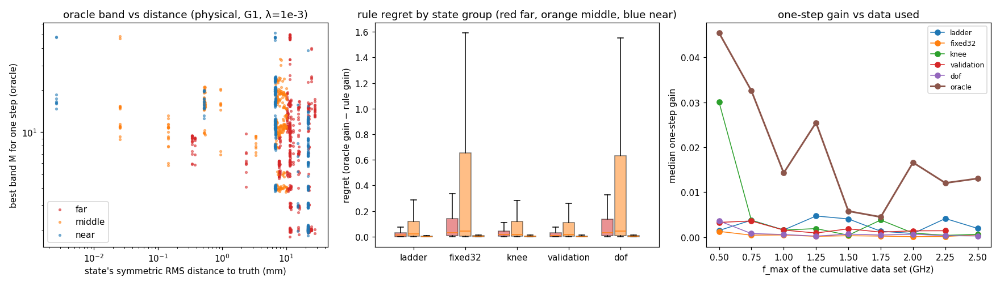

# SC-023 — numerical qualification and conditional band candidates offline

[Plan](../../../../docs/iterations/shape_frequency_continuation/iteration_08/03_plan.md) ·
[review resolution](../../../../docs/iterations/shape_frequency_continuation/iteration_08/02_proposals/02_review_resolution.md).
This bundle asks whether truth-free local atlas quantities choose a better
update band than Borges' ladder. It reads SC-022's saved trajectories and
blocks. The candidate study performs no physics solves. Q0 uses 64 solves and 16 reciprocal batches.

## Q0 — numerical qualification

**Atlas refinement (review N1). All 12 cells pass.** The four states are:
- Borges C at the end of stage 3;
- the Borges star's final state;
- the fixed-32 star after its first step;
- the wrong circle's final state.

Each is taken at 0.5, 1.25 and 2.5 GHz and recomputed at N=1024:
- per-harmonic sensitivity agrees with the stored N=512 layers to ≤1.8e-9
  relative;
- conditional LM steps for M ∈ {9, 16, 32, 48} agree to ≤6.6e-7.

(`qualification/refinement.json`)

**Directional checks through the actual update. All 24 pass.** At 1.25 GHz,
the Jacobian column for cosine harmonics p ∈ {1, 9, 15, 20, 32, 48} is
compared with central differences through `BorgesUpdate.trial` at ±1 µm. It
agrees to ≤6e-7 relative wherever the change is resolvable.
(`qualification/directional.json`)

**Refit-gate record** (`qualification/gate_record.json`). Every
`unresolved_projection` refusal in SC-022 is recorded. The runs with such
refusals are the Borges C and all three fixed-32 runs:

| Run | Refusals | Median refused error | At the last halving | Accepted curves' own refit error (max) | Same curves at K=384 | Tightest radius |
|---|---:|---:|---:|---:|---:|---:|
| Borges C | 489 | 2.7e-7 | 1.05e-7 | 9.7e-8 | 1.6e-11 | 4.0 mm |
| Fixed-32 wrong circle | 288 | 4.0e-7 | 3.2e-7 | 9.9e-8 | 1.3e-11 | 2.6 mm |
| Fixed-32 star | 125 | 2.2e-6 | 1.9e-7 | 6.8e-8 | 2.4e-12 | 3.7 mm |
| Fixed-32 C | 315 | 5.0e-7 | 2.8e-7 | 9.4e-8 | 1.1e-11 | 3.2 mm |

The Borges wrong circle and star have no refusals, and their refit errors
stay ≤2.6e-12.

**Interpretation.**
- The stalled runs' accepted curves had drifted to the 1e-7 gate on their
  own, so even 1/128 of a step fails it.
- The curves are representable at K=384.
- The content comes from sharp features created by the early steps, not from
  a numerical pump: zero and small steps leave the refit error unchanged.
  SC-024 tests the consequences.

## Candidate study

**States.** All 141 unique recorded states.

**Factors:**
- 9 cumulative frequency sets, {0.5…f_max} with f_max ∈ 0.5–2.5 GHz;
- 22 bands, 2–48, including every ladder value;
- damping λ ∈ {1e-4, 1e-3, 1e-2};
- coefficient or physical (6 mm) step control;
- refit gate G1 (1e-7, as run) or G2 (1e-5).

That gives 335,016 candidate rows and 15,228 decisions.

**Label (evaluation only).** Each candidate is the conditional LM step,
halved (up to 7 times) to the first geometrically admissible Borges trial.
The label is its one-step gain, 1 − d_after/d_before, where d is the
symmetric RMS distance to the truth.

**The rules** read only truth-free features:
- ladder: M = floor(3·max(k, kᵢ));
- fixed32;
- knee: the smallest M capturing 90% of the P=48 model decrease;
- validation: the M whose step most reduces the model loss at the next
  frequency up;
- dof: the largest M whose determined fraction is ≥0.5.

**Results at the plan's focus setting** (λ=1e-3, physical control, G1;
pooled over 1,269 decisions):

| Rule | Median gain | Mean gain | Gain > 0 | Median regret | Mean regret | Median M |
|---|---:|---:|---:|---:|---:|---:|
| Oracle band | 0.017 | — | 1.00 | 0 | 0 | — |
| Ladder | 0.002 | 0.077 | 0.73 | 0.005 | 0.064 | 11 |
| Knee | 0.002 | 0.094 | 0.82 | 0.006 | 0.048 | 15 |
| Validation | 0.002 | 0.085 | 0.79 | 0.004 | 0.055 | 5 |
| Dof | 0.000 | −0.074 | 0.71 | 0.015 | 0.215 | 40 |
| Fixed32 | 0.000 | −0.074 | 0.71 | 0.016 | 0.216 | 32 |

Under G2 the ordering is the same: ladder median regret 0.031, validation
0.034, knee 0.063, fixed32 0.081, dof 0.083. The full breakdown by
control, gate, damping and state group (far / middle / near) is in
`analysis.json`.

**Qualification gate** (plan: median regret ≥0.05 below the ladder's, and a
positive-gain fraction ≥ the ladder's, under both gates). **No rule
qualifies.**
- The ladder's median regret is already 0.005 (G1) and 0.031 (G2), so a
  0.05 improvement is impossible under G1.
- Under G2 every rule's regret exceeds the ladder's.

**Descriptive findings:**
- **The model's predicted data decrease ranks bands backwards.** Within a
  decision, the Spearman correlation between a band's predicted decrease
  and its geometric gain has median −0.27; it is positive in only 34% of
  decisions. Larger bands always predict more decrease, and they tend to
  make the geometry worse.
- **Two features rank bands in the right direction, weakly.**
  - The cross-frequency validation feature: median +0.23, positive in 65%.
  - The determined fraction (dof): median +0.31, positive in 66%.
  - For comparison, the evaluation-only first-order normal-ray gain reaches
    +0.50 (71%).
- **The oracle band grows with f_max roughly as the ladder does up to about
  1.5 GHz.**
  - Far states: medians 5, 5, 8, 9, 10 against the ladder's 3, 5, 7, 9, 11.
  - Beyond 1.5 GHz the far-state oracle plateaus near 11 while the ladder
    rises to 19.
  - Middle and near states prefer 16–20 at f_max ≥ 1.75 GHz.
- **Wide bands lose on average.** Fixed32 and dof have negative mean gain
  in every group.
- **More data does not raise the one-step gain.** The median oracle gain
  falls from 0.045 at f_max = 0.5 GHz to 0.013 at 2.5 GHz.



## Decision

A negative for one-step conditional band selection at this level. None of
the declared truth-free rules beats Borges' ladder by the declared margin.
The per-candidate model decrease is misleading as a band selector. As the
plan specifies for this outcome, [SC-025](../SC-025-band-policies/README.md)
compares the ladder, fixed M=32 and a progress controller, and runs no atlas
arm.

## Limits

- The labels are one-step, geometric and evaluation-only. They do not show
  whether the data would accept a step; SC-024(b) measures that.
- States are those two fixed schedules visited. 55 of the 141 unique states
  come from the Borges C run and 56 from the fixed-32 runs, so far and rough
  states dominate the pooled numbers.
- One-step gains are small at the focus setting (median oracle 0.017). A
  band's value over a whole trajectory can differ.
- Each rule has one fixed threshold, declared in advance; no sensitivity
  sweep was made.

## Reproduce

```bash
export PYTHONPATH=solvers:. OMP_NUM_THREADS=1 OPENBLAS_NUM_THREADS=1 MKL_NUM_THREADS=1
PY=/home/drdeng/miniconda3/envs/EMNerf/bin/python; OUT=<fresh bundle>
$PY -m experiments.shape_continuation.conditional_study --output $OUT --prepare
$PY -m experiments.shape_continuation.conditional_study --output $OUT --qualification --workers 4   # ~40 s
$PY -m experiments.shape_continuation.conditional_study --output $OUT --candidates --workers 16     # ~26 min
$PY $OUT/analyze.py
```

The following are local and not tracked:
- `candidates/rows.jsonl.gz` (16 MB); its SHA-256 is in
  `candidates/summary.json`;
- SC-022's dense `atlas.npz` files, which it reads. Those regenerate bitwise
  from commit 5b852c0 (see the review resolution).

The distance polygon change made after preparation is recorded under
`amendments` in `manifest.json`.
