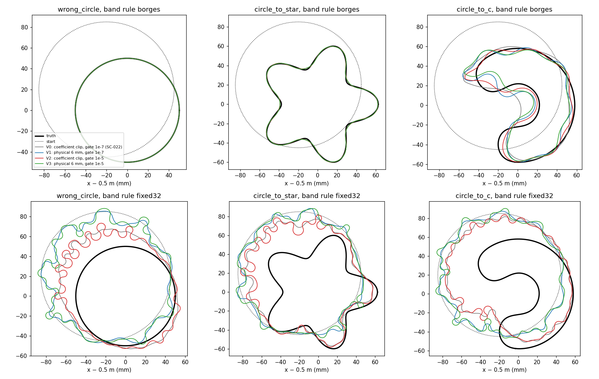

# SC-024 — backend ablations and executed probes

[Plan and amendments](../../../../docs/iterations/shape_frequency_continuation/iteration_08/03_plan.md) ·
[review resolution](../../../../docs/iterations/shape_frequency_continuation/iteration_08/02_proposals/02_review_resolution.md).
The questions:
- **(a)** Are SC-022's C failure and the fixed M=32 stalls caused by the
  refit gate or by oversized steps?
- **(b)** Does the local model predict steps that were never executed?

Inputs are SC-022's, copied with equal hashes. Geometry scores are
evaluation only.

## (a) Shared-backend ablations

These use SC-022's schedule, caps, start and cases. Only the backend
changes:

| Variant | Step control | Refit gate |
|---|---|---|
| V0 = SC-022 | coefficient clip | 1e-7 |
| V1 | physical, maximum normal move ≤ 6 mm | 1e-7 |
| V2 | coefficient clip | 1e-5 |
| V3 | physical, maximum normal move ≤ 6 mm | 1e-5 |

V0's symmetric RMS and curvature radii are computed here from SC-022's saved
curves. The table (`summary.json`) gives final values: symmetric RMS
distance (Sym.) and Hausdorff distance (H.) in mm, work units, the tightest
curvature radius reached along the run, and the refusal counts (refit /
self-intersection).

| Case | Rule | V0 | V1 | V2 | V3 |
|---|---|---|---|---|---|
| Wrong circle | ladder | Sym. 0.003, H. 0.005; 87 u | 0.002, 0.004; 90 u | 0.003, 0.005; 87 u | 0.002, 0.004; 90 u |
| Star | ladder | Sym. 0.522, H. 1.43; 139 u | 0.517, 1.39; 145 u | 0.522, 1.43; 139 u | 0.517, 1.39; 145 u |
| C | ladder | Sym. 6.70, H. 19.4; 386 u; 4.0 mm; 489/8 | 5.49, 15.9; 690 u; 3.4 mm; 520/0 | **3.20, 11.8**; 651 u; 1.8 mm; 625/12 | 6.03, 17.9; 690 u; 1.8 mm; 528/0 |
| Wrong circle | fixed32 | Sym. 11.4, H. 26.3; 2.6 mm | 19.6, 42.4; 3.6 mm | 11.2, 27.6, hard stop | 19.9, 44.3, hard stop |
| Star | fixed32 | Sym. 15.2, H. 33.7; 3.7 mm | 20.6, 41.5; 3.3 mm | 14.9, 37.1, hard stop | 19.8, 42.6, hard stop |
| C | fixed32 | Sym. 21.6, H. 47.8; 3.2 mm | 26.0, 55.6; 3.2 mm | 21.7, 46.7; 1.8 mm | 25.3, 51.7, hard stop |

"Hard stop" means NUMERICAL_FAILURE: a candidate left the frozen
production/refined agreement regime.



**Measured:**
- **Ladder, wrong circle and star:** unaffected by any variant, within 0.04 mm
  Hausdorff.
- **Ladder, C:**
  - Relaxing the gate (V2) is the largest single improvement: Hausdorff
    19.4 → 11.8 mm, symmetric RMS 6.7 → 3.2 mm.
  - Physical control alone (V1) helps less, and combined with the relaxed
    gate (V3) it is worse than V2.
  - In every variant the C curve still sharpens, to curvature radii of
    1.8–4.0 mm against the truth's 14.6 mm, and keeps hitting even the
    1e-5 gate.
- **Fixed M=32:** fails in every variant.
  - Physical control makes it worse: final Hausdorff 42–56 mm against
    26–48 mm with clipping.
  - The relaxed gate lets it continue into loops and self-intersections
    until the physics-regime check stops the run.
- In the figure, the fixed-32 boundaries stay near the start circle and grow
  wiggles and small loops. The energy sits in harmonics that the stage-1 data
  at 0.5 GHz barely constrain.

**Iteration-cap diagnostic (declared amendment `V2x4`).** Every C stage in
V1–V3 ended at SPD's 22-iteration cap, so V2 was rerun on the C with that
cap ×4. The result: symmetric RMS 3.61 mm and Hausdorff 11.71 mm, against
3.20 / 11.79 at ×1, using 1,185 units.
- Stage 3 used all 88 iterations and gained only 0.25 mm.
- Stage 4 stopped on the gate (1,310 refit refusals, radius 1.7 mm).

The iteration cap is not what limits the C.

**Interpretation.**
- **Review point 4c** said the M=32 far-start failure was shown only under
  coefficient clipping. It now also holds under physical step control and a
  relaxed gate. It remains a statement about these regularizations and this
  start; a smoothness penalty was not tested.
- **The C's limit** is progressive roughening, which the gate then freezes:
  a representation-and-regularity failure in the terms of principle 3. It
  is neither a data limit nor an iteration-budget limit.

**Selection for SC-025.** V2 has the lowest summed final symmetric RMS over
the ladder's three runs: 3.73 mm, against V1 6.00, V3 6.55 and V0 7.23. All
SC-025 arms use it.

## (b) Executed probes at recorded states (`probes/`)

**Design.** Four SC-022 states per run: start, end of stage 1, end of stage
2, and final. At each, every rule's band from SC-023, plus the oracle band,
gives one step:
- the conditional LM step at λ=1e-3, with physical control and the as-run
  gate, halved to the first admissible trial;
- executed on the stage's frequencies at N=512 (production) and N=1024
  (refined).

That is 124 band-state pairs. 110 had an admissible trial; the other 14 are
recorded as such.

**The model is right on steps that were never taken.**
- Realized over predicted decrease: median 1.04; 10–90% range 1.00–1.27;
  85% within ±20%.
- The backend would accept 95% of the executed steps.
- Every halving index matched SC-023's geometry-only record.

The five unaccepted executed steps are all ladder steps at converged ladder
states, where the absolute decrease (1e-17 to 2e-12) is below the acceptance
margin.

**Data decrease and geometry disagree for wide bands near convergence.** In
12 accepted steps, most of the stage loss disappears while the geometry gets
worse:
- At the Borges wrong circle's end of stage 1, M=14 or 32 removes 86% of the
  loss while the symmetric RMS error grows 2.2×. The oracle band, M=6,
  removes 99.9% and improves the geometry by 71%.
- At the star's final state, M ≥ 32 removes 75% of the loss and worsens the
  geometry by 41%. M=15–16 removes 90% and improves it by 54%.

**Ranking.** The realized decrease of the step actually taken still ranks
bands like the geometric gain: within-state Spearman positive in all 21
states that have at least three executed bands (median 1.0). This
observation led to amendments A1 and A2. They are post hoc, declared before
evaluation, and recorded in SC-023.

## Limits

- One start per case, one contrast, noiseless data. The step-control and gate
  settings are the tested ones.
- The probes use four states per run and one damping value. Their
  data-versus-geometry comparison relies on SC-023's evaluation-only labels.
- The V2 selection comes from three development cases.

## Reproduce

```bash
export PYTHONPATH=solvers:. OMP_NUM_THREADS=1 OPENBLAS_NUM_THREADS=1 MKL_NUM_THREADS=1
PY=/home/drdeng/miniconda3/envs/EMNerf/bin/python; OUT=<fresh bundle>
$PY -m experiments.shape_continuation.ablation_cases --output $OUT --prepare
$PY -m experiments.shape_continuation.ablation_cases --output $OUT --all --workers 18      # V1-V3, ~15 min
$PY -m experiments.shape_continuation.ablation_cases --output $OUT --one circle_to_c borges V2x4
$PY -m experiments.shape_continuation.probe_cases --output $OUT \
    --candidates results/validation/shape_continuation/SC-023-conditional-candidates/candidates/rows.jsonl.gz
$PY $OUT/analyze.py && $PY $OUT/analyze.py --probes
```

The post-preparation source change, which added V2x4, is recorded under
`amendments` in `manifest.json`. The probe sources are hashed in
`probes/manifest.json`.
