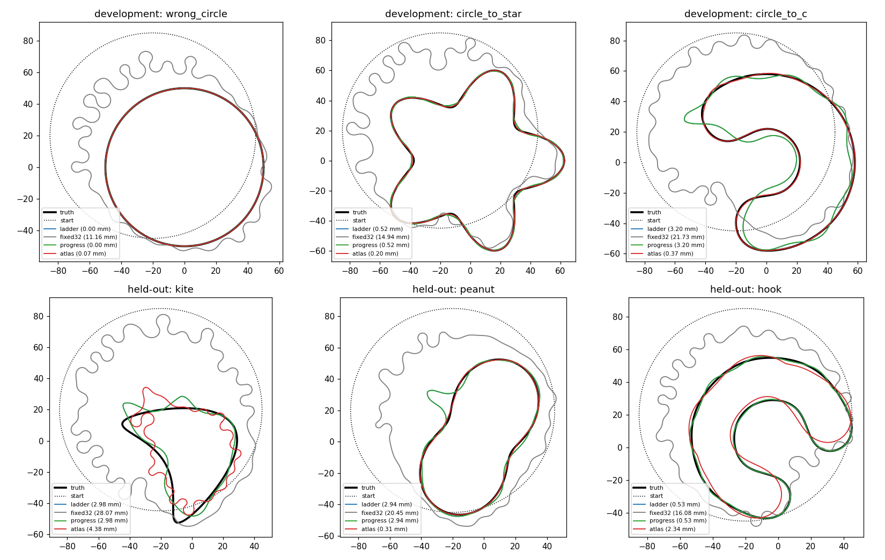

# SC-025 — band policies on development and held-out cases

[Plan, amendments A1–A2](../../../../docs/iterations/shape_frequency_continuation/iteration_08/03_plan.md) ·
[SC-023](../SC-023-conditional-candidates/README.md) · [SC-024](../SC-024-backend-ablations/README.md).
This is the review's last step: a frozen minimal policy against the ladder
and a cheap controller, on development cases and then on held-out cases. All
arms run SPD's cumulative schedule, quotas and caps with SC-024's selected
backend V2 (coefficient clip, refit gate 1e-5). Only each stage's update band
differs:

| Arm | Band M at each stage start |
|---|---|
| `ladder` | Borges: floor(3·max(k, kᵢ)) = 3, 5, 7, 9 |
| `fixed32` | 32 |
| `progress` | The ladder; after a stage that stops with no decreasing step and < 10% loss reduction, M doubles (at most 48) |
| `atlas` | A2 `parsimonious`: from fresh P=48 cells at the stage's frequencies, the smallest band whose admissible, controlled step has ≥ 0.9 of the best band's model decrease |

**Provenance.**
- A2 was derived post hoc from the SC-024 probes and qualified on SC-023's
  development decisions.
- It was frozen, and recorded in `manifest.json`'s amendments, before any
  held-out run.
- The held-out truths (kite, peanut, hook) were declared in the plan before
  SC-023 ran. They were generated only after the freeze, with SC-022's
  oracle checks (all ≤ 6.7e-14).
- The atlas arm's policy probes (2 units per stage) count toward its work
  units.

## Results

Final values (`summary.json`, evaluation only); the lowest symmetric RMS in
each case is in bold:

| Case | Arm | Bands | Status | Sym. RMS (mm) | Hausdorff (mm) | Area sym. diff. | Units |
|---|---|---|---|---:|---:|---:|---:|
| Wrong circle | ladder / progress | 3,5,7,9 | completed | **0.003** | 0.005 | 0.0001 | 87 |
| | fixed32 | 32 | numerical failure | 11.2 | 27.6 | 0.35 | 336 |
| | atlas | 2,3,4,5 | completed | 0.066 | 0.136 | 0.0023 | 119 |
| Star | ladder / progress | 3,5,7,9 | completed | 0.522 | 1.43 | 0.022 | 139 |
| | fixed32 | 32 | numerical failure | 14.9 | 37.1 | 0.55 | 171 |
| | atlas | 2,5,7,15 | completed | **0.204** | 0.589 | 0.008 | 203 |
| C | ladder / progress | 3,5,7,9 | completed | 3.20 | 11.8 | 0.16 | 651 |
| | fixed32 | 32 | completed | 21.7 | 46.7 | 1.12 | 87 |
| | atlas | 2,4,6,8 | completed | **0.369** | 1.26 | 0.017 | 248 |
| **Held-out** kite | ladder / progress | 3,5,7,9 | completed | **2.98** | 9.58 | 0.18 | 411 |
| | fixed32 | 32 | completed | 28.1 | 60.8 | 2.54 | 355 |
| | atlas | 2,7,3,19 | completed | 4.38 | 15.7 | 0.31 | 572 |
| **Held-out** peanut | ladder / progress | 3,5,7,9 | completed | 2.94 | 17.0 | 0.076 | 528 |
| | fixed32 | 32 | completed | 20.5 | 49.8 | 1.03 | 62 |
| | atlas | 2,3,4,6 | completed | **0.310** | 0.949 | 0.014 | 128 |
| **Held-out** hook | ladder / progress | 3,5,7,9 | completed | **0.525** | 1.51 | 0.032 | 195 |
| | fixed32 | 32 | completed | 16.1 | 40.6 | 1.00 | 176 |
| | atlas | 2,3,5,8 | completed | 2.34 | 5.42 | 0.165 | 674 |



**Measured:**
- **The progress controller never triggered.** No stage ended with a
  no-decreasing-step stall and < 10% loss reduction, so it is identical to
  the ladder in all six cases.
- **SC-024's runs reproduce.** The development ladder and fixed-32 runs
  repeat SC-024's V2 runs bitwise.
- **Fixed M=32 fails in all six cases.**
- **Atlas against the ladder, on development cases:**
  - better on the star (0.20 against 0.52 mm) and the C (0.37 against
    3.20 mm; Hausdorff 1.3 against 11.8 mm);
  - worse on the wrong circle (0.066 against 0.003 mm);
  - fewer units (570 against 877).
- **Atlas against the ladder, on held-out cases:**
  - better on the peanut (0.31 against 2.94 mm; Hausdorff 0.95 against
    17.0 mm);
  - worse on the kite (4.38 against 2.98) and the hook (2.34 against
    0.53);
  - geometric-mean symmetric RMS 1.47 against 1.66 mm;
  - units 1,374 against 1,134.

## Decision

**A2 is not established as a better band policy than Borges' ladder.** On
the held-out cases it wins one of three, by a factor of 9.5, and loses two,
by factors of 1.5 and 4.4. Where it helps, the effect is large, but it is
not reliable. The held-out cases have now been used once. Any follow-up that
is tuned after seeing them must treat them as development data and declare
new held-out cases.

## Descriptive observation for the next cycle

Across the 18 non-fixed-32 runs, the tightest curvature radius reached at
any stage end rank-correlates with the final error: Spearman −0.88. Fixed32
is excluded because it fails for several reasons at once; including it gives
−0.64 over 24 runs. Refit refusals correlate +0.65 over the 24 runs.

| Run | Tightest radius | Refit refusals | Final symmetric RMS |
|---|---:|---:|---:|
| Atlas peanut | 18.8 mm | 0 | 0.31 mm |
| Atlas C, from stage 2 on | ≈10 mm | 105 | 0.37 mm |
| Ladder hook | 7.9 mm | 2 | 0.53 mm |
| Ladder kite | 1.1 mm | 503 | 2.98 mm |
| Ladder peanut | 1.3 mm | 531 | 2.94 mm |
| Ladder C | 1.8 mm | 625 | 3.20 mm |

Runs that sharpen early to radii far below the truth's end frozen by the
refit gate. Which band rule avoids that depends on the case: A2 avoided it
on the C and the peanut, and the ladder avoided it on the hook. This
supports controlling regularity along the trajectory as the next lever,
rather than further band-selection rules. It is proposed, not tested, in
[iteration 09](../../../../docs/iterations/shape_frequency_continuation/iteration_09/01_results.md).

## Limits

- The results are one start per case, noiseless data, one contrast and three
  held-out cases.
- The kite truth's tightest radius is 2.1 mm, and at K=192 it is
  representable only to 1.37e-7, just above the 1e-7 gate. The run uses the
  1e-5 gate, so the kite is reachable, but it is a hard case for every arm.
- The policies choose only M. Frequencies, weights, quotas and LM damping are
  SPD's.
- A2's rule and its tolerance were chosen on development data after two
  failed amendments. The held-out result is the only unbiased evidence here.

## Reproduce

```bash
export PYTHONPATH=solvers:. OMP_NUM_THREADS=1 OPENBLAS_NUM_THREADS=1 MKL_NUM_THREADS=1
PY=/home/drdeng/miniconda3/envs/EMNerf/bin/python; OUT=<fresh bundle>
$PY -m experiments.shape_continuation.policy_cases --output $OUT --prepare            # development inputs
$PY -m experiments.shape_continuation.policy_cases --output $OUT --prepare --held-out # held-out oracles, ~30 min
$PY -m experiments.shape_continuation.policy_cases --output $OUT --run --cases wrong_circle circle_to_star circle_to_c kite peanut hook
$PY $OUT/analyze.py
```

At run time the sources must match the last manifest amendment.
