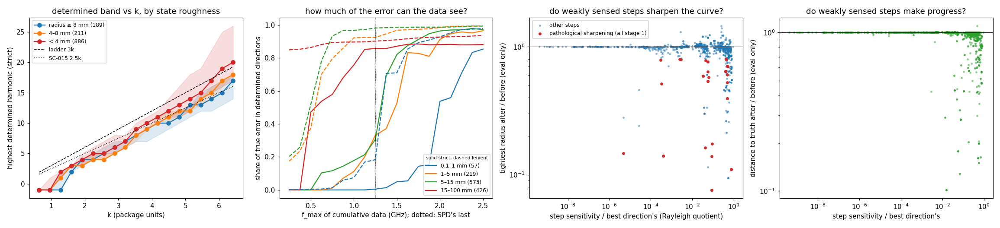

# SC-026 — first analysis of the atlas dataset

This is a short descriptive pass over all 1,286 states, 24,434 cells and the
1,875 steps actually taken between them (`analyze.py` → `analysis*.json`,
`analysis.png`). No solves. Truth-derived quantities are evaluation only:
the normal-ray error, distances and curvature radii.

**Conventions:**
- Directions are measured per unit RMS normal move (the Fourier mass W).
- A direction counts as **determined** under a declared noise model: 0.1%
  relative noise on every measurement, and a move of 0.1 mm ("strict") or
  1 mm ("lenient").
- Stacked frequencies add their information.

## 1. The determined band grows like the ladder's, and roughness widens it

The highest determined harmonic grows roughly linearly with k:

| Noise model | Highest determined harmonic | Directions determined at 0.5 GHz |
|---|---|---:|
| Strict | ≈ 2.1–2.8·k for f ≥ 0.75 GHz; nothing below 0.5 GHz | 3 |
| Lenient | ≈ 4·k | 10 |

Borges' ladder, 3k, sits between the two; SC-015's line was 2.5k.

Rough states, with a tightest radius below 4 mm, have *wider* determined
bands than smooth ones. At 2.5 GHz, under the lenient model, the highest
determined harmonic is 37 against 21. Off the circle, sensitivity leaks to
high harmonics (as in SC-015).

**So the ladder's scaling with k is roughly right; the band is not the main
weakness.**

## 2. The next frequency agrees with the current stage

Take the gradient of the stage objective at each recorded state, and compare
it with the gradient of the next frequency the schedule would add (2,066
state occurrences):
- They point the same way in 97.7% of occurrences.
- Within 15 mm of the truth, the median cosine is 0.85–0.99.
- Conflict appears only far from the truth (15–100 mm: median cosine 0.36,
  6% negative) and at the jump from stage 4 to 1.5 GHz (11% negative).

A naive "any two training frequencies disagree" count is misleading. At a
converged stage the per-frequency gradients cancel by construction.

**So at this contrast, adding frequencies does not fight the descent.**

## 3. Data up to 1.25 GHz cannot see the error that remains near convergence

This is the share of each state's true error (normal-ray, evaluation only)
that lies in determined directions, by cumulative f_max:

| State's distance to truth | Model | 1.25 GHz (SPD's last) | 1.5 | 1.75 | 2.5 |
|---|---|---:|---:|---:|---:|
| 0.1–1 mm (57 states) | strict / lenient | 0.5% / 18% | 5% / 71% | 14% / 89% | 85% / 98% |
| 1–5 mm (219) | strict / lenient | 33% / 93% | 53% / 97% | 83% / 97% | 97% / 99% |
| 5–15 mm (573) | strict / lenient | 31% / 98% | 82% / 99% | 91% / 99% | 97% / 99% |

- Mid-distance errors are mostly visible by 1.25 GHz, if the noise is
  modest.
- The error left near convergence (0.1–1 mm) is not. For most of it to be
  visible, the data must reach 1.5–1.75 GHz under the lenient model, and
  2.5 GHz under the strict one.
- This matches the star, which stalls at 1.43 mm with its error at
  harmonics 15–25.

**So SPD's top frequency is the binding limit on sub-millimetre accuracy.**

## 4. Pathological roughening happens only in stage 1

Define it as a step that shrinks the tightest radius by more than 20% and
ends below half the truth's tightest radius. Then:
- **39 of the 1,875 steps qualify, all in stage 1** (0.5 GHz alone). By
  band: 15 at band 3 (ladder), 23 at band 32 (fixed32), 1 at band 2.
- **Within stage 1, the rate rises with the band:** 1.6% at M=2, 5.2% at
  M=3 and 8.1% at M=32.
- **These steps are large:** median 0.96 mm RMS against 0.04 mm for the
  others. The rate is about 11–12% for 0.3–3 mm steps and 0.07% below
  0.3 mm.
- **They are less well sensed** than the others, though not the least sensed.
  Their sensitivity relative to the best direction has median 0.09, against
  0.22 for the other steps.

SC-025 already showed that runs roughened early end frozen by the refit
gate. The damage is done at the lowest frequency, where only about 3
(strict) to 10 (lenient) directions are determined, by steps of about 1 mm
or more.

Separately, steps with a relative sensitivity below 1e-3 barely change the
geometry: the distance ratio is 1.0000 at the median. Well-sensed steps make
the progress (Spearman −0.47 between relative sensitivity and distance
ratio).

## What this points to (not yet proposals)

1. **Extend the frequency continuation beyond 1.25 GHz**, with a truth-free
   trigger such as the stage converging. The atlas says near-converged error
   needs higher k, and the next frequency rarely conflicts with the current
   stage.
2. **Protect stage 1.** Cap the step size, or the band, at the lowest
   frequency, or apply the SC-027 regularity metric there only. That is
   where roughening starts, and it is what later freezes runs.
3. **Leave band selection roughly as the ladder has it.** The determined
   band scales with k similarly. The per-state variation (roughness widens
   it) is a secondary effect.
4. **Skip weakly sensed directions.** Directions sensed at below about 1e-3 of
   the best one make no progress. Filtering them would be an efficiency
   measure; it is not shown to improve accuracy.

## Limits

- The states come from 49 specific trajectories. 886 of the 1,286 states
  are rough (radius < 4 mm), mostly from the fixed-32 runs and the C, so
  pooled numbers lean toward those.
- The noise model is declared, not measured. The strict and lenient
  thresholds bracket plausible conditions.
- One contrast (0.5), noiseless observations, one start per case.
- Correlations are not interventions. Items 1–4 need their own controlled
  tests.
