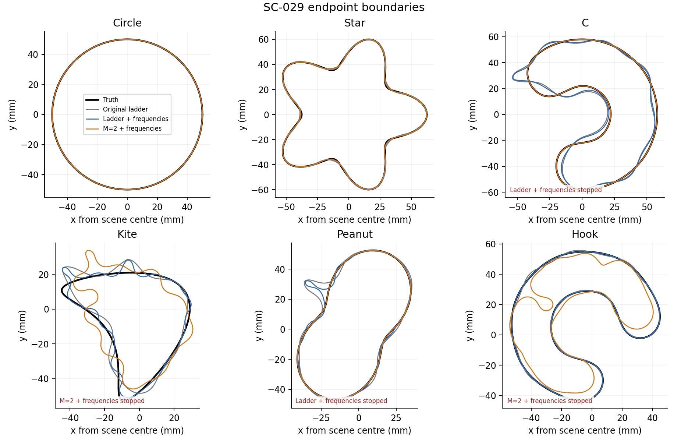

# SC-029 — initial-band and frequency-continuation strategies

**Execution: COMPLETE.** All 36 planned endpoints are recorded: 31 paths
completed their schedules, three stopped at the numerical-accuracy guard,
and two hit the time limit. **Neither proposed strategy qualifies under the
frozen robustness criteria.** M=2 in stage 1 helps C and peanut but badly
hurts kite and hook. Added frequencies have useful case-specific effects;
they do not establish a robust improvement over extra work on the old data.
Core numerical code and production defaults are unchanged.

Read the [research closeout](../../../../docs/iterations/shape_frequency_continuation/iteration_12/01_results.md)
for decisions, the [atlas audit](../SC-026-independent-audit/README.md) for
the underlying evidence, and the [proposal](../../../../docs/iterations/shape_frequency_continuation/iteration_10/02_proposals/01_atlas_strategies.md)
for the strategy selection made before these runs.

## Question and controls

The [frozen plan](frozen_plan.txt) tests two suggestions from the atlas:
use M=2 instead of M=3 in stage 1, and extend cumulative data from 1.25 to
2.5 GHz. Six development cases are crossed with two initial-band settings
and three endpoints (none, extra work on old data, extra work with new data):
**36 endpoints from 12 shared prefixes and 24 suffixes**.

The four-stage prefixes use M=(3,5,7,9) or (2,5,7,9), cumulative frequencies
(0.5,0.75,1,1.25) GHz, 22 iterations per stage, and the original stage
quotas. The suffixes begin from identical saved prefix coefficients.
Both open bands M=11,13,15,17,19, receive 22 iterations and 1500 units per
stage, and retain V2's K=192, N=512/1024 and refit tolerance 1e-5. Repeat
uses the original four frequencies; extend adds 1.5,1.75,2,2.25,2.5 GHz
cumulatively. Frequency weights are uniform within each active set.
Both have the same work ceilings, **not equal actual work** or equal
per-iteration costs. Each continuation path has a 15,512-unit and
3,600-second limit including its prefix; the prefix cap is 8,012 units.

The fitting interface receives no truth or evaluation-only data. Geometry
and all 19 common-frequency residuals are scored after each path returns.
Unused catalog frequencies are development evaluation data, not fresh
held-out measurements. Endpoint times and solve counts exclude those
evaluation solves; a continuation path includes its sunk prefix work.
Actual computation executes a shared prefix only once.

## Geometry outcomes

Symmetric boundary RMS error, **mm**. “Baseline” is the original four-stage
ladder; “M=2 first” changes only its first band. The two extra-work endpoints
are independent continuations from that prefix, not consecutive checkpoints.

| Case | Baseline | M=2 first | Baseline + old data | Baseline + high f | M=2 + old data | M=2 + high f |
|---|---:|---:|---:|---:|---:|---:|
| Circle | 0.00259433 | 0.0013825 | 0.00139792 | 0.000646988 | 0.00121551 | 0.000257503 |
| Star | 0.522234 | 0.543738 | 0.197097 | 0.20224 | 0.197104 | 0.202493 |
| C | 3.20199 | 0.353737 | 2.18056 | 2.74735* | 0.0667894 | 0.06402 |
| Kite | 2.98258 | 5.53663 | 2.73194 | 1.95826 | 5.51119 | 4.58806* |
| Peanut | 2.94427 | 0.129188 | 2.6088 | 2.49228* | 0.0420313 | 0.0104808 |
| Hook | 0.525391 | 4.99401 | 0.0662035 | 0.0597076 | 3.03896* | 3.49656* |

\* Hard stop: the retained accepted endpoint, not a completed continuation path.


The corresponding approximate Hausdorff distances, **mm**, retain local
protrusions that RMS can understate:

| Case | Baseline | M=2 first | Baseline + old data | Baseline + high f | M=2 + old data | M=2 + high f |
|---|---:|---:|---:|---:|---:|---:|
| Circle | 0.0050716 | 0.00541662 | 0.00351807 | 0.00102207 | 0.0046629 | 0.000793067 |
| Star | 1.42535 | 1.60454 | 0.533309 | 0.609717 | 0.542532 | 0.628915 |
| C | 11.7899 | 1.53633 | 11.0221 | 11.407* | 0.36783 | 0.360868 |
| Kite | 9.58043 | 14.6226 | 9.15552 | 9.57192 | 14.6241 | 15.1893* |
| Peanut | 16.9904 | 0.365913 | 16.5724 | 16.4654* | 0.117535 | 0.029546 |
| Hook | 1.50648 | 13.127 | 0.264263 | 0.22043 | 13.0441* | 13.0709* |

\* Hard stop: the retained accepted endpoint, not a completed continuation path.


[The full case table](case_results.csv) also contains the conservative
Hausdorff upper bounds, residuals at 1.25/2.5 GHz, tightest radii, projection
refusals, elapsed times, last attempted frequency and explicit stop codes.
Submicron circle RMS values are reported measurements, not certified
submicron Hausdorff accuracy. The primary decision applies a 0.01-mm floor.



## Frozen decisions

For each case, divide candidate RMS by reference RMS after flooring both
at 0.01 mm. Qualification for a future fresh-case test requires geometric
mean <=0.8, worst ratio <=1.5, and no additional hard stop. S2 must pass in
both prefixes. All cases, including stopped paths, remain in these summaries;
they are retained-endpoint comparisons, not completed-run efficacy estimates.

| Contrast | Geometric mean ratio | Worst ratio | Additional stopped cases | Decision |
|---|---:|---:|---|---|
| S1: M=2 first vs original first band | 0.668 | 9.505 | none | Reject as a universal replacement: large completed-run regressions |
| S2: high frequencies vs old-data continuation, original prefix | 0.963 | 1.260 | C, peanut | Not qualified; insufficient average gain and additional stops |
| S2: high frequencies vs old-data continuation, M=2 prefix | 0.786 | 1.151 | kite | Not qualified; additional stop, and both hook paths are incomplete |
| Combined M=2 + frequencies vs original four-stage endpoint | 0.256 | 6.655 | kite, hook | Not qualified; also combines three effects |

Exact floored/raw ratios and all incomplete pairs are in
[comparisons.json](comparisons.json). A failed numerical or time gate is
not proof that more accurate numerics or a longer run could not help.
Those alternatives were not tested and would be different contracts.

## What the controls establish

**Extra work on the old data matters.** Original-prefix repeat improves
RMS in all six cases and completes all six schedules. Its floored geometric
mean ratio versus the original endpoint is 0.545, with total path work
rising from 2,011 to 6,419 units (3.19x). This is a
[descriptive control contrast](control_extension.json), not a preregistered
adoption gate. Extra iterations, wider bands and stage restarts change
together. Their individual contributions are not identified. The result
rules out treating the atlas's local noise projection as proof that 1.25 GHz
alone binds the attained noiseless accuracy.

**New data has a strong interaction with the starting trajectory.** On the
M=2 peanut, extension improves RMS from 0.0420 to 0.0105 mm versus repeat,
with work rising from 342 to 525 units. On the M=2 C, it gives similar
accuracy (0.0640 vs 0.0668 mm) at 582 vs 1,351 units. On the original hook,
it gives 0.0597 vs 0.0662 mm at 525 vs 1,303 units. Star error is slightly
worse with extension (about 0.202 vs 0.197 mm) although it uses fewer units.
These are solve-count comparisons; no controlled wall-time speedup is claimed.

**Smaller initial bands do not guarantee regularity.** The prefix
[mechanism report](PREFIX_RESULTS.md) records peanut's minimum radius
improving from 1.27 to 18.37 mm and projection refusals falling from 531
to zero, while hook's radius falls from 7.88 to 1.73 mm and refusals rise
from 2 to 495. These opposite responses accompany the final RMS tradeoff.
The original kite gains RMS with extension but retains a 9.57-mm Hausdorff
error versus 9.58 mm at the original endpoint. The visible local defect
has not been removed.

Complete-path work units, including the reused prefix:

| Case | Baseline | M=2 first | Baseline + old data | Baseline + high f | M=2 + old data | M=2 + high f |
|---|---:|---:|---:|---:|---:|---:|
| Circle | 87 | 87 | 159 | 261 | 143 | 297 |
| Star | 139 | 123 | 551 | 454 | 671 | 456 |
| C | 651 | 267 | 2031 | 2586* | 1351 | 582 |
| Kite | 411 | 255 | 987 | 2604 | 311 | 460* |
| Peanut | 528 | 210 | 1388 | 2745* | 342 | 525 |
| Hook | 195 | 594 | 1303 | 525 | 1250* | 2837* |

\* Hard stop: the retained accepted endpoint, not a completed continuation path.


## Failures and stopping evidence

| Prefix / case / continuation | Last attempted stage | Stop | Retained RMS (mm) |
|---|---|---|---:|
| Original / C / high frequencies | 9, 2.5 GHz | 3,600-s wall limit | 2.74735 |
| Original / peanut / high frequencies | 9, 2.5 GHz | Numerical failure | 2.49228 |
| M=2 / kite / high frequencies | 5, 1.5 GHz | Numerical failure | 4.58806 |
| M=2 / hook / old data | 7, still 1.25 GHz | Numerical failure | 3.03896 |
| M=2 / hook / high frequencies | 9, 2.5 GHz | 3,600-s wall limit | 3.49656 |

The three numerical stops were rejected candidates whose maximum production/
refined field discrepancies were 1.36e-7, 1.09e-6 and 1.12e-7, respectively,
against the applicable 1e-7 gate. The previous accepted curve is retained.
The hook's old-data stop shows that numerical obstruction is not exclusive
to adding frequencies. No accuracy tolerance was relaxed to finish a path.

The ledger checks time between operations. The C and hook returns exceeded
3,600 seconds by **0.314 and 3.600 seconds**, respectively, because an
in-flight operation crossed the deadline. These measured overruns are in
[validation.json](validation.json); no further optimization budget was granted.
Wall-limited endpoints depend on host load and cannot establish asymptotic
optimizer accuracy. “Completed schedule” itself means that all stages
returned under the declared rules, not that every stage converged.

## Numerical qualification, validation and provenance

- [SC-028](../SC-028-atlas-strategies/README.md) stopped at its failed P=48
  preflight. That full-atlas gate remains failed.
- The [active-space diagnostic](../SC-028-active-band-diagnostic/diagnostic.json)
  passes every column through M=19 at the unchanged 1e-6 tolerance, on
  six recorded endpoints and 1.5/2.5 GHz. Maximum error: 5.37e-7. This is
  a representative preflight, not a guarantee for every later trial.
- [Qualification](qualification.json), [source/input/evidence hashes](manifest.json)
  and [execution environment](execution_metadata.json) are retained. The
  [verbatim prospective plan](frozen_plan.txt) matches the manifest hash;
  only execution status is subsequently updated in the live plan document.
- **33 targeted tests passed** before dispatch. The [circle replay](replay.json)
  matches coefficients, history, stops and work. All six fresh baseline
  endpoints are bitwise identical to SC-025 with identical work.
- The [post-run audit](validation.json) passes for all 36 endpoints and
  162 stage records: **1,330 accepted steps and cross-resolution checks**,
  maximum accepted field discrepancy 8.41e-8, strictly decreasing accepted
  loss within each stage, identical suffix starts, correct parent hashes,
  unchanged source/input/evidence hashes, and valid work sums and caps.
  Losses across different cumulative objectives are not compared.
- Actual unique inverse computation: **21,272 work units**, plus **684**
  endpoint evaluation field solves. The two earlier preflight/diagnostic
  runs used 48 units each, or **96** in total. SC-029 reused their evidence
  without more qualification solves.

A work unit is a frequency-system solve or a reciprocal derivative batch,
as in SPD. Geometry-only refused trials can cost time without adding such
units. At most twelve processes run with one BLAS thread each; the shared
machine was not isolated. The campaign finished within its two-hour ceiling.

## Artifact map

| Record | Contents |
|---|---|
| [summary.json](summary.json), [comparisons.json](comparisons.json) | Endpoint counts, work, fixed-criterion decisions and incomplete pairs |
| [case_results.csv](case_results.csv) | All 36 endpoints and their geometry, work, residual and stop metrics |
| [validation.json](validation.json) | Numerical, provenance, replay, ledger and history audit |
| [PREFIX_RESULTS.md](PREFIX_RESULTS.md), [prefix_summary.json](prefix_summary.json) | Earlier completed first-band milestone, preserved |
| [runs/](runs/) | Every configuration, stage history, rejected trial, acceptance check, checkpoint and result |
| [prefix.log](prefix.log), [suffix.log](suffix.log) | Campaign worker outputs, including all stopped arms |
| [report.py](report.py), [report.log](report.log) | Deterministic postprocessing and verification; no inverse runs |
| [prepare.py](prepare.py) | Fresh-bundle preparation and stale-evidence rejection |

## Reproduce

Use the recorded numerical sources and the repository's tracked SC-022/025
observations. The large SC-026 NPZ dataset is not needed for these inversions.
Create a fresh output directory; preserve this evidence bundle:

```bash
export PYTHONPATH=solvers:. OPENBLAS_NUM_THREADS=1 OMP_NUM_THREADS=1 MKL_NUM_THREADS=1
PY=/home/drdeng/miniconda3/envs/EMNerf/bin/python
ATLAS_REPLAY=/tmp/sc029-replay-new
mkdir "$ATLAS_REPLAY"
cp results/validation/shape_continuation/SC-029-atlas-strategies/prepare.py "$ATLAS_REPLAY/"
cp results/validation/shape_continuation/SC-029-atlas-strategies/report.py "$ATLAS_REPLAY/"
$PY "$ATLAS_REPLAY/prepare.py"
timeout 2700 $PY -m experiments.shape_continuation.atlas_strategy_tests prefix --output "$ATLAS_REPLAY" --workers 12
timeout 4500 $PY -m experiments.shape_continuation.atlas_strategy_tests suffix --output "$ATLAS_REPLAY" --workers 12
$PY "$ATLAS_REPLAY/report.py"
```

Preparation rejects stale qualification if numerical sources, inputs or
the reused qualification evidence have changed. It was checked both on a
fresh temporary bundle and with deliberately changed source fingerprints.
The original P=48 gate can be reproduced with the SC-028 commands; the
active-space diagnostic's script records how the narrower gate was measured.

Owner: Codex. Independent reviewer: unassigned. All six cases are development
data at one contrast, with noiseless observations and one geometric start.
No default is changed and no generalization claim is made.
