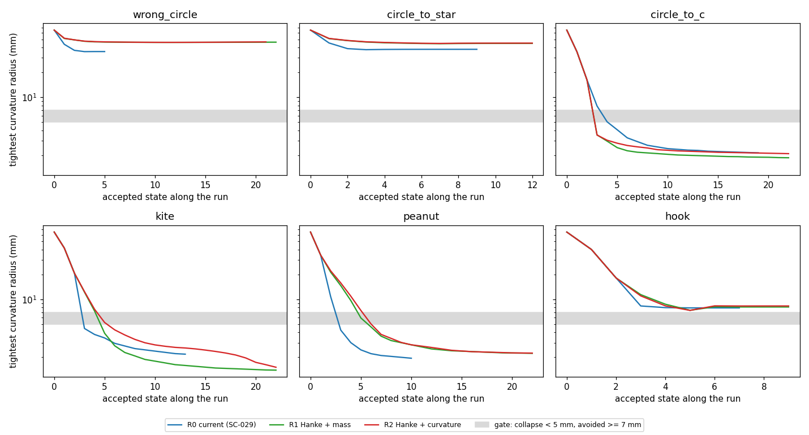
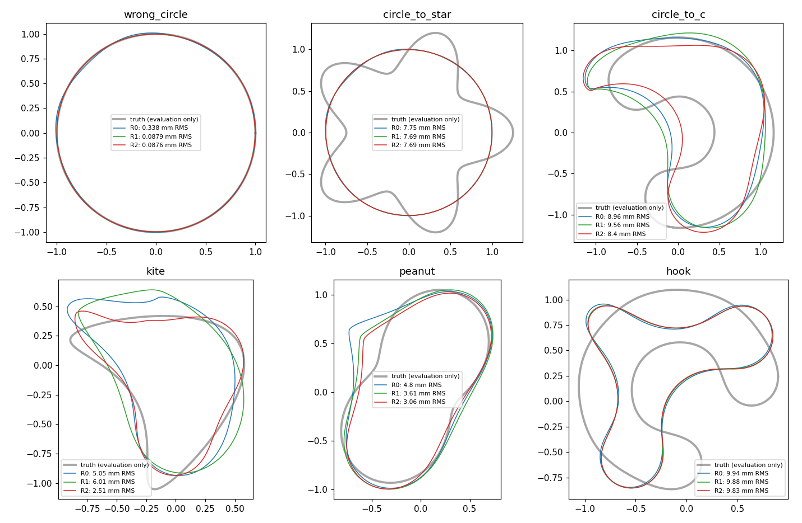

# SC-031 — curvature-aware regularizing LM against the stage-1 collapse

**COMPLETE at the stage-1 gate.** The pre-registered hypothesis is
**falsified**. With Hanke's regularizing parameter choice, neither the L²
mass metric (R1) nor the curvature-change metric (R2) avoids the stage-1
curvature collapse: C and peanut still end stage 1 at 1.9–2.2 mm tightest
radius, like the current rule (R0). The gate therefore withheld stages 2–4,
and no four-stage outcome was produced. An unplanned stage-1 observation is
recorded separately below. It is not a recovery result.

[Frozen plan](../../../../docs/iterations/shape_frequency_continuation/iteration_13/03_plan.md) ·
[proposal and RD-1 evidence](../../../../docs/iterations/shape_frequency_continuation/iteration_13/02_proposals/02_state_reconciliation_and_SC-031.md) ·
[research closeout](../../../../docs/iterations/shape_frequency_continuation/iteration_14/01_results.md)

## What ran

| Phase | Result |
|---|---|
| Qualification | 16 tests pass: circle closed forms, finite-difference curvature variation ≤ 1e-3, arclength-origin covariance ≤ 1e-10, Hanke root/fallback, logged stage. With the default settings, both SC-029 prefixes replay exactly: wrong circle (87 units) and C (651 units), matching states, trials, stops and work. 738 units ([`qualification.json`](qualification.json)). |
| Stage A | Stage 1 (0.5 GHz, M = 3) for R1 and R2 on all six cases: 12 paths, 747 units, at most 65 s per path, 6 single-thread workers, no hard stops. |
| Gate | R2 ends stage 1 at 2.09 mm (C) and 2.24 mm (peanut), below the 5 mm collapse line on both; release required ≥ 7 mm on at least one. **Not released** ([`gate.json`](gate.json)). |
| Scoring | The 12 stage-A endpoints, evaluation only: 228 field solves. |

About 25 min of wall time and 1,485 inverse units were used, within the
3 h / 25,000-unit caps. Stages 2–4 did not run.

## Hypothesis test

Tightest curvature radius at the end of stage 1, mm; truth radii for C and
peanut are 14.6 and 13.5 mm:

| Case | R0 current | R1 Hanke + mass | R2 Hanke + curvature |
|---|---:|---:|---:|
| C | 2.14 | 1.87 | 2.09 |
| Peanut | 1.94 | 2.23 | 2.24 |

The metric was active, so this is not an inert-arm artifact:

- Hanke's rule was attainable in 91–95% of C/peanut iterations (77% for
  kite), giving λ ≈ 1e2–3.5e3, comparable to diag G (3e2–7e3).
- On C, kite and peanut the curvature term carries a median 64–89% of R2's
  step-metric norm.
- The collapse goes through accepted, well-predicted descending steps:
  the quartiles of actual/predicted decrease are 1.00–1.05.
- R2 slows the peanut collapse only slightly (see the figure).

On C, the first two iterations in R1/R2 could not reach the Hanke target,
so they took the declared Gauss–Newton fallback. Coefficient clipping
makes those steps effectively R0's: the radius goes 65 → 35.7 → 16.3 mm in
all three arms. The collapse then happens on the first regularized step (cusp index
0.80), where the linearized curvature metric underestimates the finite
change, as RD-1 predicted. On peanut, about 20 regularized steps from
34 mm still descend smoothly into the 2 mm corner.



## Unplanned stage-1 observation (hypothesis-generating)

Stage 1 ends at a different objective value in each arm. All arms share
the same stage-1 objective, so the losses are directly comparable. R0's
stage-1 endpoint was taken from its saved SC-029 history and scored on
geometry only, without field solves.

| Case | Stage-1 loss R0 / R1 / R2 | RMS mm R0 / R1 / R2 | Hausdorff mm R0 / R1 / R2 | Refit refusals R0 / R1 / R2 |
|---|---|---|---|---|
| Circle | 1.3e-6 / 1.3e-7 / 1.5e-7 | 0.338 / 0.088 / 0.088 | 0.92 / 0.14 / 0.14 | 0 / 0 / 0 |
| Star | 2.6e-3 (all) | 7.75 / 7.69 / 7.69 | 12.9 / 12.7 / 12.7 | 0 / 0 / 0 |
| C | 5.9e-2 / 9.0e-2 / 2.1e-2 | 8.96 / 9.56 / 8.40 | 26.8 / 30.9 / 19.8 | 127 / 144 / 94 |
| Kite | 1.1e-2 / 1.9e-2 / **1.4e-5** | 5.05 / 6.01 / **2.51** | 12.5 / 11.2 / **7.75** | 90 / 78 / **9** |
| Peanut | 1.2e-2 / 4.9e-3 / 1.0e-3 | 4.80 / 3.61 / 3.06 | 17.6 / 11.2 / 9.16 | 50 / 67 / 56 |
| Hook | 1.2e-2 (all) | 9.94 / 9.88 / 9.83 | 22.1 / 21.5 / 21.2 | 0 / 0 / 0 |

At the stage-1 endpoint, R2 has a geometric-mean floored RMS ratio of
0.650 against R0 (worst 0.992) and 0.822 against R1. It fits the 0.5 GHz
data 3–700× better on C, kite and peanut, with fewer refit refusals than
R1 on those cases. Its corners are no less sharp; kite's truth tip
radius is 2.14 mm. These are single stage-1 runs on development data. They
do not say whether the advantage survives stages 2–4, which is the
question stage B would have answered.



## Files and reproduction

- `manifest.json`: source, input and plan hashes, the parent commit and
  the caps. `qualification/`: the replay histories.
- `runs/<arm>/<case>/`: configuration, stage-1 history with every trial
  (Hanke λ, attainability, predicted decrease), `stage_a.json`,
  `unscored_result.json` and `result.json`.
- `gate.json`: the gate record. `summary.json` and `tables.md`: rebuilt
  by `report.py`, without fitting or solves. `logs/`: the driver output.

```bash
export OPENBLAS_NUM_THREADS=1 OMP_NUM_THREADS=1 MKL_NUM_THREADS=1 PYTHONPATH=solvers:.
python -m experiments.shape_continuation.regularity_cases prepare --output <fresh>
python -m experiments.shape_continuation.regularity_cases qualify --output <fresh>
python -m experiments.shape_continuation.regularity_cases stage-a --output <fresh>
python -m experiments.shape_continuation.regularity_cases gate --output <fresh>
python -m experiments.shape_continuation.regularity_cases score-a --output <fresh>   # stage-b if released
python results/validation/shape_continuation/SC-031-regularizing-metric/report.py
```

Owner: Claude. Independent reviewer: unassigned. All six cases are development data.
