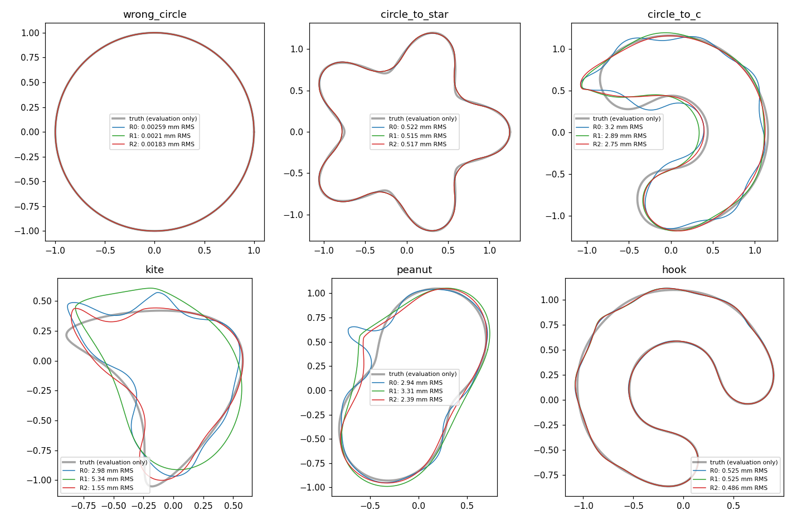
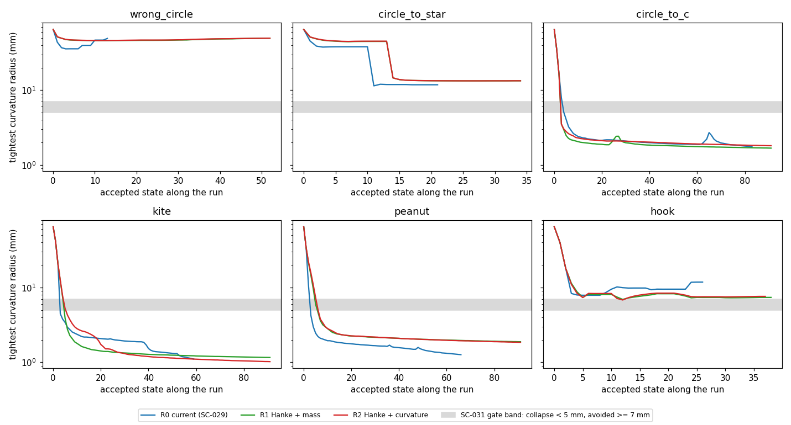

# SC-032 — four-stage continuation of the regularizing-metric arms

**COMPLETE.** All 12 paths finished their schedules. None hit a budget or
numerical stop.

Against the unchanged SC-031 criteria, **R2 (Hanke + curvature-change
metric) narrowly fails to qualify.** Its geometric-mean floored RMS ratio
to the current rule (R0) is 0.832; the bar was ≤ 0.8. No case is worse
(the worst ratio is 1.00), no hard stop was added, and neither star nor
kite regresses. **R1 (Hanke + L²) is worse than R0**, with GM 1.10 and
kite 1.79×. R2/R1 is 0.755, so what helps is the curvature metric, not
Hanke's rule. The stage-1 collapse persists in every arm.

[Plan](../../../../docs/iterations/shape_frequency_continuation/iteration_14/03_plan.md) ·
[SC-031 (stage 1 and the gate)](../SC-031-regularizing-metric/README.md) ·
[research closeout](../../../../docs/iterations/shape_frequency_continuation/iteration_15/01_results.md)

## What ran

- Stages 2–4 (0.75/1.0/1.25 GHz cumulative, M = 5/7/9) for R1 and R2 on
  six cases, resumed from SC-031's stage-A checkpoints. Those records were
  copied here with their hashes.
- `prepare-continuation` confirmed that every numerical source
  hash-matches SC-031; only the driver differs.
- R0 is the SC-029 `baseline/none` prefix.
- Stage-B work was 5,112 units against a 10,000-unit cap. The per-path
  stage-B caps of 833 units were not reached: the heavy paths used 621.
- Wall time was 19 min with 6 single-thread workers; 228 evaluation solves.

## Outcomes (four-stage endpoints)

| Case | RMS mm R0 / R1 / R2 | Hausdorff mm R0 / R1 / R2 | Final stage-4 loss R0 / R1 / R2 | Work units R0 / R1 / R2 | Refit refusals R0 / R1 / R2 |
|---|---|---|---|---|---|
| Circle | 0.0026 / 0.0021 / 0.0018 | 0.005 / 0.004 / 0.004 | 1.6e-11 / 2.1e-11 / 1.6e-11 | 87 / 342 / 351 | 0 / 0 / 0 |
| Star | 0.522 / 0.515 / 0.517 | 1.43 / 1.49 / 1.49 | 4.3e-6 / 7.1e-6 / 7.2e-6 | 139 / 211 / 211 | 0 / 0 / 0 |
| C | 3.20 / 2.89 / 2.75 | 11.8 / 11.1 / 11.8 | 2.1e-2 / 2.1e-2 / 1.5e-2 | 651 / 690 / 690 | 625 / 710 / 378 |
| Kite | 2.98 / 5.34 / **1.55** | 9.58 / 9.52 / **6.77** | 1.3e-2 / 8.1e-2 / **1.8e-4** | 411 / 690 / 690 | 503 / 570 / 258 |
| Peanut | 2.94 / 3.31 / 2.39 | 17.0 / 10.4 / 8.27 | 1.1e-2 / 3.2e-2 / 1.7e-2 | 528 / 690 / 690 | 531 / 781 / 427 |
| Hook | 0.525 / 0.525 / 0.486 | 1.51 / 2.02 / 1.86 | 6.0e-6 / 6.6e-6 / 6.4e-6 | 195 / 308 / 296 | 2 / 0 / 0 |

| Ratio (0.01-mm floor) | GM | Worst | Criterion |
|---|---:|---:|---|
| R2/R0 | 0.832 | 1.000 | ≤ 0.8 and worst ≤ 1.5: **not met** (GM) |
| R1/R0 | 1.103 | 1.792 | not met |
| R2/R1 | 0.755 | 1.003 | ≤ 0.8: the gain R2 does have comes from the curvature metric |



## Mechanism

- **The collapse is unchanged.** The minimum tightest radius on the hard
  cases is 1.0–1.9 mm in every arm (figure below). R2's gains come from a
  better fit around the corner: fewer refit refusals and a lower final loss
  on C and kite. Avoiding the corner is not the mechanism.
- **The heavy paths are limited by the iteration budget.** R1 and R2 end
  every stage on C, kite and peanut at the 22-iteration cap. Actual/predicted
  decrease is 1.00, so the steps are conservative and well modelled but
  slow. They cost 6–68% more work units than R0 on those cases. With cache
  on for R1/R2 and off for SC-029's R0, wall time is not a controlled
  comparison.
- **Where it helps most.** Kite is the case whose truth has a sharp tip
  (2.14 mm). There R2 halves the RMS error, and its stage-4 misfit is 70×
  lower than R0's. Peanut's Hausdorff defect halves (17.0 → 8.3 mm) even
  though its RMS improves only 19%.



## Limits

These are single runs on the six development cases. Nothing here
qualifies R2 for fresh cases, and the result is not an endpoint-accuracy
claim beyond the tested prefix. The decision criteria were fixed in SC-031
and not revised after these results.

## Files and reproduction

`manifest.json` (hashes, the parent manifest and the copied stage-A
records), `runs/<arm>/<case>/` (stage 1 as copied, stages 2–4, trials with
Hanke λ and predicted decrease, `result.json`), `summary.json`,
`tables.md`, `report.py` and `logs/`.

```bash
export OPENBLAS_NUM_THREADS=1 OMP_NUM_THREADS=1 MKL_NUM_THREADS=1 PYTHONPATH=solvers:.
python -m experiments.shape_continuation.regularity_cases prepare-continuation --output <fresh>
python -m experiments.shape_continuation.regularity_cases continue --output <fresh>
python results/validation/shape_continuation/SC-032-regularizing-metric-prefix/report.py
```

Owner: Claude. Independent reviewer: unassigned.
