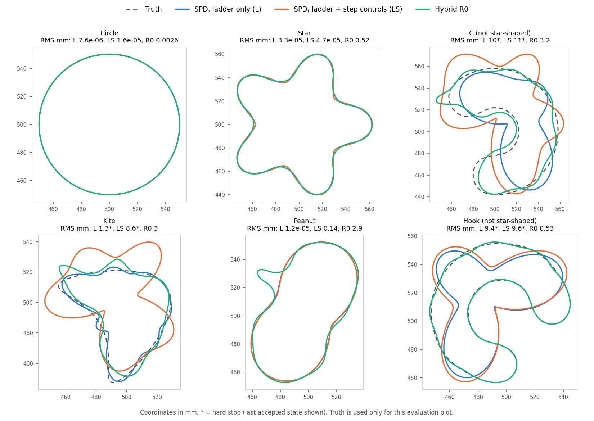

# SC-034 — SPD comparison fitter with the legacy single-object controls

**COMPLETE.** 18 fits (3 arms × 6 cases), all workers exited cleanly, and
every hard stop is retained.

**The pre-declared adoption test H1 passes.** LS (ladder + step controls)
recovers the circle (1.6e-5 mm RMS) and the star (4.7e-5 mm). SC-030's SPD
arm reached 7.49 and 7.34 mm on these cases, with hard stops.

**The ablation changes which control deserves the credit.** The ladder alone
(L: Cartesian K = 4/6/8/10, with no step controls) has lower RMS than LS on
every case, and costs fewer units on circle, star and peanut:

- circle 7.6e-6 mm;
- star 3.3e-5 mm;
- **peanut 1.2e-5 mm in 59 units**, where hybrid R0 reaches 2.94 mm and R2
  2.39 mm;
- kite 1.25 mm before a certificate stop (R0 2.98 mm, R2 1.55 mm).

The four step controls alone at K17 (S) do not suppress the high-mode ripple.
They are worse than SPD-008 (GM 1.20), and with the ladder they cap every
peanut stage at 22 iterations (0.137 mm).

[Plan](../../../../docs/iterations/shape_frequency_continuation/iteration_15/03_plan.md) ·
[assessment](../../../../docs/iterations/shape_frequency_continuation/iteration_15/02_proposals/01_spd_legacy_controls.md) ·
[research closeout](../../../../docs/iterations/shape_frequency_continuation/iteration_16/01_results.md)

## What ran

- The SPD fitter as in SC-030 (compiled/real-Bessel/certified, 512/1024
  nodes, 8 mm radius certificate, refined acceptance, per-coefficient clips,
  22 iterations and 1000/1250/1750/4000 units per stage), with only these
  changes by arm:

  | Arm | Cartesian K by stage | `StepSafeguards` |
  |---|---|---|
  | L | 4/6/8/10 (radial orders 3/5/7/9 = hybrid M) | off |
  | S | 17 throughout | m⁴ ridge 1e-4, damping floor 1e-6, 2 mm normal trust region, Armijo 1e-4 |
  | LS | 4/6/8/10 | as S |

- Qualification:
  - 6 new unit tests pass, and the existing SPD suites pass (95 tests,
    [logs](qualification/pytest/)).
  - With the controls off, the modified code replays SC-030's SPD circle
    **trajectory digest exactly** (`d15be8a8…`, 134 units, same
    `NUMERICAL_FAILURE` stop; [record](qualification/result.json)).
- 26.6 min campaign wall with 9 concurrent single-thread workers; 7,260
  inverse units in total. Concurrent timings are observations, not cost
  claims.

## Outcomes (symmetric RMS, mm; * = hard stop, last accepted state scored)

| Case | Star-shaped truth | SPD-008 | L | S | LS | Hybrid R0 | Hybrid R2 |
|---|---|---:|---:|---:|---:|---:|---:|
| Circle | yes | 7.49* | **7.6e-6** | 18.5* | 1.6e-5 | 0.0026 | 0.0018 |
| Star | yes | 7.34* | **3.3e-5** | 1.67 | 4.7e-5 | 0.522 | 0.517 |
| C | **no** | 19.0 | 10.1* | 25.3 | 11.2* | 3.20 | 2.75 |
| Kite | yes | 21.3 | **1.25*** | 29.2* | 8.63* | 2.98 | 1.55 |
| Peanut | yes | 13.8* | **1.2e-5** | 27.3* | 0.137 | 2.94 | 2.39 |
| Hook | **no** | 12.6 | 9.36* | 18.8* | 9.58* | 0.525 | 0.486 |

Work units, L / LS: circle 51 / 137, star 111 / 233, peanut 59 / 920,
kite 869 / 372 (both stopped). Every endpoint passes the training
cross-resolution audit except SPD-008's circle. The full tables, including
Hausdorff distances and per-stage steps, are in [`tables.md`](tables.md);
[`summary.json`](summary.json) is machine-readable.



| GM RMS ratio (0.01 mm floor) | Six cases | Four star-shaped cases |
|---|---:|---:|
| L / SPD-008 | 0.018 | 0.003 |
| L / hybrid R0 | 0.34 (worst 17.8: hook) | **0.072** (worst 1.00) |
| LS / hybrid R0 | 0.74 | 0.23 (worst 2.89: kite) |
| S / SPD-008 | 1.20 | 1.11 |

## Mechanism

- **A band-limited state is what removes the ripple.** At the end of stage 1,
  radial RMS above mode 5 is 6.5–9.9 mm for SPD-008 and 9.1–12.6 mm for S. For
  L and LS it is 0 by construction, since K4 holds radial orders ≤ 3. The
  circle and star truths have none. Under S the 2 mm bound limits each step
  (largest accepted move 2.00–2.01 mm), but the ripple still accumulates
  over 22 small steps. The m⁴ ridge, referred to max diag G, is weak on
  modes 6–10 (0.13–1.0 × max diag).
- **Peanut is exactly radial mode 2** (37.5 + 15 cos 2θ mm;
  [`audit/truthmodes.txt`](audit/truthmodes.txt)). L reaches it in 7
  stage-1 steps from the 0.5 GHz data alone and takes no step afterwards.
  The hybrid, with the same data and first band (M = 3), collapses into a
  1.9 mm corner in stage 1 (SC-031). The hybrid limits the band of each
  *step*, while SPD-L limits the band of the *state*. *Refined by
  [RD-2](../../../../docs/iterations/shape_frequency_continuation/iteration_16/02_proposals/01_band_energy_audit.md):*
  both overshoot into a 3–4 mm feature; SPD-L reverses it because its state
  stays inside its step span. The limited band does not by itself cap
  bending energy.
- **The step controls cost iterations.** With a 2 mm trust region and 22
  iterations per stage, LS uses all 22 in stage 1 on every case, and in all
  four stages on peanut. LS peanut is therefore iteration-limited
  (inconclusive under the plan), not a failure of accuracy. The legacy
  inverse had 150 iterations in total.
- **Every hard stop is the conservative 8 mm radius certificate** blocking
  both sides of an FD-compatible stencil (`UNRESOLVED_DERIVATIVE`;
  [`audit/stopdiag.txt`](audit/stopdiag.txt)). The certificate reads
  8.00–8.02 mm while the actual minimum centre distance is 18 mm (L kite)
  and 30–36 mm (all S). On C and hook, whose truths are not star-shaped
  ([`audit/starshaped.txt`](audit/starshaped.txt)), the fits are pulled
  toward the concavity and the actual distance is 8–11 mm. This is the stencil
  control the assessment deferred.

## Decisions against the frozen rules

- **H1: PASS.** By the pre-declared rule LS qualifies as the SC SPD comparison
  reference.
- **Amendment adopted by the user** ("ladder as baseline yes", 2026-09-24). Use **L** as that
  reference. Its RMS is lower than LS's on every case, at lower cost except on kite. The
  four step controls stay available (opt-in) but are not part of the baseline.
- **Per-case classes, as pre-declared on LS:** kite *open* (8.63 > 2.98 mm);
  peanut *baseline better, not solved* (0.137 mm). On L they would be kite
  *baseline better, not solved* (1.25 mm, certificate stop) and peanut
  *solved by the restored baseline* (1.2e-5 mm).
- **C and hook are representation-limited** for SPD; the hybrid keeps a clear
  advantage there (0.49–3.2 mm against 9–25 mm).

## Limits

These are single runs on six noiseless development cases with one start.
H1 is established on two cases. The comparison of L with the hybrid on
peanut differs in more than the state band: in the chart (polar radial
versus arclength normal moves), the LM details and the guards. The
state-band attribution is a mechanism hypothesis with one supporting case,
not a measured single-change effect. Kite's truth lies 8.75 mm from its
Cartesian centre, close to the 8 mm floor, and the polar gauge does not
converge on its band-8 truth ([`audit/truthfloor.txt`](audit/truthfloor.txt)).

## Files and reproduction

- `manifest.json` (source, input and plan hashes; parent `ac2ea9b`) and
  `approved_plan.md`.
- `qualification/` (replay record and pytest logs).
- `runs/<arm>/<case>/`: configuration, per-stage records, `safeguards.jsonl`,
  final state and `result.json`.
- `campaign.json`, `logs/`, `audit/` (scripts and outputs), and
  `report.py` → `tables.md`, `summary.json`, `boundaries.png`.

```bash
export PYTHONPATH=solvers:. OPENBLAS_NUM_THREADS=1 OMP_NUM_THREADS=1 MKL_NUM_THREADS=1
python -m experiments.shape_continuation.spd_safeguards prepare  --output <fresh>
python -m experiments.shape_continuation.spd_safeguards qualify  --output <fresh>
python -m experiments.shape_continuation.spd_safeguards campaign --output <fresh>
python results/validation/shape_continuation/SC-034-spd-legacy-controls/report.py   # no solves
```

Owner: Claude. Independent reviewer: unassigned.
