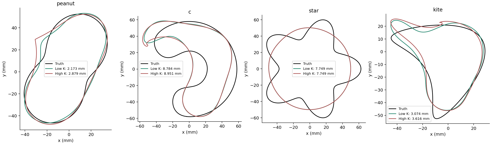
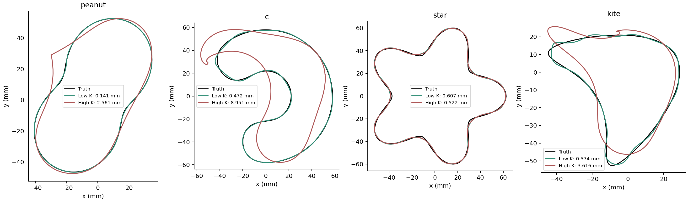
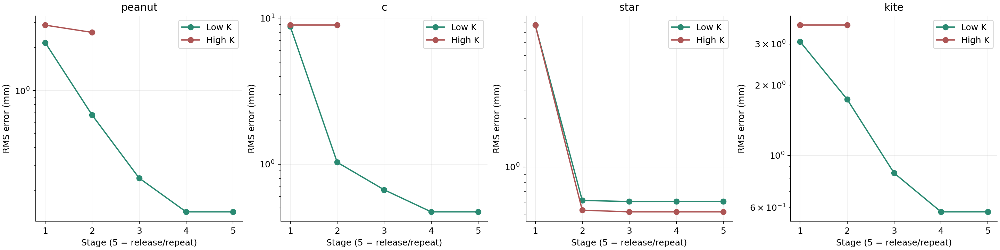

# SC-035 — centred state-band restriction

**COMPLETE:** all eight matched paths returned; low K completes all four
schedules, high K has three numerical-resolution hard stops. No default promoted.
Owner: Codex; independent reviewer unassigned.
[Contract](../../../../docs/iterations/shape_frequency_continuation/iteration_17/03_plan.md) ·
[Theory/derivative review](../../../../docs/iterations/shape_frequency_continuation/iteration_16/02_proposals/04_state_band_qualification.md).

One intervention: state band 8/12/16/20, then release to 192 on the existing
last objective, versus 192 throughout with the same final repeat. Both arms
use `T_z(a) = z + P_K[A(z + h(a)n) - A(z)]`, with A the resolved arclength map.
This centred construction leaves a zero step exactly unchanged. Padding the
state at a stage boundary preserves its shape. The Jacobian differentiates
the ENTIRE construction using cheap geometry differences and the existing
reciprocal field derivative; there are no field finite differences in fitting.
M=3/5/7/9, cumulative frequencies, LM settings and acceptance checks remain the
same. No curvature or clearance prior is added. The high-K control is this
same centred construction, not a relabeling of the original Borges hybrid.

The pure-normal preprojection and the final candidate must both be valid.
The trial's numerical gate checks grid refinement; the intentional change
from projection is recorded separately. This is an explicit method change,
not a storage optimization. Band K alone provides no curvature guarantee:
parametrization speeds matter, and are measured rather than assumed uniform.

Qualification passes: exact zero-step identity and band-padding invariance;
complete-trial field derivative errors below 9e-10 on peanut, non-star C and
star controls; geometry derivative step-halving stability below 3e-10; high-K
agreement with a smooth Borges trial within 1e-12 mm. The old Jacobian differs
by 0.19–0.97% in the low-K tests, so the complete derivative is material.
[Raw qualification](qualification.json), [script](qualify.py).

The stage-one gate passes. Low/high RMS ratios are 0.755 (peanut), 0.981 (C),
1.00001 (star), 0.850 (kite). Smoothness alone was not the release criterion.
All eight actual pilot endpoints also pass an additional active-Jacobian
512/1024 refinement and full-trial derivative audit; the most difficult
high-K kite FD error is 9.06e-4 against the frozen 1e-3 tolerance.
[Pilot table](pilot_table.md), [gate](gate.json),
[endpoint derivative audit](pilot_derivative_audit.json).




## Complete inverse outcome

| Case | Low K RMS (mm) | High K RMS (mm) | Ratio | Low / high work | Low / high status |
|---|---:|---:|---:|---:|---|
| peanut | 0.141496 | 2.560561 | 0.0553 | 188 / 109 | COMPLETED_SCHEDULE / HARD_STOP |
| circle_to_c | 0.471729 | 8.950858 | 0.0527 | 184 / 60 | COMPLETED_SCHEDULE / HARD_STOP |
| circle_to_star | 0.606737 | 0.522234 | 1.1618 | 147 / 147 | COMPLETED_SCHEDULE / COMPLETED_SCHEDULE |
| kite | 0.574345 | 3.616370 | 0.1588 | 1045 / 49 | COMPLETED_SCHEDULE / HARD_STOP |

High-K failures are retained at their last accepted state. They are not
stationary solutions. Against the original normal hybrid, the low-K arm
changes peanut **2.9443 → 0.1415 mm**, non-star C **3.2020 → 0.4717 mm**, kite
**2.9826 → 0.5743 mm**, and star **0.5222 → 0.6067 mm**. The original hybrid
is a context control; the high-K centred construction above is the matched
state-band ablation. SC-036 reruns the original control unchanged.



The gains are already present before the extra release stage. The four
low-K paths use **1,160 units through stage four**, against the original
hybrid's 1,729, with essentially the final geometry. The release costs another
404 units (364 on kite) for no meaningful reconstruction gain; kite slightly
worsens despite a smaller objective. Total low-K work is 1,564 units; matched
high K uses 365 because three paths stop early. Both accounting facts matter.
Final evaluation adds 152 fields across the eight arms. Geometry derivative
and trial-construction counts/times are in each result, separately from BIE
work. Wall times are concurrent observations, not a speedup claim.



Kite reaches the 22-iteration cap in both final stages; its endpoint is
**iteration-limited**, not a certified stationary optimum. The sharp-detail
star regresses 16.2%. The low-K pilot therefore demonstrates a useful state
regularization mechanism, not a universally improved method. SPD-L remains
far more accurate on its representable peanut/star controls; it cannot
represent the C. The final K=192 release does not repair the star bias.

Decision: keep this as positive, opt-in development evidence for state-level
regularization with a complete-construction derivative. Retain the failure
and sharp-detail controls. A single later-release schedule is tested in
[SC-037](../SC-037-later-state-release/README.md); no prior bundle is added.

Final numerical audit: all four low-K endpoints pass the stage's field
512/1024 agreement limits, active-Jacobian refinement (<1.4e-13), and a full
actual-trial central derivative check (<3.6e-10). This audit costs 96 units;
initial qualification (28), pilot endpoint audit (48), and final audit (96)
total **172**, below the 200-unit qualification ceiling. [Raw audit](final_derivative_audit.json).

Run/rebuild under EMNerf with `PYTHONPATH=solvers:.` and
`OPENBLAS_NUM_THREADS=1 OMP_NUM_THREADS=1 MKL_NUM_THREADS=1`:

```bash
python results/validation/shape_continuation/SC-035-state-band/qualify.py
python results/validation/shape_continuation/SC-035-state-band/run.py
python results/validation/shape_continuation/SC-035-state-band/report.py
```

`run.py` refuses an existing `runs` directory; use a copied fresh bundle for a
new run. Its continuation is gated on the saved pilot. Source/input hashes,
work counters, accepted states, failed trials and hard stops are saved. The
prototype remains isolated in this bundle; no production defaults changed.
These four cases are development data. No generalization or atlas-controller
improvement is claimed.
