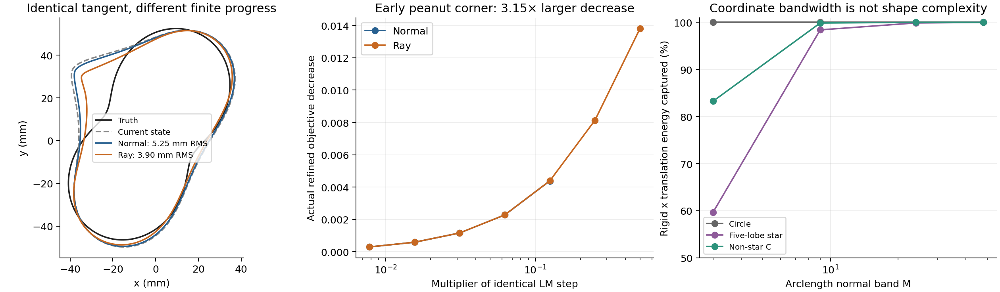
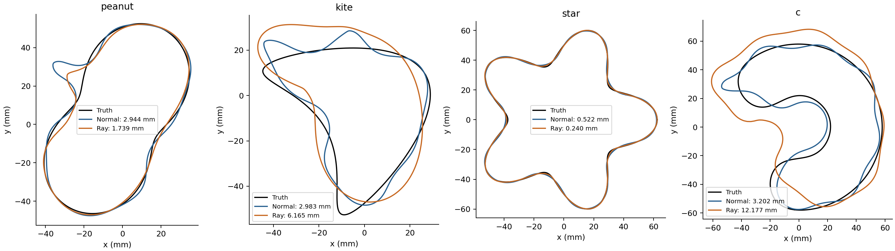

# SC-036 — same local information, different finite paths

**COMPLETE:** matched screen and all eight full inverse comparisons. Owner: Codex;
independent reviewer unassigned. [Frozen contract](../../../../docs/iterations/shape_frequency_continuation/iteration_16/03_plan.md).

The two trials apply exactly the same arclength-normal velocity h at the same
current shape: normal motion `h n`, or ray motion `h e_r/(e_r dot n)` about the
current parameter-mean centre. There is no second radial bandwidth truncation.
The production/refined forward grids, K=192 arclength refit, numerical gates,
Jacobian, objective, damping and coefficient controls agree. In full inverses,
a non-star current state uses the normal path in the ray arm; a refused ray
trial never triggers that fallback.

The replay screen finds a real, limited finite-path effect. At an early
peanut corner, a ray step accepts four times the normal step and gives 3.15x
its actual data decrease. Both also improve truth distance (evaluation only).
The ray step sharpens the corner further; at the final collapsed peanut state
BOTH paths fail across the declared multipliers. The smooth star changes very
little. [All five states](screen_table.md), [raw summary](summary.json).



All ten actual-trial derivative checks pass (worst 3.32e-7 relative); the five
update unit tests and 25 existing backend/atlas/metric regression tests pass.
The screen uses 131 field/reciprocal units. A reporting TypeError interrupted
the first attempt after 7 units; that attempt and traceback are retained in
[SC-036-logs](../SC-036-logs/). The separate coordinate check uses 15 units.
Regression-test field calls are not included in these experiment-unit counts.
No end-to-end speed claim is made.

The screen's binding gate released eight full inverses (peanut, kite, star,
non-star C; normal versus ray). [Dispatch allocation](inverse_allocation.md)
reserves 2,400 inverse units per path and 19 final evaluation fields, within the
20,000 aggregate ceiling. Two concurrent single-thread workers; wall times
are observations, not an isolated timing comparison.

An external SIGTERM ended the first dispatcher after three paths completed.
Completed results are retained. Two incomplete attempts remain under
`inverse/interrupted_attempt01`; only the five missing endpoints are rerun,
from unchanged initial states/settings. Their partial work is a lower bound;
`inverse/recovery_manifest.json` reserves the interrupted attempts' full caps
and still stays below the aggregate ceiling (18,322 units). The interruption
is not a scientific failure or a reason to change numerical settings.

## Complete inverse result

| Case | Normal RMS (mm) | Ray RMS (mm) | Ratio | Normal / ray inverse units | Status normal / ray |
|---|---:|---:|---:|---:|---|
| peanut | 2.94427 | 1.73937 | 0.591 | 528 / 690 | COMPLETED_SCHEDULE / COMPLETED_SCHEDULE |
| kite | 2.98258 | 6.16452 | 2.067 | 411 / 57 | COMPLETED_SCHEDULE / COMPLETED_SCHEDULE |
| circle_to_star | 0.52223 | 0.24015 | 0.460 | 139 / 133 | COMPLETED_SCHEDULE / COMPLETED_SCHEDULE |
| circle_to_c | 3.20199 | 12.17687 | 3.803 | 651 / 576 | COMPLETED_SCHEDULE / COMPLETED_SCHEDULE |

The ray path improves peanut and star, but worsens kite and non-star C.
All four normal paths replay SC-029's accepted coefficients and work counts
**bitwise**. Endpoints use 3,185 inverse units plus 152 evaluation fields;
interrupted attempts are additional, with a known 180-unit lower bound and
a reserved 4,800-unit upper bound. Screening/coordinate units are separate.
No experiment ceiling is exceeded, even at that conservative interruption
bound. [Integrity/replay audit](../SC-036-logs/integrity_audit.json).



**Decision:** finite-path geometry has a causal but case-dependent effect.
A shared tangent and larger feasible step do not predict a better full
inverse. The matched ray alternative is not adopted as a general repair.
The terminal peanut obstruction survives this change; state restriction is
therefore tested separately in [SC-035](../SC-035-state-band/README.md).

Reproduction (EMNerf, repository root, single-thread BLAS):

```bash
PYTHONPATH=solvers:. python -m experiments.shape_continuation.finite_path_study --output <fresh-directory>
```

The screen driver refuses an existing output. `run_inverse.py` records the
conditional campaign; `recover_dispatch.py` records recovery from the external
termination. `report.py` rebuilds tables/figures without solving fields.
[Coordinate study](../SC-036-coordinate-review/README.md) distinguishes a
change of coordinates from a change of physical subspace.

No solver, optimizer default, production geometry or comparison baseline was
changed. These four cases are development evidence, not generalization.
