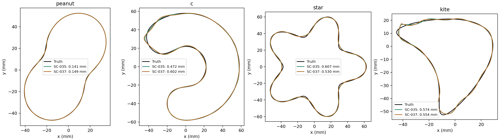

# SC-037 — relax the state restriction earlier

**COMPLETE; predeclared adoption gate FAIL.** Four completed continuations,
no hard stops, 1,429 charged inverse units (including reused stage-one prefixes)
and 76 evaluation fields. The single tested ladder is K=8/16/32/64/192;
all other SC-035 update/backend settings are unchanged. No parameter sweep.
[Contract](../../../../docs/iterations/shape_frequency_continuation/iteration_18/03_plan.md),
[raw decision](decision.json), [comparison table](comparison.md).

Relative to SC-035's tighter 8/12/16/20 ladder, the wider ladder:

- restores star from 0.6067 to **0.5305 mm**, within 1.6% of the high-K control;
- changes peanut 0.1415 → **0.1491 mm**;
- changes non-star C 0.4717 → **0.6021 mm**;
- changes kite 0.5743 → **0.5537 mm**, at 926 rather than 1,045 units.

The C regression is **27.65%**, exceeding the frozen 25% allowance. All other
gates pass. The threshold is not retuned: this specific tradeoff hypothesis
fails its selection gate, even though both schedules retain large benefits
against the original hybrid on peanut/C/kite. No universal winner or
production-default change is claimed. The final release adds almost no
reconstruction value here either.

That final-release statement is specific to M=9 and the original four
frequencies. [SC-038](../SC-038-update-band-release/README.md) separately tests
a later M=11/15/19 update-band release on all 19 available frequencies.

Interpretation: temporary coarse-stage bias can be affected by when capacity
is restored; releasing only at the very end is ineffective on these paths.
One simple schedule does not remove the tradeoff. Keep the substantive
state-regularization result and close this bounded schedule comparison
without a grid search. These are existing development cases, not a
new-shape/noise generalization study.

`run.py` imports the frozen SC-035 update and stage fitter, reuses exactly its
K=8 accepted prefixes, charges their work, and saves sources/inputs/settings.
`report.py` computes the fixed gate and figures from saved results without
field solves. Run under EMNerf with `PYTHONPATH=solvers:.` and one BLAS thread;
use a fresh copied bundle for a new run because existing results are refused.
