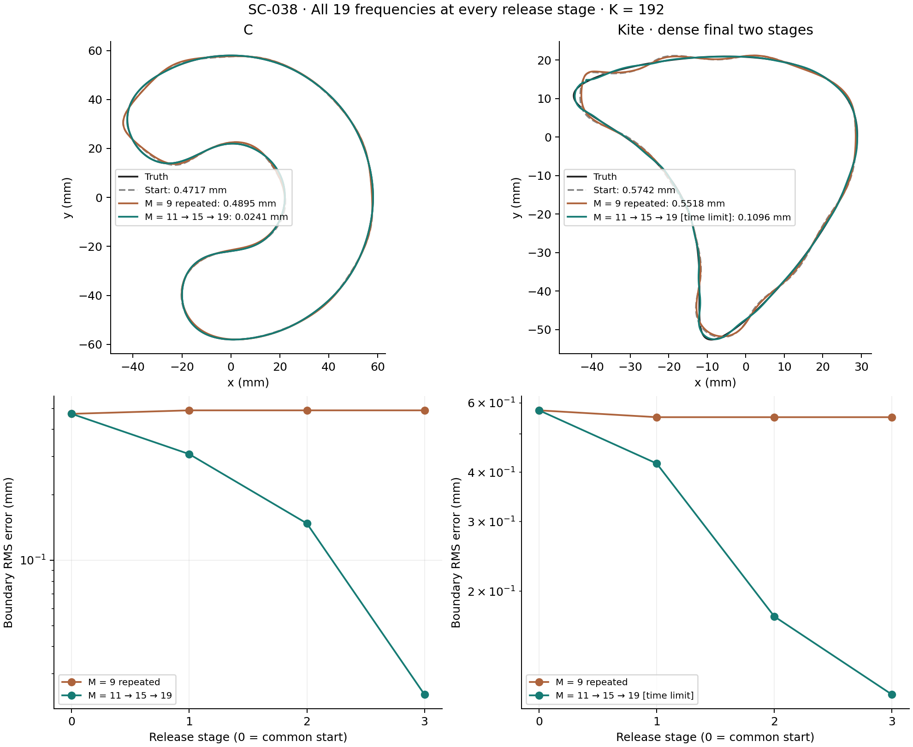
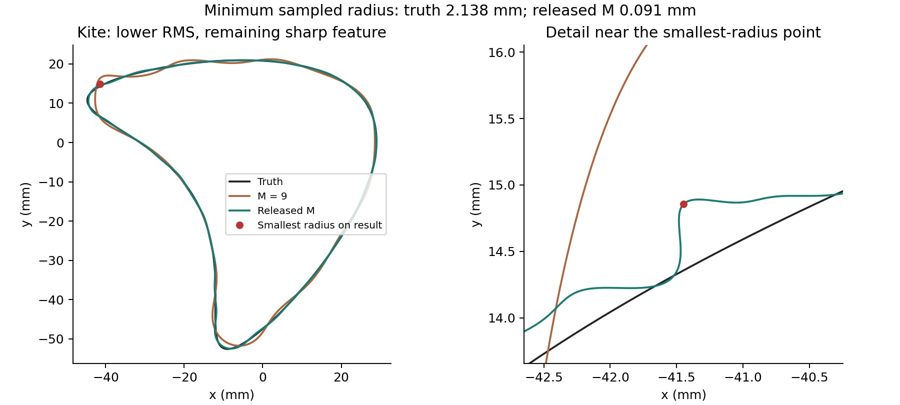
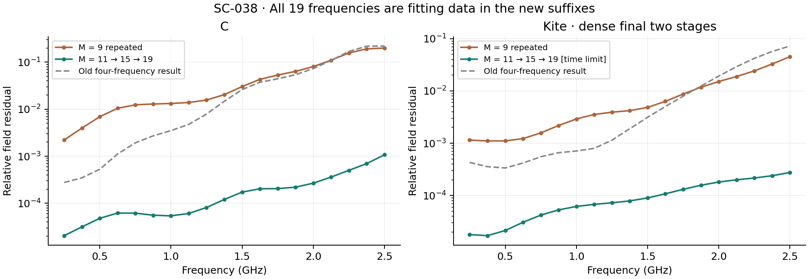

# SC-038 — release M on all available frequencies

**COMPLETE.** Raising M materially improves both development cases. C reaches
0.024100 mm RMS; kite reaches 0.109571 mm, but remains time-limited and has an
unwanted sharp feature. This is not a complete regularity fix for kite.
Owner: Codex; independent reviewer unassigned. No production default changed.

[Frozen comparison](../../../../docs/iterations/shape_frequency_continuation/iteration_19/03_plan.md) ·
[Resolution follow-up](../../../../docs/iterations/shape_frequency_continuation/iteration_19/04_resolution_followup.md) ·
[Conditional final stage](../../../../docs/iterations/shape_frequency_continuation/iteration_19/05_remaining_m19.md) ·
[Iteration 20](../../../../docs/iterations/shape_frequency_continuation/iteration_20/01_results.md).

Both arms start at the exact SC-035 low-K stage-four boundary, before its old
release. Padding K=20 to 192 leaves the boundary exactly unchanged. Every new
stage uses all 19 existing frequencies, 0.25–2.5 GHz, with equal weights.
Compare **M=11/15/19** (the existing band rule at 1.5/2/2.5 GHz) with
**M=9/9/9**, at K=192. The full catalog is now fitting data, not held-out data.
The projected update, complete-construction derivative and optimizer are shared.

| Case | Common start RMS (mm) | All frequencies, M=9 | All frequencies, M ladder | RMS reduction vs M=9 |
|---|---:|---:|---:|---:|
| C | 0.471739 | 0.489494 | **0.024100** | **95.1% (20.3x)** |
| Kite | 0.574158 | 0.551755 | **0.109571** | **80.1% (5.0x)** |

The old four-frequency, M=9 release ended at 0.471729 / 0.574345 mm.
The new same-data M=9 repeats take no further steps after their first stage.
Thus extra frequencies and additional opportunities alone do not explain the
new improvement. The broader update space is useful on these saved states.

C progresses 0.471739 → 0.307814 → 0.147683 → 0.024100 mm, completing all three
stages at 512/1024 nodes. Each returns on `no_decreasing_step`; the final stage
accepts two steps. Its Hausdorff error falls from the matched control's
1.77449 to 0.11460 mm, and mean catalog field residual from 5.48% to 0.0226%.
This is a strong recovery gain, not a global-convergence claim.

Kite progresses 0.574158 → 0.421182 mm at M=11. The original M=15 path accepts
one step to 0.278808 mm, then the next candidate fails the frozen 512/1024
field gate (4.0567e-7 versus 1e-7). Preserve that stopped attempt. Replaying the
last two stages at **768/1536 nodes** keeps every tolerance unchanged; the
M=9 control is exactly unchanged. The dense M=15 stage takes 11 steps to
0.172712 mm and hits its 30-minute wall limit after 779 units.

The conditional completion was recorded before that endpoint was known. It
allows the already planned M=19 stage one 900-second opportunity using the
unspent original 3,000-unit dense-path budget. After the endpoint audit passes,
M=19 takes four steps to **0.109571 mm**, then reaches the wall limit after
411 units. The two dense fitting segments together use 1,190 units, below
3,000. No mode, damping, tolerance or truth-based selection sweep occurred.
The final kite is **not converged**.

Kite's geometry is still too sharp locally: minimum sampled curvature radius
is **0.09078 mm versus 2.13789 mm for the truth** (the common start was
1.76049 mm). The result is stable when sampling curvature at 8,192 and 16,384
points. Its Hausdorff error is 0.44486 mm. Low RMS and low data residual do not
remove this remaining geometry defect. C also retains some curvature error:
minimum radius 8.55 mm versus 14.55 mm for truth. These are sampled diagnostics,
not continuous curvature certificates.

All numerical audits pass. C's final all-frequency field/Jacobian refinement
and full-trial FD checks pass. Kite's final 768/1536 all-frequency field check
has maximum relative error 1.22e-8; the 2.5 GHz M=19 Jacobian check is 7.90e-9
and full-trial FD error 3.30e-10. No field finite differences are used in fitting.
[Final kite audit](final_m19/final_audit.json), [original audits](final_audit.json),
[dense audits](dense_kite/final_audit.json), [provenance/settings verification](verification.json).

Actual new work, **including all repeated and stopped attempts**: 3,052
inverse units + 822 audit units + 133 scoring fields = **4,007 units**.
Selected suffix costs (M=9 / released M) are C 361 / 684 and kite 304 / 1,475;
charging their reused SC-035 prefixes gives complete-path totals C 521 / 844
and kite 985 / 2,156. Equal ceilings are not equal actual work. No isolated
runtime speedup is claimed. The raw [comparison](comparison.json) retains
stage stops, regularity measurements and work totals.

The earlier conclusion about a final K release adding little was specific
to M=9 on four frequencies. SC-038 does not support extending it to a release
of M with all frequencies. It supports a late update-space limitation on
these states, while kite still needs attention to regularity and convergence.
These are saved development-state continuations, not new-shape/noise tests.
The Müller/Kress solver, physical observations, materials and defaults remain
unchanged; the only numerical-resolution change is isolated to the kite replay.

`run.py` performs the original comparison, `resolve_kite.py` the recorded
resolution follow-up, and `finish_m19.py` the conditional remaining stage.
`report.py` rebuilds figures from saved results without field solves;
`verify.py` checks hashes, matched settings, prefix identity and accounting.
Use EMNerf with `PYTHONPATH=solvers:.` and all BLAS/OpenMP thread counts set to
one. Existing output folders are refused. Reproduce in a fresh copied bundle
with updated provenance; wall-limited endpoints can depend on hardware and
concurrent load. Saved histories are the evidence for the reported endpoints.
