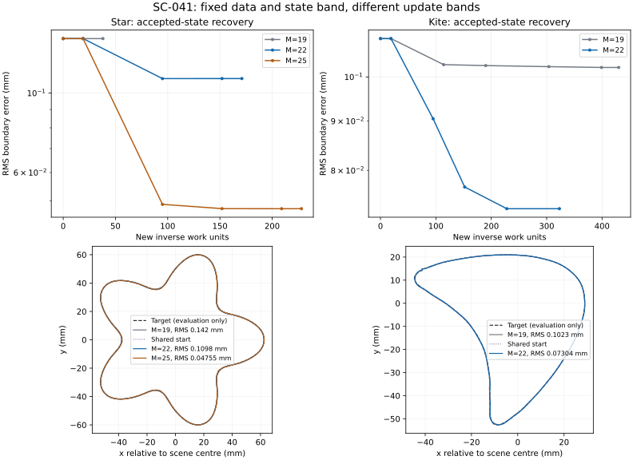

# SC-041 — atlas predictions against finite updates

2026-09-26. **COMPLETE.** Owner: Codex; independent reviewer: unassigned.
[Frozen contract](../../../../docs/iterations/shape_frequency_continuation/iteration_22/03_plan.md).

Question: does the complete projected-update linear model predict useful
finite progress when the update band is released? Five arms share saved
SC-040/038 endpoints: star M=19/22/25, kite M=19/22. This is a development
comparison at fixed K=192 and all 19 frequencies, not a general controller.

**Decision:** the complete-update forecast correctly identifies useful band
release on star. Kite also benefits in aggregate error, but the sharper local
feature and numerical stop prevent a geometry-recovery claim. Finite probes
are necessary: the nominal RMS radius does not ensure an admissible or
decreasing step. No solver or production default is promoted.

## Matched continuations

Every returned endpoint passes its field/Jacobian/directional audit. All rows
start from the same saved endpoint within each case. Curvature radii below are
sampled at 16,384 points; they are geometry descriptors, not certified bounds.
Work counts include rejected trials, and exclude the separately charged screen
and endpoint audit.

| Case, M | Final loss | Boundary RMS (mm) | Hausdorff estimate (mm) | Minimum radius (mm) | Inverse units | Accepted steps / stop |
|---|---:|---:|---:|---:|---:|---|
| Star, 19 | 1.479e-6 | 0.14198 | 0.45851 | 8.98874 | 38 | 0 / no decreasing step |
| Star, 22 | 7.641e-8 | 0.10981 | 0.31702 | 8.23605 | 171 | 2 / no decreasing step |
| Star, 25 | 9.197e-10 | 0.04755 | 0.13869 | 7.00223 | 228 | 3 / gradient tolerance |
| Kite, 19 | 5.120e-9 | 0.10229 | 0.46797 | 0.10064 | 430 | 4 / wall limit |
| Kite, 22 | 2.711e-9 | 0.07304 | 0.34176 | 0.08170 | 323 | 3 / numerical failure |

Star M=25 cuts RMS 66.5% against M=19 and 56.7% against M=22, at 33.3%
more inverse work than M=22. Its accepted actual/predicted decrease ratios
are 1.002, 0.996 and 0.995. The tips remain blunt: minimum radius 7.00 mm
versus truth 5.11 mm, despite a 99.94% data-loss reduction.

Kite starts at RMS 0.10957 mm and minimum radius 0.09078 mm (truth 2.13789
mm). M=22 lowers RMS 33.3% from that start and 28.6% against the M=19
endpoint, while making the already sharp point sharper. Accepted decrease
ratios deteriorate from 0.760 to 0.408 to 0.159. The next candidate misses
the frozen field-refinement tolerance: 1.0044064e-7 versus 1e-7, a 0.44%
excess. Its production and refined gains agree closely, but the tolerance is
not relaxed and the candidate is not accepted. The preserved last accepted
endpoint passes its own audit. Neither kite arm establishes convergence.

The [common-work comparison](common_work.json) retains the advantage: at a
323-unit ceiling, M=19's latest accepted state (304 units) has RMS 0.10248
mm, versus 0.07304 mm for M=22 (228 units). This compares attained states
within a common solve-work allowance, not controlled wall-clock speed.



[Raw summary](summary.json), [completion](completion.json),
[integrity audit](integrity_audit.json). Total charged work is **2,634 units**:
874 screen + 1,190 inverse + 570 endpoint audits. All five endpoint audits
and 61 artifact/provenance checks pass. The 24 targeted tests cover the new
algebra, legacy atlas rendering, LM logging and saved-trace reconstruction.

## Completed finite-step screen

All five complete-update derivatives qualify against live backend evaluation,
grid refinement and full-construction central differences. Stored residuals
reproduce saved losses exactly. Both cases pass the predeclared release gate;
the five matched continuations follow from their original saved endpoints,
not from the diagnostic trial shapes.

| Case, M | Full linear loss-reduction forecast | First useful probe scale | Actual reduction at that scale | Actual / predicted |
|---|---:|---:|---:|---:|
| Star, 19 | 0.000043% | none | 0.000043% at full scale | 1.006 |
| Star, 22 | 94.76% | 1 | 94.80% | 1.0005 |
| Star, 25 | 99.22% | 1 | 99.29% | 1.0007 |
| Kite, 19 | 89.68% | 1/8 | 12.43% | 0.5913 |
| Kite, 22 | 99.81% | 1/2 | 39.74% | 0.5308 |

"Useful" here means the frozen 10% actual loss reduction, ratio >=0.5 and
the existing geometry/numerical acceptance gates. It is not a shape-error
claim. The conditional descent lower bound, using the measured remainder,
is positive for all four useful probes.

Kite M=19's full step raises refined loss to **16.4 times** its starting
value and narrowly fails field refinement (maximum 1.06e-7). Its half-step
also increases loss; its quarter-step decreases loss by only 4.54%, with
ratio 0.116. M=22's full step self-intersects despite its smaller RMS
displacement; its half-step passes. These observations reject a general
finite-validity interpretation of the empirical radius.

The successful kite RMS displacements are 0.0187 mm (M=19) and 0.0423 mm
(M=22), against the common 0.935 mm test radius. The proposed constraint is
inactive on all five initial linear minimizers. Thus this comparison exposes
nonlinearity/admissibility beyond a global first-order RMS bound; it does not
demonstrate that the new constraint itself improves reconstruction.

Screen work: star 494 units / 934 s; kite 380 units / 1490 s. Total **874
units**, below the 2,000-unit screen ceiling. Two workers, one BLAS thread
each; these are recorded costs, not controlled timing comparisons.

## What the diagnostic actually establishes

For a complete finite construction T, use J = D(F composed with T)(0), and
the mass metric G of its actual first-order normal velocity. Solve

    min_p 0.5 ||r + Jp||²  subject to p^T G p <= delta².

The implementation whitens the **parameter metric** using Cholesky and solves
the constrained least-squares secular equation using SVD. Its physical step
and predicted decrease are invariant under invertible coordinate changes
when J and G are transformed together. A 1e-12 relative singular cutoff is
applied in those physical coordinates. The caller supplies the data weighting;
this experiment uses the existing equal-weight relative residual, not an
assumed statistical noise covariance.

The radius delta = 0.12/k_max is an empirical **test radius**. It is not
certified for this construction or geometry. Actual shape admissibility and
numerical-resolution checks still apply.

If the finite residual is r + Jp + e with ||e|| <= epsilon, expanding its
squared norm and applying Cauchy-Schwarz gives

    actual decrease >= predicted decrease - ||r + Jp|| epsilon - epsilon²/2.

The trial records use a **measured** remainder to check this inequality.
They do not establish an a-priori remainder bound for unseen candidates or a
convergence theorem. The exact nested-space fitting identity only concerns
the linear problem on fixed data; shape recovery requires additional evidence.
The recorded identity uses the discrete residual. N/2N agreement supplies
numerical qualification, not a rigorous enclosure of the continuum PDE error.

## Why the old heatmap is not this diagnostic

The old `atlas_video.removable` caps QR components independently. With
J=[[1,100],[0,1]], r=[0,1] and a unit coefficient radius, it counts the whole
residual as removable although exact cancellation needs p=[100,-1], norm
about 100. A clipped correction's squared norm also differs from the loss
decrease. Without caps, a rank-aware projection measures nested-space fitting
capacity, not nonlinear recovery. The videos additionally use ideal normal
ripples rather than the solver's complete projected derivative, and the
first sensitivity crossing at an assumed display level is not a stable
recoverability frontier. Historical videos/numbers are retained and qualified.

## Reproduction and artifacts

The completed bundle should be preserved. The recorded numerical invocation
was, from the repository root, EMNerf, before diagnostics existed:

```bash
OMP_NUM_THREADS=1 OPENBLAS_NUM_THREADS=1 MKL_NUM_THREADS=1 PYTHONPATH=solvers:. \
  /home/drdeng/miniconda3/envs/EMNerf/bin/python \
  results/validation/shape_continuation/SC-041-atlas-decisions/run.py run
```

Replace `run` with `summarize` to rebuild `summary.json` without field solves.
Run `audit.py` and `plot.py` in the same environment to regenerate the
integrity/common-work reports and figure, also without field solves.
`manifest.json` freezes sources and inputs. `diagnostics/` contains predictions
made before field probes, local matrices (NPZ, local), qualifications, refusals
and finite-step measurements. `runs/` contains configurations, every accepted
state, rejected-trial records, endpoint audits and post-fit truth scores.
Every field and reciprocal batch is charged; scoring reuses audited predictions.

After all numerical workers and endpoint audits finished, report aggregation
raised `KeyError: 'status'` on a trial interrupted by the numerical gate. The
only post-run driver change uses `trial.get('status')` in `summarize`; saved
numerical results were reused without rerunning any fit. The original executed
driver and contract are preserved in `frozen_run.py` and `frozen_plan.md` with
their original manifest hashes in `source_snapshots.json`. `audit.py` checks
those hashes and that the numerical driver is unchanged outside `summarize`;
the live contract differs only in execution status. The original traceback
remains in `run.log`. Dense NPZ matrices and the PNG remain local under the
repository's existing ignore rules; JSON records, sources, the log and SVG
are included as the evidence to retain in Git.
