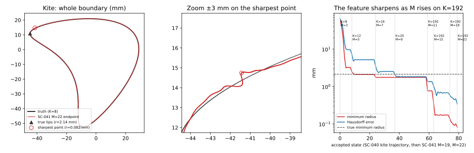

# SC-041 outsider review — kite's worst error is a spurious flank feature, and removing high-band content fixes it

2026-09-26. Reviewer: Claude, outside SC-041's authorship. Reviewed
[SC-041](../SC-041-atlas-decisions/README.md) at `204d93af`.
[Frozen probe plan](plan.md), committed before its evaluations.

## Reproduction of SC-041 from Git

- All 24 targeted tests pass (`test_action_atlas`, `test_atlas_video`,
  `test_lm_backend`, `test_trajectory_atlas`).
- Every number in the SC-041 README tables reproduces from the committed raw
  JSON (screen forecasts, probe scales, actual/predicted ratios, continuation
  losses, RMS, Hausdorff, minimum radii, work totals 874 + 1,190 + 570 = 2,634,
  common-work states).
- `audit.py` **cannot run from a clean clone**. It hashes two gitignored inputs
  (`SC-040.../shots/9bd992a34579a9d6282e.npz`, `SC-039.../shots/23740fc8e74e07ef38f2.npz`)
  and the five local `M*_model.npz`. The 61-check record is therefore
  unverifiable outside the author's machine; 16 checks depend on those arrays
  (`inputs_preserved` and three per arm).
  The JSON-only checks all hold.
- The SC-041 kite M=22 endpoint loss reproduces here to 1.3e-12 relative with
  the unchanged SC-041 objective (768 nodes, 19 frequencies).

## Finding 1 — the kite "sharp point" is not the kite's point

SC-041 says M=22 "make[s] the already sharp point sharper". Geometry
([`kite_feature_survey.py`](kite_feature_survey.py),
[JSON](kite_feature_survey.json)) shows:

- The sharpest point of the M=22 endpoint (radius 0.082 mm) lies on the
  **flank**, 5.0 mm from the nearest true tip, where truth has radius ≈18 mm.
  The reconstruction reproduces both true tips (radius 2.18 and 3.34 mm
  against truth 2.14 mm).
- Locally the flank is a **staircase** of ~0.4 mm steps (figure, centre).
  The worst-case error sits on it: the Hausdorff point is 0.03–0.04 mm from
  the sharpest point in every state since SC-038's `dense_2`.
- A mild bump is already there at K≤20 (SC-035 stage 4: radius 1.76 mm, same
  place). It becomes a sub-millimetre feature only when the **update band M
  rises above 9 on the K=192 state**: `release_1` (M=11) 0.77 mm, `dense_2`
  (M=15) 0.17 mm, M=19 0.09 mm, SC-041 M=22 0.082 mm. SC-038's matched
  `fixed_m9` control, on the same K=192 state, keeps 1.71 mm, so the K=192
  band alone does not create it.
- All 33 committed kite records with RMS < 0.6 mm (SC-035, SC-037, SC-038,
  SC-041) put their sharpest point within 2.5 mm of that flank location. None
  of the 124 committed kite shapes has its sharpest point at a true tip.
- Correction: the frozen plan's motivation line (and commit `1d63a439` survey
  message) attributes the feature to the K=20 → 192 release. The `fixed_m9`
  control shows that is wrong; the plan's question and rules are unaffected.



## Finding 2 — the data do not require it ([probe](probe.py), [JSON](probe.json))

The true kite is a K=8 curve. With the unchanged SC-041 kite M=22 objective:

| Curve | Loss | RMS (mm) | Hausdorff (mm) | Min radius (mm) |
|---|---:|---:|---:|---:|
| Truth | 6.9e-29 | 0 | 0 | 2.138 |
| SC-041 M=22 endpoint (control) | 2.711e-9 | 0.0730 | 0.342 | 0.082 |
| Endpoint low-passed to K≤8 | 2.7e-4 | 0.287 | 1.60 | 2.92 |
| Endpoint low-passed to K≤16 | 4.8e-6 | 0.112 | 0.604 | 3.19 |
| Endpoint low-passed to K≤32 | 6.41e-9 | **0.0724** | **0.204** | 3.38 |
| Endpoint low-passed to K≤64 | 3.42e-9 | 0.0723 | 0.200 | 1.04 |
| Coefficient midpoint, endpoint–truth | 3.3e-3 | 0.602 | 3.17 | 0.148 |

Refined (1536-node) losses agree: truth 6.8e-29, endpoint 2.7113e-9.

- By the frozen rule, loss(truth) ≤ 0.1 loss(endpoint) holds by 20 orders of
  magnitude: the kite stop is far from a data-consistent solution; the
  feature is an artefact of the fitting path, not of the data.
- Deleting modes above 32 removes the feature, keeps RMS and cuts Hausdorff
  by 40%, at 2.4× loss. The frozen spectral-cap rule required loss ≤ the
  endpoint's, so **no low-pass meets it**; K=64 comes closest (1.26×).
- The straight coefficient path to truth is not a descent path (loss 3e-3 at
  the midpoint): the landscape between the two is strongly non-convex, so the
  gap is not "just more iterations".

**Scope.** The data are noiseless and generated by the same forward model
(truth loss is machine zero). That is an inverse crime: it makes the feature
diagnosis sharp, but none of these runs says anything about noisy data.

## Strategies tried ([runner](strategy.py), [records](strategies/))

Not frozen in advance; exploratory, one run per arm, truth used only for
scoring. Each arm changes the curve band K (and, where stated, raises M) and
otherwise keeps the SC-038/SC-041 backend, catalogue, weights, tolerances and
768/1536 nodes. Stages had 2,400 s wall limits (controls: 900 s), so most
end at `TRIAL_WALL_LIMIT`; unit counts are comparable, wall time is not.

**Kite — the cap removes the feature without losing data fit.**

| Arm | Start | Loss | RMS (mm) | Hausdorff (mm) | Min radius (mm) | Units |
|---|---|---:|---:|---:|---:|---:|
| SC-038/040 path to M=19, K=192 (control) | SC-035 K=20 | 8.92e-9 | 0.1096 | 0.445 | 0.091 | on disk |
| Same M 11/15/19 path, **K=32** | SC-035 K=20 | 1.07e-8 | 0.1158 | **0.300** | **3.61** | 285+358+400 |
| SC-041 M=22, K=192 (control) | SC-040 end | 2.71e-9 | 0.0730 | 0.342 | 0.082 | 323 |
| Refit M=22, **K=32** | M=22 end low-passed | 1.61e-9 | 0.0671 | 0.219 | 3.41 | +394 |
| Refit M=22, **K=64** | M=22 end low-passed | 1.46e-9 | 0.0666 | 0.216 | 1.07 | +396 |
| **M=28, K=64** | K=64 refit end | **6.99e-10** | **0.0537** | **0.162** | 1.21 | +357 |
| M=28, K=192 (matched control) | K=64 refit end | 6.87e-10 | 0.0537 | 0.158 | 1.16 | +356 |

- Along the release path the K=32 state matches the K=192 control stage by
  stage in loss (M=11: 6.748e-6 both; RMS 0.4216 vs 0.4212 mm) and never
  forms the feature (1.73 mm vs 0.77 mm at M=11).
- **The matched M=28 control is decisive in the other direction:** from the
  same clean start, K=192 performs the same as K=64 over ~5 steps. What
  helps is removing the accumulated high-band content once (the low-pass
  refits) and, over the long release path, the cap keeping it from building
  up. A clean state does not re-grow the feature within a few steps at K=192.
- At M=28/K=64 the best accepted state had RMS 0.0384 mm; the last is 0.0537
  mm with 1% lower loss. At loss ~1e-9 the data no longer order shapes that
  differ by a few hundredths of a millimetre.

**Star — the cap is harmless; raising M is what helps.**

| Arm | Loss | RMS (mm) | Hausdorff (mm) | Min radius (mm, truth 5.11) | Units |
|---|---:|---:|---:|---:|---:|
| SC-041 M=25, K=192 (control) | 9.20e-10 | 0.0476 | 0.139 | 7.00 | 228 |
| Refit M=25, **K=64** | 9.20e-10 | 0.0476 | 0.139 | 7.00 | +38 (no-op) |
| M=31, K=64 | 5.48e-11 | 0.0336 | 0.084 | 6.49 | +321 |
| M=37, K=64 | 4.01e-12 | **0.0181** | **0.047** | 6.07 | +318 |

The star M=25 endpoint has no content above K=64, so the cap changes nothing;
the gains come from M. No K=192 control was run at M=31/37 for star.

**How restrictive is a cap?** Under arclength parameterization (what the
updates maintain) the truths need these bands for a given worst-case error
(16,384 samples; floor ≈0.01 mm is sampling):

| Case | K=16 | K=32 | K=48 | K=64 |
|---|---:|---:|---:|---:|
| star | 0.48 | 0.11 | 0.03 | 0.015 |
| kite | 0.39 | 0.083 | 0.023 | 0.011 |
| C, peanut, hook | ≤0.085 | ≤0.014 | floor | floor |

So K=32 would cap kite/star Hausdorff near 0.1 mm; K=64 costs nothing
measurable. This uses truth only to judge the cap, not to pick it for a run.

## Proposed next steps (for the owner)

1. **Keep the state band from accumulating unobservable content.** Either tie
   K to the update band (e.g. K = max(48, 2M)) or low-pass the state to such a
   K at each stage boundary. On kite either one removes the artefact that sets
   the worst-case error; on star it costs nothing measurable. The M=28
   control shows a one-off clean-up already captures most of the gain over a
   few steps, so compare "cap throughout" against "low-pass at stage
   boundaries" in a frozen, matched experiment on all six scenes before any
   default changes.
2. **Keep raising M on star** (M=25 → 37 cut RMS 62%) with the cap; watch
   whether the tip radius (6.07 vs 5.11 mm) keeps improving.
3. **Add noise before tuning further.** Every loss here is 10^16–10^20 times
   the truth's machine-zero loss; differences at loss ~1e-9 are
   inverse-crime precision. Settle the noise model before optimizing
   sub-0.05 mm behaviour.
4. **Make audits reproducible from Git**: commit (or content-address and
   publish) the two SC-039/SC-040 input shots and the five model NPZ files,
   or split `audit.py` into Git-only and local checks.

## Reproduction

From the repository root with numpy, scipy, matplotlib, torch, shapely,
scikit-image and pytest installed:

```bash
PYTHONPATH=solvers:. python results/validation/shape_continuation/SC-041-outsider-review/kite_feature_survey.py  # geometry only
PYTHONPATH=solvers:. python results/validation/shape_continuation/SC-041-outsider-review/plot.py
PYTHONPATH=solvers:. python results/validation/shape_continuation/SC-041-outsider-review/probe.py                # 171 units, ~21 min on 4 threads
S=results/validation/shape_continuation/SC-041-outsider-review/strategy.py
PYTHONPATH=solvers:. python $S release 32 && PYTHONPATH=solvers:. python $S continue 32
PYTHONPATH=solvers:. python $S refit 32;  PYTHONPATH=solvers:. python $S refit 64
PYTHONPATH=solvers:. python $S from:refit_K64 64 kite 28;  PYTHONPATH=solvers:. python $S from:refit_K64 192 kite 28
PYTHONPATH=solvers:. python $S refit 64 circle_to_star 25;  PYTHONPATH=solvers:. python $S refit 64 circle_to_star 31 25
PYTHONPATH=solvers:. python $S from:refit_circle_to_star_M31_K64_from_M25 64 circle_to_star 37
```
