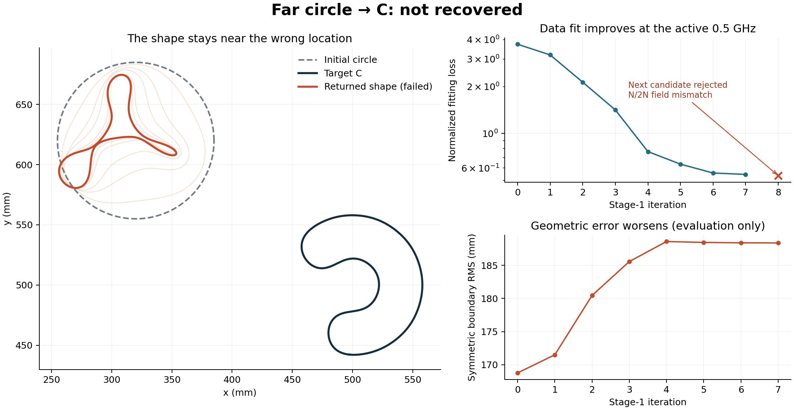
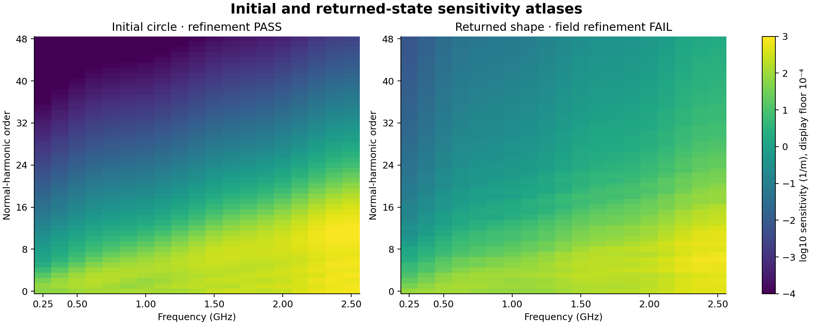

# SC-049: far circle to C

**COMPLETE / NOT RECOVERED.** One full reconstruction was attempted from the
user-requested distant circle. It stops in the first frequency stage with
`NUMERICAL_FAILURE`; later stages do not run. The result is retained without
restart, a more favorable initial position or relaxed tolerances.

## Fixed scene and outcome

The circle starts at (0.32, 0.62) m with radius 65 mm. Its sampled boundary
is 96.13 mm from the C boundary, and
their x extents have a 72.73-mm gap, proving
initial nonoverlap. Target and all 19 noiseless observations are the original,
qualified SC-022 C. This is a new initialization stress test, not a new target
shape. The [contract](approved_plan.md) and [configuration](configuration.json)
freeze the full M3/5/7/9 prefix, M11/15/19 release and M25/31/37 fixed suffix.

| Quantity | Initial | Returned |
|---|---:|---:|
| Symmetric boundary RMS | 168.764 mm | 188.367 mm |
| Sampled Hausdorff estimate | 226.135 mm | 240.514 mm |
| Stage-1 loss, 0.5 GHz | 3.739628 | 0.546252 |
| Full-catalog numerical audit | PASS | FAIL |

Seven updates are accepted with strictly decreasing loss at the active
frequency. The object shrinks/deforms near its incorrect starting position
while geometric error increases. The next candidate's N512/N1024 prediction
discrepancy is **4.7e-05**, exceeding the
unchanged **1e-5** limit. It is rejected, and the original backend stops rather
than continuing outside its frozen numerical regime. The stop is neither a
timeout nor exhaustion of work. See [stage and trial evidence](stage_1.json).

All four declared recovery checks fail: RMS <=1 mm, sampled Hausdorff <=2 mm,
maximum catalog relative residual <=0.003, and endpoint numerical audit.
The returned maximum catalog relative residual is
3.201. The endpoint is the
last accepted state, not the rejected candidate or a truth-selected iterate.

## Independent qualification and diagnostic controls

The initial full-catalog audit passes: fields agree to
6.3e-15, full Jacobian columns to
1.7e-15, and the full-trial directional
finite difference to 2.1e-10.

At the returned endpoint, the complete derivative checks still pass
(worst column 4.1e-07, full-trial FD
5.8e-07), but field refinement fails at
the higher frequencies: the worst discrepancy is
9.77e-07, against 1e-7 above 0.5 GHz.
The accepted point still met its active 0.5-GHz field limit; the final audit
adds the entire catalog. This is retained as a failed audit.

After the stop, a bounded verification adds four CPU forward solves at 0.5
and 2.5 GHz, N512/1024, with the original dense geometry checker. CPU and CUDA
predictions agree within **3.9e-15** and the CPU reproduces both endpoint
refinement discrepancies. All 24 comparisons of dense/spatial intersection
counts on the eight saved states at N512/1024/2048 agree. These checks support
the recorded endpoint obstruction on both execution paths; they are not a
second full inverse or a speedup measurement. [Checks](postrun_checks.json),
[pre-dispatch scope and script hash](postrun_check_manifest.json).

## Atlas and runtime

Initial and returned-state atlases use ideal normal harmonics P48, all 19
frequencies and N512/1024. Each costs 76 physical units. The initial atlas
qualifies. The returned atlas fails its field-refinement gate and is displayed
as exploratory evidence, not a qualified observability or recovery claim.
The color is a relative-data Jacobian column-pair norm per metre of normal
amplitude; the floor is a display choice. The atlas never chooses a fitting
step. Raw fields and Jacobians are saved in the two NPZ files.

| Work | Time | Physical units |
|---|---:|---:|
| Fitting, stopped in stage 1 | 1.613 s | 26 |
| Initial independent audit | 7.057 s | 114 |
| Final independent audit | 6.572 s | 114 |
| Initial atlas | 2.800 s | 76 |
| Returned-state atlas | 2.802 s | 76 |
| Complete main run, including scoring/verification overhead | 21.432 s | 406 |
| Separate post-stop CPU/geometry checks | 12.074 s | 4 |

The complete failed attempt takes **21.43 seconds**; this is
not a successful reconstruction time. Total charged work including post-stop
controls is **410 units**, below the 13824-unit ceiling. No timing
factor against an unaccelerated full reconstruction was measured.

Explicit CUDA, four frequency threads, one BLAS thread and SPD-014 geometry
acceleration ran on the RTX 5090. Source and input hashes match before/after;
the numerical [source archive](sources.tar.gz), [manifest](manifest.json),
[raw result](result.json) and [summary](summary.json) preserve provenance.
Historical observations and source bundles remain unchanged. No default,
optimizer policy, branch or worktree changed; no independent review is claimed.

## Interpretation and timing correction

The accelerated solver runs this attempt quickly, but the existing local
shape continuation does not localize the C from this distant initialization.
Its lower data loss does not imply better geometry. The numerical stop prevents
a conclusion about eventual convergence with another grid or policy; neither
was tried. A follow-up would have to distinguish global localization from
quadrature/finite-shape feasibility while keeping the failed case intact.

The earlier SPD-010–014 timing tables replay **SC-043 continuation suffixes
from saved intermediate shapes**, not complete reconstructions from the
original circles. Their 6485 s versus 281 s historical comparison must not be
presented as a full circle-to-target runtime or a guaranteed new-scene factor.
This SC-049 attempt starts from the actual circle and includes every executed
stage from that start.

Reproduce only in a separate evidence folder: `run.py prepare`, then
`run.py run`, using `PYTHONPATH=solvers:.`, `SC_FORWARD_BACKEND=cuda`,
`SC_FREQUENCY_THREADS=4` and all BLAS/OpenMP thread counts set to 1.
The runner refuses to overwrite a saved trajectory. `report.py` uses saved
data only and may regenerate these figures.
