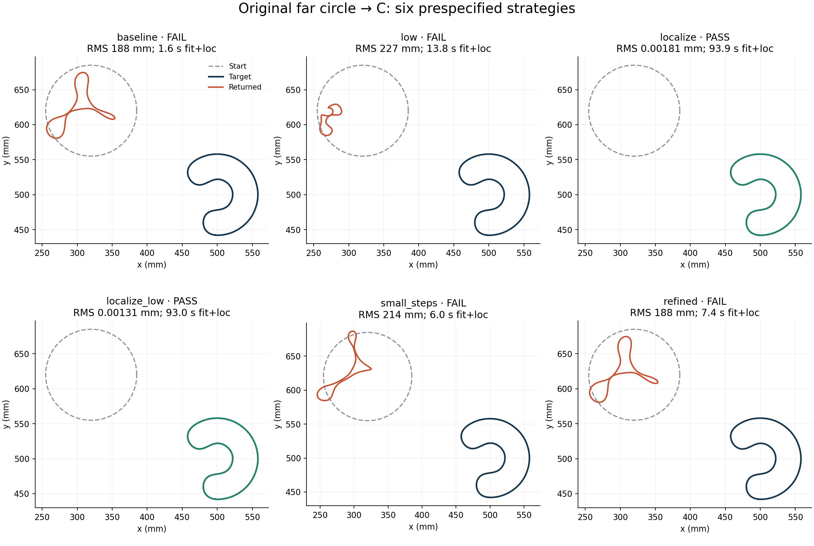
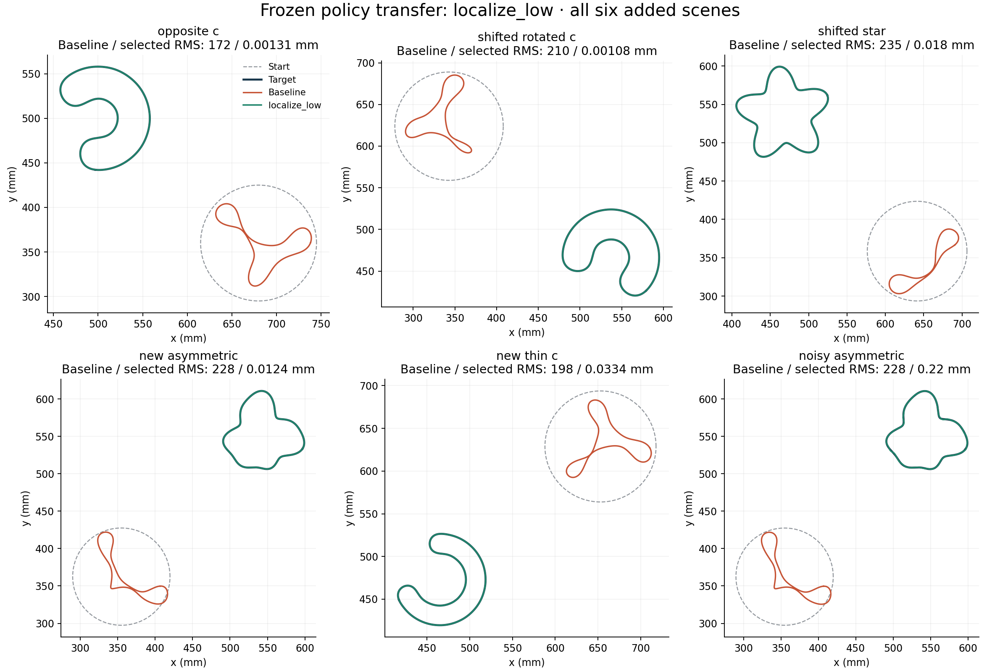
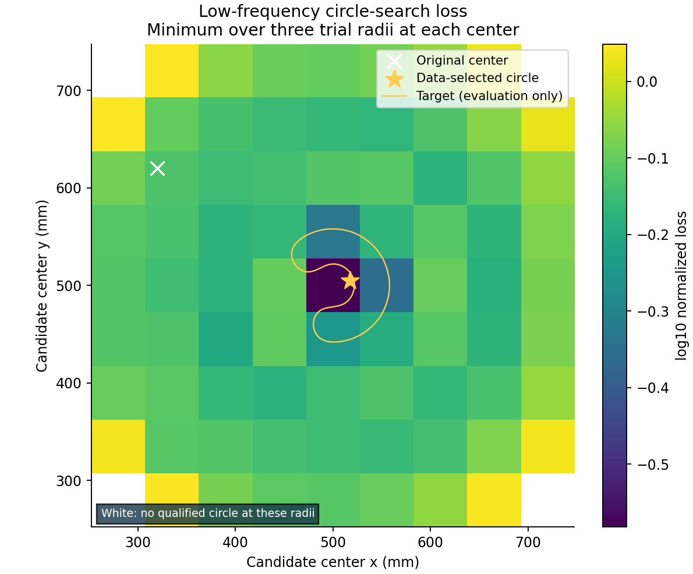

# SC-050: far-start strategies and six-scene transfer

Completed 2026-09-28 under the [frozen plan](plan.md) and documented
[search-domain amendment](amendment_01.md) and [initial-domain correction](amendment_02.md). Sources and inputs verify;
SC-049 accepted baseline trajectory replay: **exact**.
Claude's SPD-014 [review amendment](../../speedup/SPD-014-amendment-20260928/README.md)
preceded this campaign. No solver or optimizer default changed.

**Result:** localization before shape fitting recovered the original failed C.
The selected policy reduced RMS error from 188.37
to 0.00131 mm in
93.03 s of localization plus
fitting (109.00 s including independent audits and
post-fit scoring; process startup and provenance hashing excluded).
Both localization arms succeeded; lower frequency alone, smaller steps alone,
and doubled quadrature alone failed. The selected policy then recovered all
five clean transfer cases and the one fixed noise case; every transfer baseline
failed. This supports the localization-first strategy within this synthetic panel.

## Development ablation

| Scene / arm | RMS mm | Hausdorff upper mm | Max residual | Audit | Recovery | Fit+loc units | Fit+loc s |
|---|---:|---:|---:|---|---|---:|---:|
| development_c / baseline | 188.4 | 240.5 | 3.201 | FAIL | FAIL | 26 | 1.60 |
| development_c / low | 227.3 | 298.8 | 2.014 | FAIL | FAIL | 233 | 13.80 |
| development_c / localize | 0.001805 | 0.03302 | 3.946e-07 | PASS | PASS | 2703 | 93.90 |
| development_c / localize_low | 0.001306 | 0.03148 | 2.764e-07 | PASS | PASS | 2706 | 93.03 |
| development_c / small_steps | 214.1 | 276.6 | 2.316 | FAIL | FAIL | 103 | 5.97 |
| development_c / refined | 188.4 | 240.5 | 3.197 | FAIL | FAIL | 37 | 7.35 |

The data-only rule selected **localize_low** before any transfer fit. It ranks completed,
audited schedules first, then audited endpoints, then remaining endpoints, using
maximum catalog residual and charged work; truth error is excluded. Selection
record: [selection.json](selection.json). Every attempt uses the same 13412-unit
fit+localization cap. Actual work differs because of stopping and stage quotas.
Reported fit+localization time excludes independent audits and post-fit scoring;
result.json retains total times and diagnostic work. Refined uses larger systems,
so equal work units are not equal wall cost.

## Transfer without retuning

Selected policy: 6/6 total recovery successes;
baseline: 0/6. This includes one prespecified
1% noise draw, reported separately below; it is a small deterministic panel,
not an estimated probability of success on unseen scenes.

| Scene / arm | RMS mm | Hausdorff upper mm | Max residual | Audit | Recovery | Fit+loc units | Fit+loc s |
|---|---:|---:|---:|---|---|---:|---:|
| opposite_c / baseline | 172.4 | 224.5 | 4.94 | FAIL | FAIL | 20 | 1.26 |
| opposite_c / localize_low | 0.001306 | 0.03148 | 2.764e-07 | PASS | PASS | 2706 | 92.92 |
| shifted_rotated_c / baseline | 210 | 268.5 | 3.608 | PASS | FAIL | 20 | 1.23 |
| shifted_rotated_c / localize_low | 0.00108 | 0.03042 | 2.933e-07 | PASS | PASS | 2699 | 92.39 |
| shifted_star / baseline | 234.8 | 306 | 1.969 | FAIL | FAIL | 64 | 3.14 |
| shifted_star / localize_low | 0.01804 | 0.08049 | 4.695e-06 | PASS | PASS | 3062 | 110.74 |
| new_asymmetric / baseline | 228.1 | 282.1 | 1.553 | PASS | FAIL | 79 | 4.70 |
| new_asymmetric / localize_low | 0.0124 | 0.08022 | 4.239e-06 | PASS | PASS | 3185 | 120.94 |
| new_thin_c / baseline | 198.1 | 246.9 | 1.426 | FAIL | FAIL | 26 | 1.59 |
| new_thin_c / localize_low | 0.03335 | 0.2089 | 5.862e-05 | PASS | PASS | 3567 | 138.59 |
| noisy_asymmetric / baseline | 227.9 | 281.8 | 1.549 | PASS | FAIL | 79 | 4.68 |
| noisy_asymmetric / localize_low | 0.2198 | 0.7267 | 0.01152 | PASS | PASS | 3701 | 135.73 |

Clean recovery requires RMS<=1 mm, Hausdorff upper bound<=2 mm, max catalog
relative residual<=0.003, and independent field/Jacobian/FD audit. The noisy
case uses the same geometry/audit thresholds and a per-frequency residual ceiling
of max(0.003, 3 times realized noise). It does not establish broad noise robustness.
Five infeasible requested starts were corrected before any transfer fit by one
acquisition-only radial-contraction rule; original input files are retained.
The targets and observations did not change. See [initial_domain_amendment.json](initial_domain_amendment.json).
Every endpoint is the last accepted state. Numerical or quota stops remain in
`runs/*/*/result.json` and complete stage histories.

## Evidence for the strategies and limits

At the displaced initial circle, the saved qualified atlas predicts shrinkage
and translation away from the target in both the 0.25 and 0.5 GHz local linear
models. The radius/translation subspace projects 75.9% versus 4.83% of the squared
residual at those frequencies. These are local, unconstrained derivatives; the
large predicted 0.25 GHz radius reduction is not a valid finite-step prediction.
The local M3 Jacobian has condition number about 2.8 at 0.5 GHz, yet its
least-squares direction points away from the target. A well-conditioned local
linear solve can therefore reduce data loss while worsening distant-shape error.
See [atlas_diagnosis.json](atlas_diagnosis.json). Sensitivity magnitude alone does
not certify correct localization or global identifiability.

Localization evaluates the nonlinear full-wave objective over center/radius,
then permits flexible shape changes. It uses measured data only. Every usable grid and
refinement candidate passes a paired-resolution check. Known source/receiver
intersections and unqualified candidates are recorded and excluded. The finite grid and bounded
circle family do not establish global optimality. Its cost is included in each
localization arm, with no cross-arm reuse of the search receipt.

The scientific basis and acquisition/physics differences are documented in the
[plan](plan.md): [Bao–Hou–Li (2007)](https://doi.org/10.1016/j.jcp.2007.08.020)
support localization before continuation; [Borges–Rachh–Greengard (2022)](https://arxiv.org/html/2210.11607v1#S2.SS1)
explain low-frequency continuation and increasing shape complexity for penetrable
objects; [Borges–Greengard (2014)](https://arxiv.org/html/1408.5436v1#S3)
discuss damping and initialization in obstacle reconstruction. None guarantees
this paired near-field implementation will recover arbitrary cavities.

Four fresh clean observation sets passed 1024/2048 refinement and independent
Kress checks at three frequencies; original-C observations retain their oracle
receipt. One fixed noise draw reuses the fresh asymmetric target. Shared model
assumptions, fixed contrast, one connected component, known inspection box,
finite scene count and single noise draw limit generalization. All target definitions and observations, including the opposite-side C and noisy
scene, were fixed before development. The disclosed acquisition-only initial
position correction occurred after development and before all transfer fitting.

Provenance: [manifest](manifest.json), [source archive](sources.tar.gz),
[summary](summary.json), [driver](run.py). Total recorded physical work including
input generation and audits: 29860 units. All
18 intended comparisons and two pre-ranking setup failures are retained.
The setup failures cost an additional conservatively counted 234 units, included
in the total. Four unaffected development controls were reused after the domain
amendment; the source chain records their hashes. This is a reconstruction-strategy
study; it does not measure a new general execution-speedup factor.
