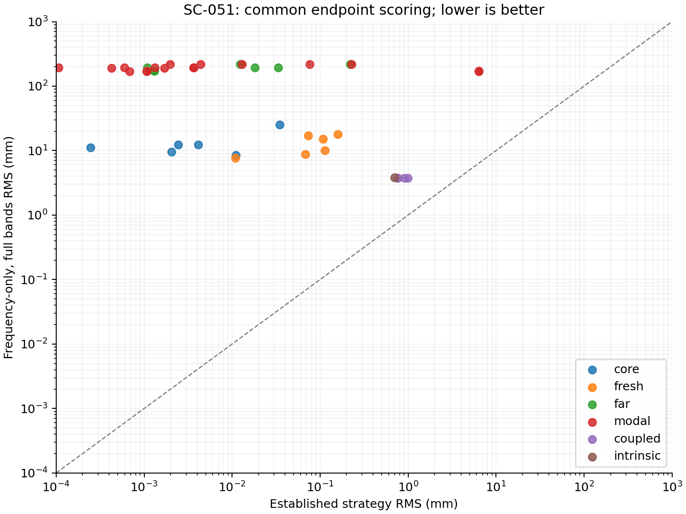
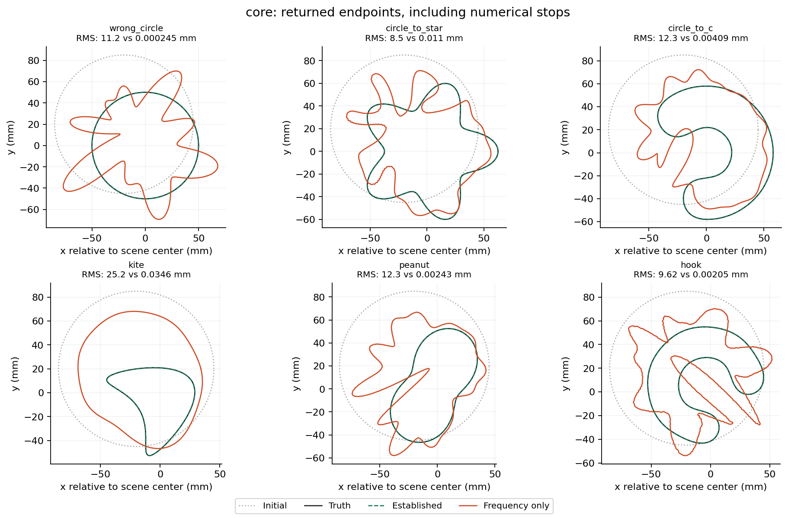
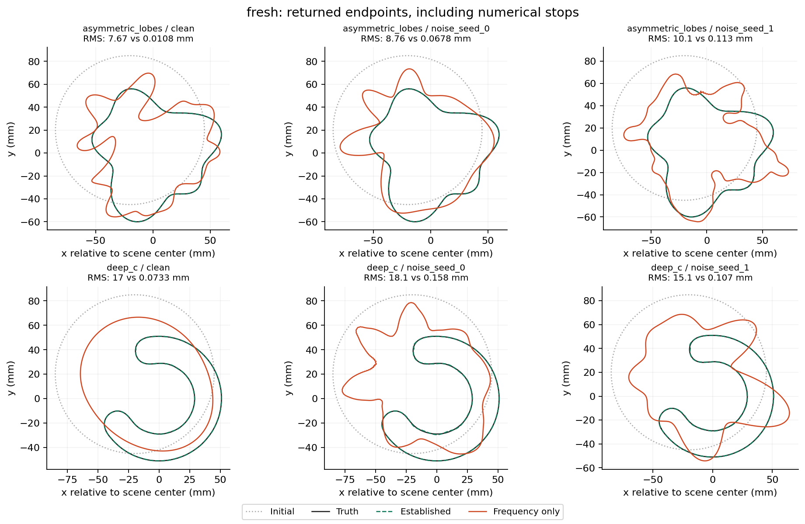
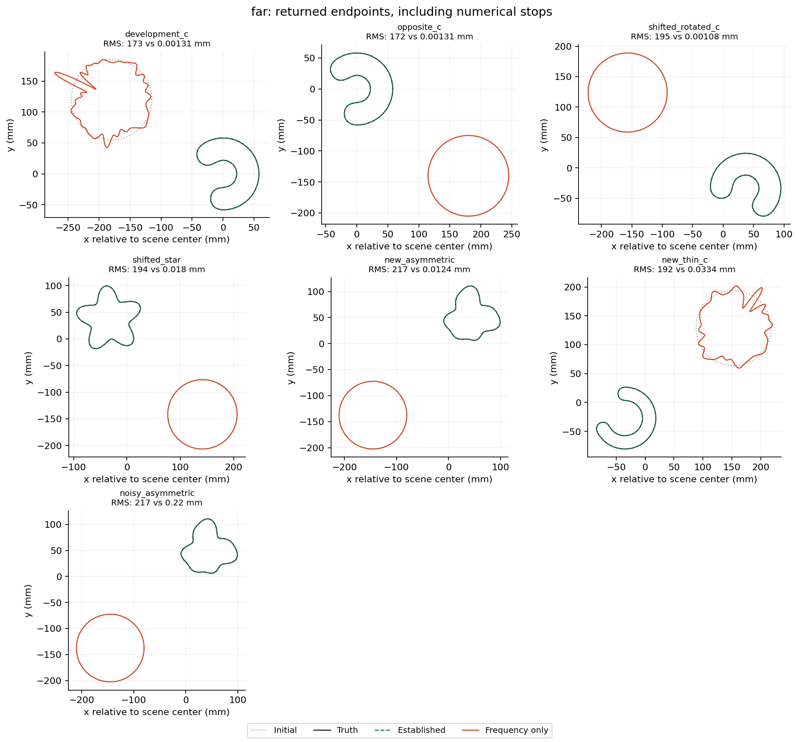
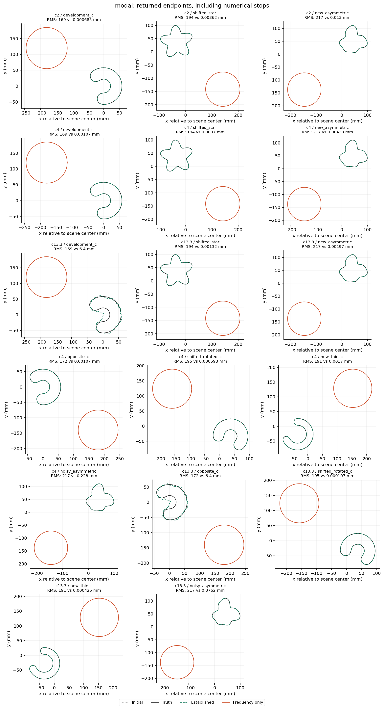
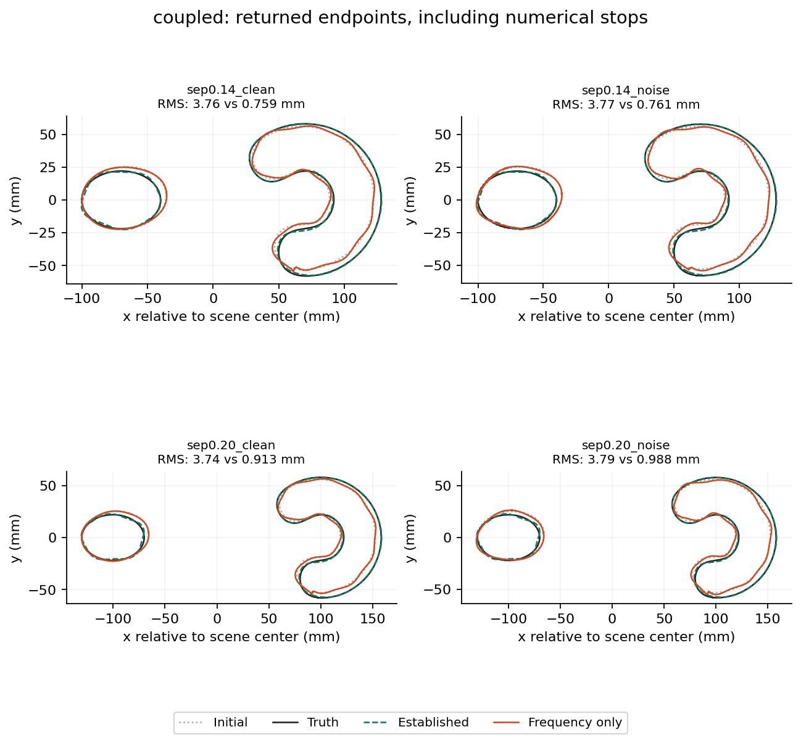
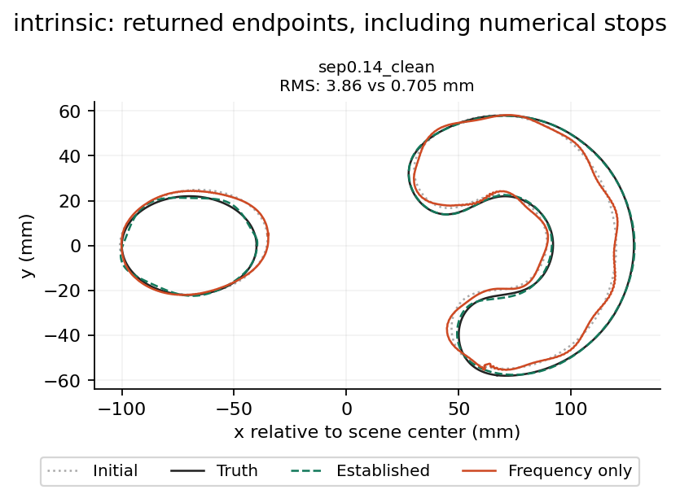

# SC-051: frequency-only continuation with full Fourier bands

Completed 41/41 configurations. Vanilla recovery: **0/41**; established strategies: **34/41**, using the stated common endpoint gates. Vanilla has lower RMS on 0/41 configurations.

For the 36 single-object configurations, recovery is **0/36 versus 34/36**. The two reference misses are the original and opposite-start C at contrast 13.3. The five coupled cases are local refinement comparisons; their established endpoints improve geometry but do not meet the common strict residual gate.

Vanilla fixes **M=K=255 from the first frequency**, the full non-Nyquist Fourier band of the 512-node mesh. It advances through cumulative real-frequency data from 0.25 to 2.5 GHz (four available frequencies for coupled scenes). There is no band ladder, localization, state cleanup, adaptive selection, or complex-frequency damping. The unchanged projected update and LM step controls remain; every candidate must pass 512/1024 numerical acceptance. This is finite discretization without a policy band cap, not literally infinite M/K.

| Panel | Cases | Vanilla recovery | Established recovery | Median RMS vanilla / established (mm) |
|---|---:|---:|---:|---:|
| core | 6 | 0 | 6 | 11.76 / 0.00326 |
| fresh | 6 | 0 | 6 | 12.59 / 0.09027 |
| far | 7 | 0 | 7 | 194.3 / 0.0124 |
| modal | 17 | 0 | 15 | 194.3 / 0.001965 |
| coupled | 4 | 0 | 0 | 3.765 / 0.8369 |
| intrinsic | 1 | 0 | 0 | 3.856 / 0.7047 |



## Per-scene results

| Scene | Contrast | Vanilla RMS mm | Established RMS mm | Vanilla audit | Vanilla stop |
|---|---:|---:|---:|---|---|
| core__wrong_circle | 0.5 | 11.209 | 0.00024467 | FAIL | NUMERICAL_FAILURE after 10 stages |
| core__circle_to_star | 0.5 | 8.4989 | 0.011028 | FAIL | NUMERICAL_FAILURE after 2 stages |
| core__circle_to_c | 0.5 | 12.343 | 0.0040929 | FAIL | NUMERICAL_FAILURE after 6 stages |
| core__kite | 0.5 | 25.25 | 0.034606 | FAIL | NUMERICAL_FAILURE after 1 stages |
| core__peanut | 0.5 | 12.308 | 0.0024278 | FAIL | NUMERICAL_FAILURE after 1 stages |
| core__hook | 0.5 | 9.6223 | 0.0020533 | FAIL | COMPLETED_SCHEDULE after 19 stages |
| fresh__asymmetric_lobes__clean | 0.5 | 7.6672 | 0.010827 | FAIL | NUMERICAL_FAILURE after 1 stages |
| fresh__asymmetric_lobes__noise_seed_0 | 0.5 | 8.7618 | 0.067808 | FAIL | COMPLETED_SCHEDULE after 19 stages |
| fresh__asymmetric_lobes__noise_seed_1 | 0.5 | 10.066 | 0.11338 | FAIL | NUMERICAL_FAILURE after 1 stages |
| fresh__deep_c__clean | 0.5 | 16.951 | 0.07327 | FAIL | NUMERICAL_FAILURE after 1 stages |
| fresh__deep_c__noise_seed_0 | 0.5 | 18.072 | 0.15805 | FAIL | COMPLETED_SCHEDULE after 19 stages |
| fresh__deep_c__noise_seed_1 | 0.5 | 15.111 | 0.10727 | FAIL | NUMERICAL_FAILURE after 1 stages |
| far__development_c | 0.5 | 173.46 | 0.0013064 | FAIL | COMPLETED_SCHEDULE after 19 stages |
| far__opposite_c | 0.5 | 172.14 | 0.0013064 | PASS | NUMERICAL_FAILURE after 1 stages |
| far__shifted_rotated_c | 0.5 | 194.89 | 0.0010803 | PASS | NUMERICAL_FAILURE after 1 stages |
| far__shifted_star | 0.5 | 194.27 | 0.018037 | PASS | NUMERICAL_FAILURE after 1 stages |
| far__new_asymmetric | 0.5 | 217.29 | 0.012405 | PASS | NUMERICAL_FAILURE after 1 stages |
| far__new_thin_c | 0.5 | 192.48 | 0.033354 | FAIL | COMPLETED_SCHEDULE after 19 stages |
| far__noisy_asymmetric | 0.5 | 217.29 | 0.21984 | PASS | NUMERICAL_FAILURE after 1 stages |
| modal__c2__development_c | 2 | 168.76 | 0.00068537 | PASS | NUMERICAL_FAILURE after 1 stages |
| modal__c2__shifted_star | 2 | 194.27 | 0.0036182 | PASS | NUMERICAL_FAILURE after 1 stages |
| modal__c2__new_asymmetric | 2 | 217.29 | 0.01295 | PASS | NUMERICAL_FAILURE after 1 stages |
| modal__c4__development_c | 4 | 168.76 | 0.0010729 | PASS | NUMERICAL_FAILURE after 1 stages |
| modal__c4__shifted_star | 4 | 194.27 | 0.0036952 | PASS | NUMERICAL_FAILURE after 1 stages |
| modal__c4__new_asymmetric | 4 | 217.29 | 0.0043811 | PASS | NUMERICAL_FAILURE after 1 stages |
| modal__c13.3__development_c | 13.3 | 168.76 | 6.3962 | PASS | NUMERICAL_FAILURE after 1 stages |
| modal__c13.3__shifted_star | 13.3 | 194.27 | 0.0013234 | PASS | NUMERICAL_FAILURE after 1 stages |
| modal__c13.3__new_asymmetric | 13.3 | 217.29 | 0.0019651 | FAIL | NUMERICAL_FAILURE after 1 stages |
| modal__c4__opposite_c | 4 | 172.14 | 0.0010729 | FAIL | NUMERICAL_FAILURE after 1 stages |
| modal__c4__shifted_rotated_c | 4 | 194.89 | 0.00059276 | PASS | NUMERICAL_FAILURE after 1 stages |
| modal__c4__new_thin_c | 4 | 190.94 | 0.0017037 | PASS | NUMERICAL_FAILURE after 1 stages |
| modal__c4__noisy_asymmetric | 4 | 217.29 | 0.2283 | PASS | NUMERICAL_FAILURE after 1 stages |
| modal__c13.3__opposite_c | 13.3 | 172.14 | 6.3962 | PASS | NUMERICAL_FAILURE after 1 stages |
| modal__c13.3__shifted_rotated_c | 13.3 | 194.89 | 0.00010723 | PASS | NUMERICAL_FAILURE after 1 stages |
| modal__c13.3__new_thin_c | 13.3 | 190.94 | 0.00042455 | FAIL | NUMERICAL_FAILURE after 1 stages |
| modal__c13.3__noisy_asymmetric | 13.3 | 217.29 | 0.076195 | PASS | NUMERICAL_FAILURE after 1 stages |
| coupled__sep0.14_clean | 0.5 | 3.7554 | 0.75882 | FAIL | NUMERICAL_FAILURE after 1 stages |
| coupled__sep0.14_noise | 0.5 | 3.7739 | 0.76121 | FAIL | NUMERICAL_FAILURE after 1 stages |
| coupled__sep0.20_clean | 0.5 | 3.7371 | 0.9126 | FAIL | NUMERICAL_FAILURE after 1 stages |
| coupled__sep0.20_noise | 0.5 | 3.7869 | 0.98808 | FAIL | NUMERICAL_FAILURE after 2 stages |
| intrinsic__sep0.14_clean | 0.5 | 3.856 | 0.70472 | FAIL | NUMERICAL_FAILURE after 1 stages |

The explicit adaptive SC-043 stagnation comparator gives:

| Original scene | Vanilla RMS mm | Adaptive stagnation RMS mm |
|---|---:|---:|
| wrong_circle | 11.209 | 0.00024467 |
| circle_to_star | 8.4989 | 0.018149 |
| circle_to_c | 12.343 | 0.0062803 |
| kite | 25.25 | 0.038771 |
| peanut | 12.308 | 0.0034569 |
| hook | 9.6223 | 0.0022539 |

## Comparison and interpretation

The references were chosen before fitting: SC-043 fixed release (best aggregate control), SC-044 recurrent cleanup, SC-050 localization plus warm-up, MA-005 damped initialization plus adaptive frontier release, SC-047 joint M3→M5, and SC-048 compact M5. There is no single adaptive policy established as best on every panel. SC-043 stagnation, the stronger tested adaptive control, is also re-scored in the CSV. These are end-to-end strategy comparisons: initialization, spectral controls and—in MA-005—damped data differ. They do not isolate the causal effect of M/K alone.

The full-band arm also exercises the existing projected-update geometry derivative at M=255, beyond the bands used by the established reconstruction policies. Its finite-difference geometry settings are unchanged. Numerical refusals are outcomes of this particular implementation and discretization, not evidence that an ideally resolved infinite-band inverse must fail. The doubled-resolution controls and separate geometry scores limit that interpretation.

At the first frequency, each single-object fit has 24 complex measurements (48 real rows) and 511 normal-update coordinates. Its linearized Jacobian therefore has at least 463 null directions. LM damping remains active, but removing the band restriction exposes a large underdetermined update space before higher-frequency data enter. This dimensional bound describes the experiment; it is not a proof that every numerical stop has the same mechanism.

The reference endpoints were re-scored on identical stored observations at 1024 and 2048 nodes. Their original derivative-audit receipts remain authoritative; the SC-045 unchanged-endpoint follow-up is used for the SC-044 noisy-asymmetric audit timeout. Vanilla endpoints are independently audited over all active Jacobian columns and a full-trial finite difference. Near-zero high-mode columns can fail a relative-only Jacobian gate; raw norms and errors are saved so this can be distinguished from meaningful field error. Neither a failed audit nor an early numerical stop is counted as recovery.

Ignoring residual and numerical-audit gates, vanilla passes the geometry thresholds on 0/41 configurations, versus 38/41 for the references. 19/41 vanilla endpoints pass their numerical audits, so the lack of recovery cannot be attributed solely to audit rejection. The comparison therefore also exposes geometric progress independently of the stricter full-band audit.

Recovery requires RMS <=1 mm, Hausdorff upper bound <=2 mm, maximum per-frequency residual <=0.003 (or max(0.003, 3×realized noise)), and passing numerical checks. Coupled RMS is the worst object. Cases are a finite correlated test panel, not independent statistical trials: opposite C starts share data, noise draws share targets, and contrast variants share geometry. The three MA development cases at contrast 0.5 were deduplicated against SC-050. Historical plane-wave paper-replication and insertion-only diagnostics are outside this current paired-source inverse benchmark.

Vanilla fitting used 2,606 work units and 12071.6 summed worker seconds. Audit/scoring work is separate in each receipt. Equal work units do not imply equal runtime at different bands or grids. SC-043/044 reference costs describe suffixes only; old runtime versions and host load also differ. **No wall-time speedup is inferred from the archived comparisons.**

## Evidence and reproduction

[Frozen plan](plan.md), [manifest](manifest.json), [machine-readable comparison](comparison.csv), [summary](summary.json). Per-stage histories, rejected trials, accepted curves, numerical stops, and audits are under `runs/`; reference scoring receipts are under `references/`.

```bash
export PYTHONPATH=solvers:. OMP_NUM_THREADS=1 OPENBLAS_NUM_THREADS=1 MKL_NUM_THREADS=1
export SC_FREQUENCY_THREADS=4 SC_FORWARD_BACKEND=cuda MPLCONFIGDIR=/tmp/sc051-mpl
python -m experiments.shape_continuation.frequency_only verify
python -m experiments.shape_continuation.frequency_only run --workers 3
python -m experiments.shape_continuation.frequency_only_report references
python -m experiments.shape_continuation.frequency_only_resolution run --workers 1
python -m experiments.shape_continuation.frequency_only_report verify
python -m experiments.shape_continuation.frequency_only_report report
```

## Doubling forward resolution at unchanged M/K

The six original cases are repeated at N=1024/2048 with M=K=255 and identical fitting budgets. This follow-up was frozen after observing the primary numerical stops; all outcomes are retained. [Control plan](resolution_1024/plan.md).

| Scene | RMS mm | Audit | Recovered | Stop |
|---|---:|---|---|---|
| core__wrong_circle | 11.208 | False | False | NUMERICAL_FAILURE |
| core__circle_to_star | 8.4413 | False | False | TRIAL_WALL_LIMIT |
| core__circle_to_c | 12.343 | True | False | NUMERICAL_FAILURE |
| core__kite | 19.943 | False | False | NUMERICAL_FAILURE |
| core__peanut | 12.835 | False | False | NUMERICAL_FAILURE |
| core__hook | 9.6242 | False | False | COMPLETED_SCHEDULE |

6/6 controls completed; 0 recover. The star reaches its fitting wall limit while still accepting steps; this is a budget-limited outcome, not a converged solution. Wall limits are checked between evaluations and can overrun by one in-flight evaluation. Its final accepted step is present in the trial, acceptance and checkpoint receipts; the timeout precedes the next gradient/history row. The returned endpoint is that accepted checkpoint, not the preceding history row.

The two-worker control pool terminated abruptly during the kite endpoint audit. The root cause is unestablished. Its saved fitting endpoint was hash-checked and audited again without rerunning fitting or changing coefficients; the last two controls ran sequentially. The lost audit cost is unknown and bounded by 126 work units, in addition to recorded work. Its total elapsed time is left unknown. [Recovery receipt](resolution_1024/runs/core__kite/audit_recovery.json) and [execution details](execution.json) preserve the interruption.

## Physical work accounting

| Component | Recorded work units |
|---|---:|
| Primary fitting | 2,606 |
| Primary endpoint audits | 4,050 |
| Reference endpoint scoring (47 receipts) | 1,636 |
| Resolution-control fitting | 1,147 |
| Resolution-control endpoint audits | 608 |
| Recorded total | 10,047 |

Additional interrupted-audit work is unknown, bounded above by 126 units. Historical reference fitting and input generation are not new work and are excluded from this table. A work unit counts one physical frequency/RHS block; dense geometry algebra is not priced by that count, so these totals do not establish a computational speed advantage.

### core returned boundaries



### fresh returned boundaries



### far returned boundaries



### modal returned boundaries



### coupled returned boundaries



### intrinsic returned boundaries


