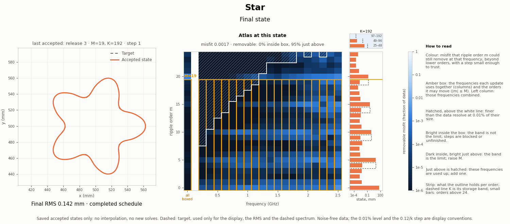

# Six development scenes: the current pipeline, with its atlas

**2026-09-26 qualification (SC-041):** the existing videos and numbers below
are preserved historical artifacts. Their "removable misfit" is a
componentwise-capped QR score, not guaranteed loss reduction within a physical
step bound. Their ideal normal-ripple derivative differs from the current
projected solver's derivative. The white line uses an assumed display threshold,
not a measured noise floor or recoverability certificate. Consequently the
historical statements "the band is the limit" are local hypotheses. See the
[SC-041 results](../SC-041-atlas-decisions/README.md)
for complete-construction predictions and finite-update tests. Future rendering
uses corrected labels; the stored videos have not been overwritten.

One video per scene, each following one trajectory through the current
pipeline. Every video is 414 frames (34.5 s at 12 fps), so they play in step
side by side. No new field solves; every saved accepted state is shown.

| # | Scene | Video | Final frame | Final RMS (mm) | Ends |
|---|---|---|---|---:|---|
| 1 | Circle | [1_circle.mp4](1_circle.mp4) | [png](frames/1_circle_final.png) | 0.00024 | completed schedule |
| 2 | Star | [2_star.mp4](2_star.mp4) | [png](frames/2_star_final.png) | 0.142 | completed schedule; tips too blunt |
| 3 | C (not star-shaped) | [3_c.mp4](3_c.mp4) | [png](frames/3_c_final.png) | 0.0241 | completed schedule |
| 4 | Kite | [4_kite.mp4](4_kite.mp4) | [png](frames/4_kite_final.png) | 0.110 | wall-clock limit; spurious sharp point |
| 5 | Peanut | [5_peanut.mp4](5_peanut.mp4) | [png](frames/5_peanut_final.png) | 0.0104 | completed schedule |
| 6 | Hook (not star-shaped) | [6_hook.mp4](6_hook.mp4) | [png](frames/6_hook_final.png) | 0.0297 | completed schedule |

**Pipeline** (the same on every scene): SC-035's state band, stages 1–4 at
0.5 → 1.25 GHz with update band M 3/5/7/9 and storage band K 8/12/16/20; then
SC-038's release, all 19 frequencies (0.25–2.5 GHz) with M 11/15/19 and
K=192. C and kite come from SC-038 (kite on its recorded 768/1536-node path).
Circle, star, peanut and hook come from
[SC-040](../SC-040-six-scene-pipeline/README.md), which also records Hausdorff
errors, curvature radii and audits.



## How to read a frame

- **Left**: the accepted state (orange) against the target (dashed), with the
  RMS error. The target is used only for display.
- **Heatmap**: columns are the 19 frequencies, rows are ripple orders m
  (normal ripples around the outline, by arclength). A cell's colour is how
  much of that frequency's misfit order m could still remove, beyond all
  lower orders, with a step no larger than the linear model trusts (0.12/k).
- **Amber box**: what each update uses. Its columns are the frequencies it
  fits together; its height is the orders it may move (|m| ≤ M). The left
  column is those frequencies combined, as one update sees them.
- **Hatched, above the white line**: finer than the data resolve at 0.01% of
  their size. The data are noise-free and the fits reach about that level, so
  it is the resolution these runs actually use.
- **Strip**: what the outline itself holds at each order, with its storage band
  K. The small bars above it sum orders 25–192.

What the atlas says at each stage's end (`frames/manifest.json` → `stage_ends`):

- Outside star, every stage ends with at least 81% of the removable misfit
  at M+1…M+3. The band is the limit, and each next stage raises it. Only two
  stage ends have more than 5% inside the box: kite's last (below), and
  circle's last, where the misfit is already about 4e-8.
- **Star** is the exception that explains its blunt tips. Its content sits at
  multiples of 5, so at M=11 and M=15 almost nothing waits at M+1…M+3 (4% and
  1%). At M=19, 95% waits at m=20–22, below the white line: the data resolve
  it, but the schedule ends one order short.
- **Kite's** last stage ends with 96% *inside* the box. It stopped on its
  wall-clock limit, not on its band.

These are development scenes, not a generalization test. The SPD-L baseline
recovers circle, star and peanut to about 1e-5 mm but cannot represent C or
hook (see the comparison below).

## Checks

- Each atlas reproduces the loss the run saved at that state to within 1e-15
  relative (every state that has a saved loss).
- Every video ends at the recorded endpoint and reproduces its recorded RMS.
- Recomputed on twice the nodes, no displayed value changes by more than
  1.0e-3 dex (on log₁₀ values), and no frontier moves.

## Earlier comparison

[`three_method_comparison/`](three_method_comparison/README.md) keeps the
earlier videos: original hybrid, SC-035 state band and SPD-L side by side, plus
the hybrid-versus-state-band atlas rows.

## Rebuild

EMNerf, repository root, about a minute:

```bash
PYTHONPATH=solvers:. python -m experiments.shape_continuation.pipeline_video
```
