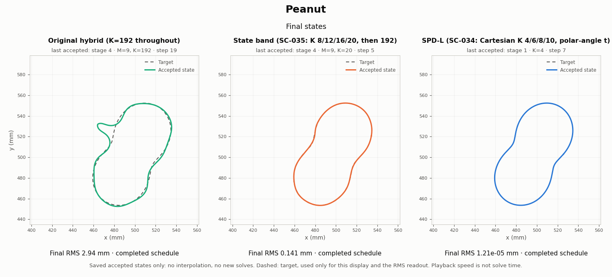

# Six development cases: inversion videos

**Earlier comparison, kept for reference.** The current six-scene videos, one
trajectory per scene through the latest pipeline, are [one level up](../README.md).
This folder holds the three-method comparison (original hybrid, SC-035 state
band, SPD-L) and its hybrid-versus-state-band atlas rows. Both renderers now
write here.

Each video shows three inversions side by side, from the common start circle
through stages 1–4 (0.5 GHz, then 0.75, 1.0 and 1.25 GHz added one per stage)
to the final states:

- **Original hybrid**: SC-029's baseline (normal steps, K=192), which SC-036
  replays bitwise.
- **State band**: the SC-035 low arm (K 8/12/16/20, then a K=192 release stage).
  It was run on peanut, C, star and kite only, so the circle and hook panels
  say so.
- **SPD-L**: SC-034's arm L, the adopted SPD reference. Its state is a Cartesian
  Fourier curve with band K 4/6/8/10 whose parameter is fixed to the polar angle,
  so it selects K directly and only holds star-shaped curves.

Every saved accepted state is shown, with no interpolation and no new field
solves. A panel holds its last state when a run takes no step in a stage or
has stopped. The dashed target and the RMS readout are evaluation only; the
RMS uses the same metric as each run's saved score. Rendering stops unless
every video ends at the scored endpoint and reproduces its recorded RMS.

| Case | Video | Final frame | Original hybrid RMS (mm) | State band RMS (mm) | SPD-L RMS (mm) |
|---|---|---|---:|---:|---:|
| Circle | [wrong_circle.mp4](wrong_circle.mp4) | [png](wrong_circle_final.png) | 0.0026 | not run | 7.6e-6 |
| Star | [circle_to_star.mp4](circle_to_star.mp4) | [png](circle_to_star_final.png) | 0.522 | 0.607 | 3.3e-5 |
| C (not star-shaped) | [circle_to_c.mp4](circle_to_c.mp4) | [png](circle_to_c_final.png) | 3.20 | 0.472 | 10.1, hard stop |
| Kite | [kite.mp4](kite.mp4) | [png](kite_final.png) | 2.98 | 0.574 | 1.25, hard stop |
| Peanut | [peanut.mp4](peanut.mp4) | [png](peanut_final.png) | 2.94 | 0.141 | 1.2e-5 |
| Hook (not star-shaped) | [hook.mp4](hook.mp4) | [png](hook_final.png) | 0.525 | not run | 9.36, hard stop |

SPD-L's hard stops are `UNRESOLVED_DERIVATIVE`; its polar-angle parameter
cannot represent C or hook. All other runs complete their schedules. Playback time is
not solve time. These are development cases, not a generalization test.



Rebuild all six (about a minute, EMNerf, repository root):

```bash
PYTHONPATH=solvers:. python -m experiments.shape_continuation.render_videos
```

[`manifest.json`](manifest.json) records the renderer and input hashes, the
number of accepted states per panel, and each video's ffprobe check.

## Atlas videos: what the data can still change

Each `<case>_with_atlas.mp4` stacks the inversion video above an atlas row with
exactly the same frames. The atlas panels sit under the original hybrid and the
state band. SPD-L has none: its update space is polar-angle coefficients, not
ripple orders. `<case>_atlas.mp4` is the atlas row alone.

| Case | Video with atlas | Final frame |
|---|---|---|
| Circle | [wrong_circle_with_atlas.mp4](wrong_circle_with_atlas.mp4) | [png](wrong_circle_with_atlas_final.png) |
| Star | [circle_to_star_with_atlas.mp4](circle_to_star_with_atlas.mp4) | [png](circle_to_star_with_atlas_final.png) |
| C | [circle_to_c_with_atlas.mp4](circle_to_c_with_atlas.mp4) | [png](circle_to_c_with_atlas_final.png) |
| Kite | [kite_with_atlas.mp4](kite_with_atlas.mp4) | [png](kite_with_atlas_final.png) |
| Peanut | [peanut_with_atlas.mp4](peanut_with_atlas.mp4) | [png](peanut_with_atlas_final.png) |
| Hook | [hook_with_atlas.mp4](hook_with_atlas.mp4) | [png](hook_with_atlas_final.png) |

How to read a panel:

- **Heatmap**: columns are the 19 catalog frequencies, rows are ripple orders
  m (normal ripples around the outline, by arclength). A cell's colour is how
  much of that frequency's misfit ripple order m could still remove, beyond all
  lower orders, with a step no larger than the linearization horizon 0.12/k.
- **Hatched, above the white line**: even that step moves the data by less than
  a declared 1% noise, so the data cannot resolve those orders.
- **Amber box**: what each update uses. Its columns are the stage's frequencies,
  all stacked into one Levenberg–Marquardt step. Its height is the orders the
  step may move, |m| ≤ M. The left column is those frequencies combined.
- **Strip**: the state itself. Its Cartesian coefficients are read as ripple
  order (order m from c₁₊ₘ and c₁₋ₘ, exact for ripples on a circle), with the
  storage band K. The small bars above it sum orders 25–192.

What a stage end looks like (`atlas_manifest.json` → `stage_ends`):

| Pattern at every stage end | Runs | Final RMS |
|---|---|---|
| 88–100% of the removable misfit **inside** the box; misfit 0.12–0.46 | Hybrid on C, kite, peanut | 2.9–3.2 mm |
| 0–2% inside; the rest mostly at M+1…M+3 | Hybrid on circle, star, hook; state band on all four | 0.0026–0.61 mm |

"Inside the box" means the allowed orders could still fix the data but the run
stopped anyway. SC-029's own logs show why: the hybrid's steps are refused. For
example, kite stage 1 refused 90 of 103 trials for an unresolved arclength
projection. "Just above the box" means the band limits the run. This split
separates the six development cases by outcome, but it is post hoc on those
same cases and is not yet a tested rule.

Checks, recorded per case in [`atlas_manifest.json`](atlas_manifest.json):

- Each atlas row has the inversion video's exact frame count and state indices.
- At every one of the 400 states, the combined column's misfit reproduces the
  loss the run saved (½·misfit²) to within 1.1e-15 relative.
- Recomputed on 1024 nodes, no displayed value changes by more than 6.5e-4 dex
  (on log₁₀ values), and no frontier moves.

The noise level and step size are display conventions. The 0.12/k horizon was
measured at contrast 0.33 (iteration 04); these cases have contrast 0.5.

Rebuild (about 90 s after the inversion videos exist):

```bash
PYTHONPATH=solvers:. python -m experiments.shape_continuation.atlas_video
```
