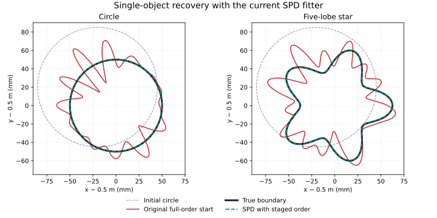

# Single-object SPD investigation — 2026-09-24

## Finding

Single-object inversion still works. The September 4–5 ellipse-to-star reference
reproduces on the current checkout. The current SPD fitter also recovers the
challenged circle and five-lobe star when its search starts at low order and
expands to the original full K17 space.

The original failing configuration started all 33 polar-gauge directions at
0.5 GHz from a displaced, oversized circle. The initial Jacobian has condition
number about 8.75e9, versus 1.694 at K4. Its path develops large high-order ripples while decreasing
the training loss, then encounters geometry or quadrature guards.

There is a historical implementation divergence behind this: the separate
multi-component LM optimizer introduced with topology did not include the old
single-object optimizer's curvature penalty, damping floor and shape-motion
trust-region mechanism. SPD accelerated that multi-component optimizer.

## Historical lineage checked

- The September 4–5 single-object radial Fourier reference uses cumulative
  frequencies 0.5; 0.5/1.5; 0.5/1.5/2.5 GHz, active radial orders 3/5/5, a
  `1e-4 * reference * k**4` step penalty, minimum damping 1e-6, a 2 mm shape-motion
  bound and adaptive FD stencil shrinking. It converges in 19/20/5 updates.
- `solvers/sdf_inverse/neural_optimization.py:1083` defines that curvature penalty;
  its history reaches `baf29c1`, September 7. Lines 246–252 explicitly describe
  the earlier high-mode-ripple failure that these safeguards addressed.
- `d7c8e87`, September 9, introduced `run_multiradial_fd_inverse`. Its normal
  equations already used only LM diagonal damping, with coefficient clipping.
  The current implementation retains that structure at
  `solvers/sdf_inverse/radial_topology.py:1316`; damping can decrease to floating
  point tiny instead of the legacy floor.
- SPD-001/002 and SPD-005–008 later accelerate derivatives, kernels, compiled
  scattering and geometry validation around this optimizer. Single-component
  compiled evaluation explicitly falls back to full Kress in
  `solvers/sdf_inverse/compiled_jacobian.py:62`.
- The native modal Müller single-object research also used a controlled shape
  space and a different bounded least-squares optimizer: modes 2/3/5, scaled
  parameters, frequency continuation and Jacobian scaling. See
  `experiments/modal_muller_research/inverse.py:201` and the September 16 BIE
  iteration-05 results. Its success is consistent with these findings.

## Fresh replay and controlled intervention

The legacy replay ran the existing `saved-star / curve_only` profile. Its
provenance collector referenced a document since moved into `docs/legacy/`;
`replay_legacy.py` resolves that path in memory. No numerical code changed.

| Legacy replay | Recorded September 5 | Fresh replay |
|---|---:|---:|
| Accepted updates | 44 | 44 |
| Training relative field error | 1.0683124e-8 | 1.0683122e-8 |
| Held-out relative field error | 1.3393169e-8 | 1.3393160e-8 |
| Reconstruction outcome | stable_data_and_geometry | stable_data_and_geometry |

The fresh replay had zero infeasible evaluations and zero full-validation
rejections. Reconstruction took 70.23 s.

For the current SPD runs, the following settings were retained: saved observations,
initial center (0.48, 0.52) m and radius 65 mm, cumulative frequencies
0.5/0.75/1.0/1.25 GHz, 512/1024 nodes, original stage quotas and 22-update limits,
reciprocal derivatives, compiled runtime with single-component fallback,
certified geometry reuse, FD-compatible constraints, 8 mm feature-radius
certificate, and the existing production/refined acceptance checks.
The diagnostic wall limit is 900 s, versus 3600 s in the original comparison.
It does not bind either staged-order run.

The controlled intervention was Cartesian order **4 → 6 → 9 → 17**, corresponding
to radial orders **3 → 5 → 8 → 16**, instead of K17 at every stage. Increasing
order zero-pads coefficients, preserving the current physical curve. The final
stage has the original 33 available directions. This schedule tests the
low-order-start hypothesis; it is a new diagnostic schedule, not a verbatim
replay of the older three-frequency schedule.

| Case | Accepted updates by stage | Final maximum training relative field error | Maximum held-out relative field error | Analytic radial RMS deviation | Inversion time |
|---|---|---:|---:|---:|---:|
| Circle | 5 / 0 / 0 / 0 | 5.806e-10 | 5.483e-10 | 2.543e-9 mm | 46.01 s |
| Five-lobe star | 9 / 4 / 0 / 0 | 1.0003e-7 | 3.216e-7 | 1.017e-6 mm | 93.97 s |

Both complete all four stages. Neither has one-sided or unresolved derivative
columns. Held-out frequencies are 1.5 and 2.5 GHz. Independent endpoint solves
at 1024 nodes compare against the saved observations; 512/1024 discrepancies
stay below 2.1e-13. Radial deviation uses the known analytic radius at each
recovered point's angle about the true center; it is distinct from the archived
symmetric nearest-boundary RMS metric.

Timings are single-run observations on a shared host. They exclude endpoint
scoring and establish no matched speedup ratio. The curvature-only and
derivative diagnostics overlapped; their elapsed times are also unsuitable for
performance comparisons.



## What the original stops actually mean

### Circle: trial-resolution failure after 13 accepted updates at 0.5 GHz

The archived candidate reduced production loss from 0.0047964372 to
0.0024262245. The refined calculation also showed improvement. However, the
candidate's 512-versus-1024 prediction discrepancy was 2.61618e-5, above the
1e-5 threshold. `run_top017.py:286` raises a whole-stage numerical failure at
this point. It does not return a rejected trial and continue backtracking.

This is a resolution failure on a highly rippled trial curve. The accepted
history has already accumulated substantial shape error. It does not show
that the physical circle inverse is unrecoverable.

A fresh check of **half the rejected displacement** keeps the same guards and
gives production/refined losses 0.0030157372 / 0.0030155810, both below the
base losses. Its prediction discrepancy is **9.76845e-6**, below the 1e-5
threshold, and it satisfies the existing gain-agreement acceptance rule. Thus
this particular abort can be replaced by a valid smaller step. The eventual
outcome of continuing the entire rippled trajectory was not tested.

### Star: blocked FD-compatible stencil after 19 + 5 accepted updates

At 0.5/0.75 GHz, the retained star fit has a conservative radius certificate of
**8.000330892 mm**, close to the 8 mm bound. The actual sampled minimum radius
about its own center is **31.1685 mm**. These are different quantities.

For direction 20, both signs of the configured 0.1 mm coefficient-space probe
drop the certificate below 8 mm: 7.996543391 and 7.996897681 mm. The
FD-compatible analytic policy therefore zeros that column and marks it
unresolved. The stage adapter raises `UNRESOLVED_DERIVATIVE` before a step.

Fresh diagnostics on the exact saved endpoint show:

| Probe size | Central columns | One-sided columns | Unresolved columns |
|---|---:|---:|---:|
| 0.1 mm | 2 | 30 | 1 |
| 0.01 mm | 3 | 30 | 0 |
| 0.001 mm | 10 | 23 | 0 |

The reciprocal analytic Jacobian itself is finite. Its relative difference
from the discrete operator Jacobian is 1.632e-7 at this distorted endpoint;
its 512-versus-1024 difference is 1.353e-10. At the common initial circle,
operator and reciprocal Jacobians agree to 4.3e-15 relative error.

Shrinking the stencil removes this particular obstruction. Recovery from that
already distorted endpoint was not tested, and this is not a claim that
changing the stencil alone repairs the full inverse.

## Interpretation and scope

The experiments establish an initialization/regularization failure in this
full-order configuration. The numerical and geometry stops are consequences
of the path it took. The successful staged runs retain the current SPD
forward, derivative, guards and final shape capacity.

The curvature-only control tests one additional historical safeguard while
keeping all 33 directions active from the start; its outcome is recorded
below. The other legacy safeguards have not been independently
ablated. These checks cover the two smooth single-object cases behind the
historical contradiction; they do not qualify a replacement six-case baseline.

## Full-order curvature-only control

`circle_full_penalty_resolved/result.json` keeps K17 and all 33 directions
throughout. The diagnostic adds the legacy-style k^4 penalty to the LM step
equations in memory, with weight 1e-4. All original acceptance and feasibility
checks remain active.

It accepts 22 / 22 / 19 updates, with no one-sided or unresolved columns, before
the 900 s diagnostic wall limit interrupts stage 3. The fourth stage is not
run. The retained circle has **0.008231 mm radial RMS deviation** and
**0.017805 mm maximum radial deviation**; maximum held-out field error is
**1.970e-3**. The endpoint remains well resolved, with maximum 512/1024
discrepancy below 7e-14.

This control suppresses the damaging ripples while leaving every shape
direction available. It is much slower than the staged-order runs and does
not complete its schedule. It supports the regularization diagnosis, but it
does not establish the curvature term alone as a qualified replacement.
Its 900 s limit differs from the original comparison's 3600 s limit, and its
elapsed time overlaps the separate derivative/trial diagnostics.

## Reproduction

From the repository root, use the EMNerf interpreter with `PYTHONPATH=solvers:.`
and `OMP_NUM_THREADS=OPENBLAS_NUM_THREADS=MKL_NUM_THREADS=NUMEXPR_NUM_THREADS=1`.
Each `diagnose.py --output` must name a new directory.

```bash
python replay_legacy.py --profile saved-star --policies curve_only --output-dir NEW_LEGACY_DIR
python diagnose.py --case wrong_circle --bands 4 6 9 17 --output NEW_CIRCLE_DIR
python diagnose.py --case circle_to_star --bands 4 6 9 17 --output NEW_STAR_DIR
python diagnose.py --case wrong_circle --curvature 0.0001 --output NEW_PENALTY_DIR
python inspect_failure.py --output NEW_DERIVATIVE_DIR
python probe_rejected_step.py --output NEW_TRIAL_CHECK_DIR
```

Use the scripts in this bundle, replacing their paths in the commands above.
The scripts retain repository input paths and the isolated diagnostic changes.
The preserved scripts resolve output directories explicitly and the repository
from the working directory; these portability edits do not change the diagnostic
math. Staged runs preceded addition of the optional curvature-control argument;
its default of zero retains their original numerical path.
Production solver code and defaults were not modified by this investigation.

## Validation and checkpoint

`verify.py` checks recorded recovery, per-stage loss decrease, derivative
agreement, the smaller-stencil result, the half-step acceptance result, and
source/input/artifact hashes. `verification.json` stores the results. The
boundary figure was visually checked against the saved coefficient curves.
`manifest.json` records the source commit and the files used for this inquiry.
