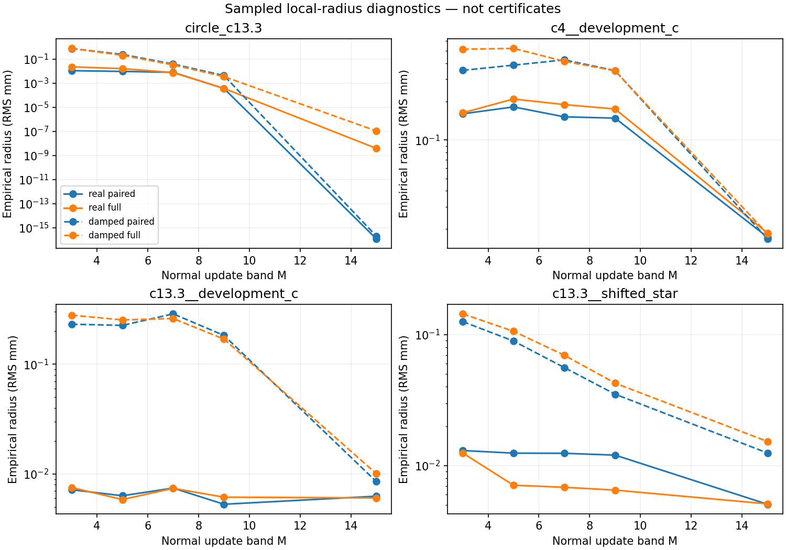

# TR-001: theory diagnostic evidence

Empirical finite-dimensional diagnostics. No certified convergence radius or new recovery claim.

Execution complete: **True**. Numerical wall time: **585.9 s**. Forward frequency solves: **9448**; derivative batches: **6392**.

Source/input hashes, source archive, execution settings and concurrent processes are in [manifest.json](manifest.json). Timings with other campaign activity are not matched benchmarks.

Qualified band/catalog rows: **40/40**, expected 40.

L_sample is a finite sample estimate of a supremum, not an upper bound. The displayed radii therefore have no certification status. Directions and radii are fixed in the plan; coefficients measure physical RMS mm in the fixed chart.

Four-frequency (0.5–1.25 GHz) results:

| Case | Catalog | M | Paired radius (mm) | Full radius (mm) | Full/paired |
|---|---|---:|---:|---:|---:|
| circle_c13.3 | damped | 15 | 2.048e-16 | 1.084e-07 | 5.292e+08 |
| circle_c13.3 | damped | 3 | 0.7348 | 0.7534 | 1.025 |
| circle_c13.3 | damped | 5 | 0.2398 | 0.2026 | 0.8449 |
| circle_c13.3 | damped | 7 | 0.03808 | 0.03234 | 0.8494 |
| circle_c13.3 | damped | 9 | 0.004251 | 0.003495 | 0.8221 |
| circle_c13.3 | real | 15 | 1.219e-16 | 3.892e-09 | 3.194e+07 |
| circle_c13.3 | real | 3 | 0.01078 | 0.02234 | 2.073 |
| circle_c13.3 | real | 5 | 0.009334 | 0.01594 | 1.707 |
| circle_c13.3 | real | 7 | 0.007852 | 0.007496 | 0.9547 |
| circle_c13.3 | real | 9 | 0.0003581 | 0.000364 | 1.016 |
| modal__c13.3__development_c | damped | 15 | 0.008537 | 0.01009 | 1.181 |
| modal__c13.3__development_c | damped | 3 | 0.2313 | 0.2798 | 1.21 |
| modal__c13.3__development_c | damped | 5 | 0.2256 | 0.253 | 1.122 |
| modal__c13.3__development_c | damped | 7 | 0.2872 | 0.2606 | 0.9072 |
| modal__c13.3__development_c | damped | 9 | 0.1828 | 0.1695 | 0.9269 |
| modal__c13.3__development_c | real | 15 | 0.006282 | 0.006062 | 0.9649 |
| modal__c13.3__development_c | real | 3 | 0.007198 | 0.00754 | 1.048 |
| modal__c13.3__development_c | real | 5 | 0.006341 | 0.00586 | 0.9243 |
| modal__c13.3__development_c | real | 7 | 0.007448 | 0.007408 | 0.9946 |
| modal__c13.3__development_c | real | 9 | 0.005307 | 0.006161 | 1.161 |
| modal__c13.3__shifted_star | damped | 15 | 0.01248 | 0.01528 | 1.225 |
| modal__c13.3__shifted_star | damped | 3 | 0.126 | 0.1444 | 1.146 |
| modal__c13.3__shifted_star | damped | 5 | 0.08948 | 0.1063 | 1.188 |
| modal__c13.3__shifted_star | damped | 7 | 0.05611 | 0.06972 | 1.243 |
| modal__c13.3__shifted_star | damped | 9 | 0.03512 | 0.04267 | 1.215 |
| modal__c13.3__shifted_star | real | 15 | 0.005063 | 0.005099 | 1.007 |
| modal__c13.3__shifted_star | real | 3 | 0.01303 | 0.01248 | 0.9578 |
| modal__c13.3__shifted_star | real | 5 | 0.01245 | 0.007078 | 0.5687 |
| modal__c13.3__shifted_star | real | 7 | 0.01241 | 0.006826 | 0.5499 |
| modal__c13.3__shifted_star | real | 9 | 0.01202 | 0.006498 | 0.5406 |
| modal__c4__development_c | damped | 15 | 0.01678 | 0.01836 | 1.094 |
| modal__c4__development_c | damped | 3 | 0.3528 | 0.517 | 1.466 |
| modal__c4__development_c | damped | 5 | 0.3876 | 0.5245 | 1.353 |
| modal__c4__development_c | damped | 7 | 0.4264 | 0.4157 | 0.9748 |
| modal__c4__development_c | damped | 9 | 0.3512 | 0.3499 | 0.9962 |
| modal__c4__development_c | real | 15 | 0.01729 | 0.01862 | 1.077 |
| modal__c4__development_c | real | 3 | 0.1608 | 0.1637 | 1.018 |
| modal__c4__development_c | real | 5 | 0.1821 | 0.2102 | 1.154 |
| modal__c4__development_c | real | 7 | 0.1522 | 0.1899 | 1.248 |
| modal__c4__development_c | real | 9 | 0.1487 | 0.1755 | 1.18 |

Additional radius probes: 936; ratios above 1/2: 22. Passing sampled probes does not establish a uniform TCC. Baseline spectra include the 19-frequency stack; nonlinear probes use only the four early frequencies.

Per-band qualification, refusals, individual probes and weak directions are under `rows/`. Compressed per-frequency Gram matrices and baseline spectra are retained separately.

