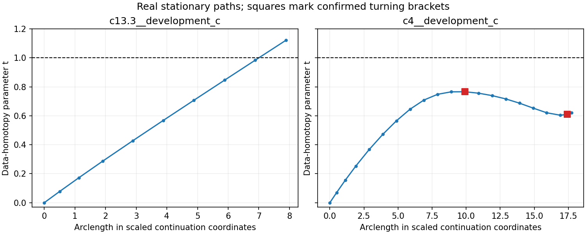

# TR-003 qualified numerical closeout

Four endpoint audits and both bounded stationary paths completed. Combined numerical cost, including the first adapter failure: **415.67 s**, **5282 forward frequency solves**, **5090 derivative batches**.

All four endpoint Hessians have resolved positive curvature. Only the full-data contrast-4 endpoint meets the declared gradient tolerance of 1e-8 per mm; the others are near stationary but do not meet that threshold. The paired archives retain positive-gain trials rejected by their acceptance margins. No fold is demonstrated at those stalled endpoints.

| Case | Accepted steps | Observed t at stop | Confirmed turning brackets | Outcome |
|---|---:|---:|---:|---|
| modal__c13.3__development_c | 9 | 1.12182 | 0 | target parameter crossed |
| modal__c4__development_c | 20 | 0.62123 | 2 | minimum arclength step |

The contrast-4 branch has two N1024-confirmed turning brackets, near t≈0.77 and t≈0.60. Its Hessian changes inertia across each bracket. Real pseudo-arclength passes both, then the declared 15 mm fixed-chart bound stops it before t=1. The high-contrast branch reaches t=1 after the final fixed-t correction without an observed turning point.

The high-contrast corrected endpoint has loss 0.00464085226 and post-run boundary RMS error 9.4133 mm. It is a wrong-shape stationary endpoint, not a recovery. Truth was loaded only for this final scoring. The fixed affine chart differs from the production moving-chart frequency ladder; these paths neither prove global absence of folds nor demonstrate that complex geometry would recover the hard case.

The concurrently completed FM-003 512-start paired census independently recovers the high-contrast C after ordinary continuation. Its geometry RMS is 6.54944e-05 mm, with maximum residual 1.58892e-06. This is separate evidence for useful alternative starts, not a TR recovery or an identifiability theorem.

## Preserved failures and provenance qualification

The first TR-003 attempt completed the endpoint audits, then refused an unpadded stage-1 curve before branch execution. The repair zero-pads without changing its physical shape; 24 tests pass. The endpoint audits were reused byte-for-byte under recorded parent hashes.

The resumed numerics completed, but the final broad source guard failed because `experiments/cleaned_interface/fm003_review.py` changed concurrently. That file is a reporting module unused by this experiment. The original manifest, archive and failure receipt are unchanged. This explicit post-run review verifies that this is the **only** changed source, every numerical source and input matches, the loaded experiment dependency modules match, all four endpoint audits qualify, both branch records are complete and the original combined budgets hold. Before/after copies of the unrelated file are retained.

The numerical evidence is qualified by this scoped provenance review; the original completion guard is still recorded as failed. See `qualification.json`, `parent.json`, `failure.json`, and the unchanged original TR-003 failure bundle.

