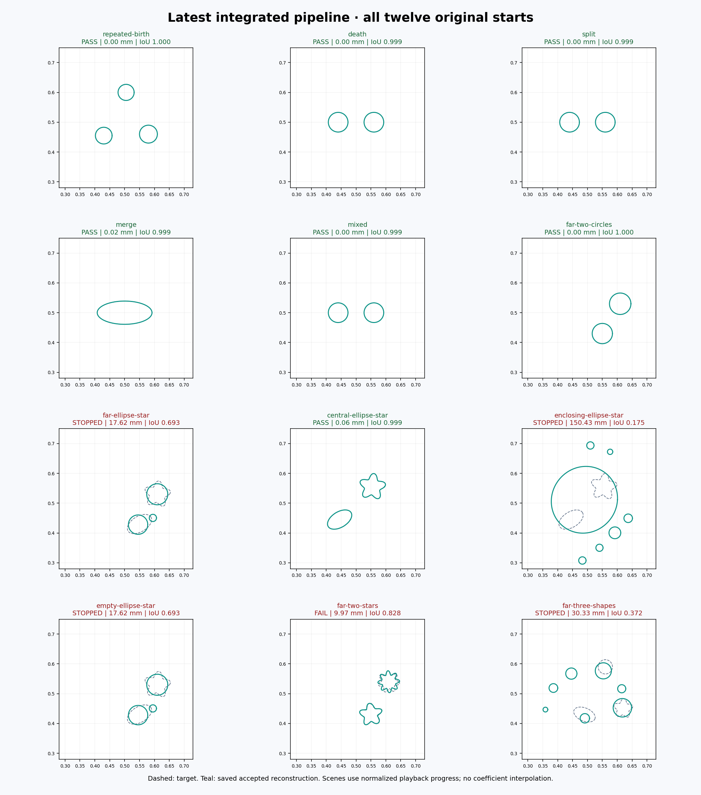

# Latest pipeline — all twelve scenes

**7 / 12 scenes pass all original recovery and numerical gates.**

[Watch the all-scene overview](videos/all_scenes.mp4) · [Final contact sheet](all_scenes.png) · [Machine-readable table](comparison.csv)

Every scene was run freshly from its original initialization with the same frozen current source. Pipeline: automatic H topology → cumulative four-frequency refinement at 256/512; K17 for one returned component, K9 otherwise. No scene-specific method choice or diagnostic damping reset.

Source base `a5fb5ac66ae3` plus the [frozen source manifest](manifest.json). All measured source files are archived under `measured_sources/`. This is a descriptive current-code evaluation, not a matched policy comparison.

## Scene gallery

| Scene / video | Outcome | Count | Boundary (mm) | IoU | Worst development error | What failed |
|---|---|---:|---:|---:|---:|---|
| [Empty start → three circles](videos/repeated-birth.mp4) | **PASS** | 3/3 | 0.0000 | 1.0000 | 1.1159e-06 | — |
| [Remove a spurious circle](videos/death.mp4) | **PASS** | 2/2 | 0.0000 | 0.9987 | 2.4515e-07 | — |
| [Peanut → two circles](videos/split.mp4) | **PASS** | 2/2 | 0.0000 | 0.9987 | 3.2391e-06 | — |
| [Two circles → one ellipse](videos/merge.mp4) | **PASS** | 1/1 | 0.0214 | 0.9994 | 0.0022936 | — |
| [Split a peanut and remove a circle](videos/mixed.mp4) | **PASS** | 2/2 | 0.0000 | 0.9987 | 1.7281e-06 | — |
| [Distant large circle → two circles](videos/far-two-circles.mp4) | **PASS** | 2/2 | 0.0001 | 1.0000 | 9.7228e-06 | — |
| [Distant large circle → ellipse + star](videos/far-ellipse-star.mp4) | **STOPPED** | 3/2 | 17.6164 | 0.6928 | unavailable | wrong component count; boundary > 1 mm or unmatched; IoU < 0.90; final prediction score unavailable; numerical qualification incomplete/failed; continuation incomplete; NUMERICAL_FAILURE |
| [Central circle → ellipse + star](videos/central-ellipse-star.mp4) | **PASS** | 2/2 | 0.0623 | 0.9994 | 0.0012377 | — |
| [Enclosing circle → ellipse + star](videos/enclosing-ellipse-star.mp4) | **STOPPED** | 7/2 | 150.4349 | 0.1751 | unavailable | wrong component count; boundary > 1 mm or unmatched; IoU < 0.90; final prediction score unavailable; numerical qualification incomplete/failed; topology handoff incomplete/failed; continuation incomplete; TRIAL_WALL_LIMIT |
| [Empty start → ellipse + star](videos/empty-ellipse-star.mp4) | **STOPPED** | 3/2 | 17.6163 | 0.6928 | unavailable | wrong component count; boundary > 1 mm or unmatched; IoU < 0.90; final prediction score unavailable; numerical qualification incomplete/failed; continuation incomplete; NUMERICAL_FAILURE |
| [Distant large circle → 5- and 7-lobed stars](videos/far-two-stars.mp4) | **FAIL** | 2/2 | 9.9735 | 0.8282 | 0.60115 | boundary > 1 mm or unmatched; IoU < 0.90; development error > 0.05 |
| [Distant large circle → ellipse + star + circle](videos/far-three-shapes.mp4) | **STOPPED** | 7/3 | 30.3307 | 0.3722 | unavailable | wrong component count; boundary > 1 mm or unmatched; IoU < 0.90; final prediction score unavailable; numerical qualification incomplete/failed; topology handoff incomplete/failed; continuation incomplete; TRIAL_WALL_LIMIT |

## Final scenes at a glance

## How to read the videos

Dashed outlines are targets; solid teal outlines are actual saved accepted reconstructions. Phases and frequency sets are labelled. Repeated frames slow playback; coefficients are never interpolated. Playback duration does not represent computational time. Empty starts and failed/partial runs stay visible. Final metric panels describe the exact retained state; unavailable prediction scores are explicitly marked.

Recovery requires the correct component count, boundary error ≤1 mm, IoU ≥0.90, original training error ≤0.003, worst development error ≤0.05, valid topology events and numerical checks. A small training residual is insufficient.

## Work and reproducibility

43,694 charged calls; 42,181 completed systems; 1,513 failed/refused calls, including 1,512 handled geometry refusals. Campaign elapsed 90.35 min with at most four BLAS-1 workers. Complete accounting: True. Partial counts are labelled as lower bounds.

[Contract](approved_plan.md) · [Artifact verification](verification.json) · [Work ledger](work_ledger.json) · [Worker commands and exits](campaign.json) · [Video provenance](video_manifest.json)

The original observations, starts and success thresholds are unchanged. Added training frequencies and the capacity policy are explicit parts of this candidate. All failures remain in the table; no production promotion or corrective redesign is implied by completing the evaluation.

## Where the unsuccessful cases stopped

- **far-ellipse-star**: wrong component count; boundary > 1 mm or unmatched; IoU < 0.90; final prediction score unavailable; numerical qualification incomplete/failed; continuation incomplete; NUMERICAL_FAILURE.
  Recorded stop detail: automatic endpoint infeasible at continuation nodes.
- **enclosing-ellipse-star**: wrong component count; boundary > 1 mm or unmatched; IoU < 0.90; final prediction score unavailable; numerical qualification incomplete/failed; topology handoff incomplete/failed; continuation incomplete; TRIAL_WALL_LIMIT.
  Recorded stop detail: hard wall limit during numerical batch.
- **empty-ellipse-star**: wrong component count; boundary > 1 mm or unmatched; IoU < 0.90; final prediction score unavailable; numerical qualification incomplete/failed; continuation incomplete; NUMERICAL_FAILURE.
  Recorded stop detail: automatic endpoint infeasible at continuation nodes.
- **far-two-stars**: boundary > 1 mm or unmatched; IoU < 0.90; development error > 0.05.
  Recorded stop detail: next complete batch and endpoint reserve exceed planned stage quota.
- **far-three-shapes**: wrong component count; boundary > 1 mm or unmatched; IoU < 0.90; final prediction score unavailable; numerical qualification incomplete/failed; topology handoff incomplete/failed; continuation incomplete; TRIAL_WALL_LIMIT.
  Recorded stop detail: hard wall limit during numerical batch.

These descriptions use the recorded stop and endpoint checks; they do not claim an unmeasured root cause.

A [geometry-only replay](qa/handoff_geometry.json) explains the two ellipse/star handoff stops: both retained states pass at 64/128 nodes, but a component gap measures about 9.989 mm at 512 nodes, below the unchanged 10 mm clearance requirement. Their component radii exceed the 8 mm floor. This replay used zero physical solves and did not change the retained states or gates.

Work accounting includes 1,512 handled geometry refusals and one call interrupted by the declared wall timer in the three-shape scene. That interruption is preserved in its [raw result](runs/far-three-shapes/result.json).

## Coverage

This gallery covers all twelve scenes in the frozen v1 Cartesian Fourier automatic-topology benchmark. The measured implementation is the explicit Fourier recovery pipeline. Other solver families and the neural-SDF inverse method are outside this evaluation.
